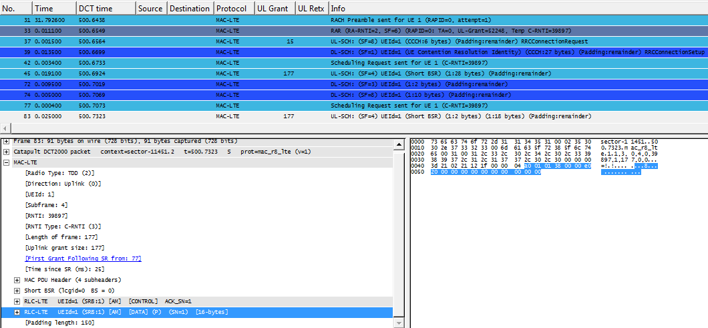
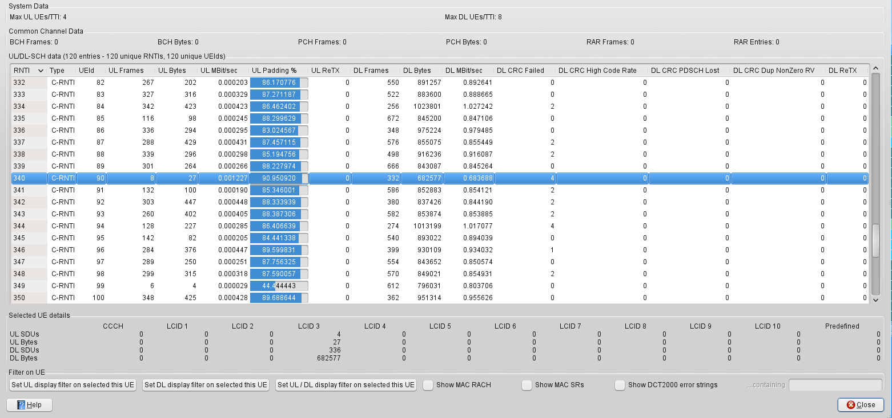

# Medium Access Control (MAC) for LTE

This protocol is layer 2 of the LTE air interface (connecting an LTE UE with an eNodeB).

## Protocol dependencies

  - MAC-LTE runs over the PHY layer

  - A UDP framing format for MAC-LTE has been defined (described in [packet-mac-lte.h](https://gitlab.com/wireshark/wireshark/-/blob/master/epan/dissectors/packet-mac-lte.h), purely for use with Wireshark)

  - Can call RLC dissector for its SDUs (see Preference Settings below)

  - BCH, PCH and CCCH payloads can be decoded by the LTE RRC dissector

  - RAR UL Grant field can be broken down according to [3GPP TS 36.213](http://www.3gpp.org/ftp/Specs/html-info/36213.htm)

## Example traffic



## Wireshark

The MAC-LTE dissector is fully functional. There is support for reading MAC-LTE frames from:

  - [DCT2000](/DCT2000) log files OR

  - using the UDP format defined in [packet-mac-lte.h](https://gitlab.com/wireshark/wireshark/-/blob/master/epan/dissectors/packet-mac-lte.h). This (BSD-licensed) [program](https://gitlab.com/martin.r.mathieson/uu-logging-for-wireshark/-/blob/master/mac_lte_logger.c) gives an example of how you might send MAC-LTE frames in this format OR

  - the compact format decoded by the mac-lte-framed dissector. This shares the same framing format as the UDP format described above. This (BSD-licensed) [program](https://gitlab.com/martin.r.mathieson/uu-logging-for-wireshark/-/blob/master/mac_lte_pcap_writer.c) gives an example of how you might write MAC-LTE frames directly in a file of this format. Currently, this does not have its own registered DLT, so if (as the same program does) you use DLT 147 you will need to edit the preferences of the DLT\_USER dissector (add an entry with DLT=147, Payload Protocol=mac-lte-framed) OR

  - your own framing protocol. The functions get\_mac\_lte\_proto\_data() and set\_mac\_lte\_proto\_data() are available for querying and setting the necessary context information associated with a frame.

MAC-LTE statistics can be viewed in a window (see Telephony | LTE | MAC ...).

The same statistics can be viewed in tshark using the -zmac-lte,stats option.



## Preference Settings

  - Number of Re-Transmits before expert warning triggered. Default is 3.

  - Attempt to decode BCH, PCH and CCCH data using LTE RRC dissector. Default is TRUE.

  - Dissect frames that have failed CRC check. Default is FALSE.

  - Try Heuristic LTE-MAC framing over UDP. Default is FALSE. Starting from Wireshark 2.0, heuristic activation is moved to Enabled Protocols window.

  - Attempt to dissect LCID 1&2 as srb 1&2. Default is FALSE.

  - LCID -\> DRB Mappings Table. Can configure data channel ID and RLC mode so that [RLC-LTE](/RLC-LTE) dissector can be called for these SDUs.

  - Attempt to track UL HARQ resends. When frame marked as reTx, looks for link back to original tx. Default is TRUE.

  - BSR size when warning should be issued. Default is 50 (19325 \< BS \<= 22624)

  - Track status of SRs within UEs. Looks for and shows links between SR request and resulting grant or failure indication. Default is TRUE.

  - Which layer info to show in Info column. Choices are PHY, MAC or RLC info. Default is MAC-info.

## Example capture file

XXX - Add a simple example capture file to the [SampleCaptures](/SampleCaptures) page and link from here (see below). Keep this file short, it's also a good idea to gzip it to make it even smaller, as Wireshark can open gzipped files automatically.

  - [SampleCaptures/PROTO.pcap](uploads/__moin_import__/attachments/SampleCaptures/PROTO.pcap)

## Display Filter

A complete list of MAC-LTE display filter fields can be found in the [display filter reference](http://www.wireshark.org/docs/dfref/m/mac-lte.html)

Show only the MAC-LTE based traffic:

``` 
 mac-lte 
```

## Capture Filter

You cannot directly filter MAC-LTE protocol frames while capturing. But, if you are using the supported UDP framing format, you may be able to filter on the UDP port you know that you are using, e.g.

``` 
  udp port 9999 
```

## External links

  - [3GPP TS 36.321](http://www.3gpp.org/ftp/Specs/html-info/36321.htm) Evolved Universal Terrestrial Radio Access (E-UTRA); Medium Access Control (MAC) protocol specification

  - [3GPP TS 36.213](http://www.3gpp.org/ftp/Specs/html-info/36213.htm) Evolved Universal Terrestrial Radio Access (E-UTRA); Physical layer procedures

  - [Example program](https://gitlab.com/martin.r.mathieson/uu-logging-for-wireshark/-/blob/master/mac_lte_logger.c) that generates and sends frames using the supported UDP framing format

  - [Example program](https://gitlab.com/martin.r.mathieson/uu-logging-for-wireshark/-/blob/master/mac_lte_pcap_writer.c) that writes to a PCAP file in a format that may be read by the mac-lte-framed dissector.

## Discussion

It is recommended that you use current sources or a recent automated build for this dissector and other LTE dissectors.

---

Imported from https://wiki.wireshark.org/MAC-LTE on 2020-08-11 23:16:25 UTC
