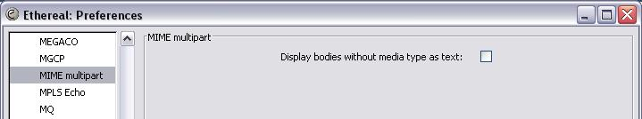

# MIME multipart (mime\_multipart)

Wireshark provides a general MIME multipart dissector, which allows encapsulation of entities to be dissected individually.

MIME multipart is a member of the [MediaTypesFamily](/MediaTypesFamily).

A MIME multipart encoded message can be recognized by means of the Content Type which starts with *multipart*. The parts are separated by means of a blank line and a boundary string starting with 2 dashes. The boundary string itself is specified with the *boundary* parameter of the Content Type. The last boundary is identical to any other boundary except that it has 2 extra trailing dashes.

:warning: The MIME multipart encoding is not always respected by all applications. The most common errors are the incorrect specification of the boundary string (with or without the dashes in the *boundary* parameter), and the last boundary identifier lacking the 2 trailing dashes.

General format of a MIME multipart document:

``` 
 [ preamble line-end ]
 dash-boundary transport-padding line-end
 body-part
 *encapsulation
 close-delimiter transport-padding
 [ line-end epilogue ]
```

where

``` 
 dash-boundary     := "--" boundary
 encapsulation     := delimiter transport-padding line-end body-part
 delimiter         := line-end body-part
 close-delimiter   := delimiter "--"
 body-part         := MIME-part-headers [ line-end *OCTET ]
 transport-padding := *LWSP-char
```

Note that line-end is often a LF instead of a CRLF.

## History

XXX - add a brief description of MIME multipart history

## Protocol dependencies

See the [MediaTypesFamily](/MediaTypesFamily) page for details.

## Example traffic

XXX - Add example traffic here (as plain text or Wireshark screenshot).

## Wireshark

The MIME multipart dissector is fully functional.

The following multipart types are dissected:

  - multipart/mixed
  - multipart/related
  - multipart/alternative
  - multipart/form-data

## Preference Settings



### Display bodies without media type as text

Enable this preference in order to display encapsulated entities that have no accompanying Content Type header. This happens in some [SIP](/SIP) stacks.

## Example capture file

XXX - Add a simple example capture file to the [SampleCaptures](/SampleCaptures) page and link from here. Keep it short, it's also a good idea to gzip it to make it even smaller, as Wireshark can open gzipped files automatically.

## Display Filter

A complete list of MIME multipart display filter fields can be found in the [display filter reference](http://www.wireshark.org/docs/dfref/m/mime_multipart.html)

Show only the MIME multipart based traffic:

``` 
 mime_multipart 
```

## Capture Filter

You cannot directly filter MIME multipart traffic while capturing.

## External links

See the [MediaTypesFamily](/MediaTypesFamily) page.

## Discussion

---

Imported from https://wiki.wireshark.org/MIME_multipart on 2020-08-11 23:16:45 UTC
