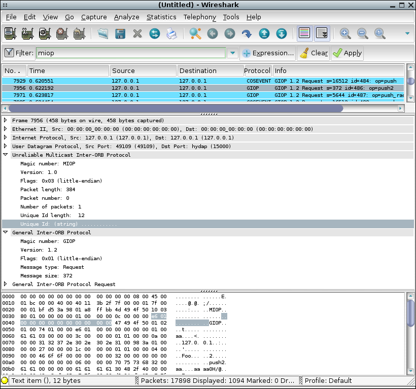

# Unreliable Multicast Inter-ORB Protocol (MIOP)

MIOP provides a common way to deliver GIOP request and fragment messages via multicast over UDP/IP. MIOP is implemented by some ORBs like TAO, TIDorb, JacORB, etc.

## History

TODO

## Protocol dependencies

  - [UDP](/UDP): MIOP is over [UDP](/UDP)

  - [GIOP](/GIOP): [MIOP](/MIOP) encapsulates [GIOP](/GIOP) protocol over [UDP](/UDP)

## Example traffic

## Wireshark

The MIOP dissector is partially functional. It can show all information about MIOP packet header fields and it groups all MIOP packets into a MIOP collection. Also it can show the subsequent GIOP details for the first MIOP packet of a MIOP packet collection. The MIOP dissector listen in any UDP port .

## Preference Settings

There are no preference settings so far.

## Example capture file

  - <https://bugs.wireshark.org/bugzilla/attachment.cgi?id=2735> MIOP sample file

## External links

  - [MIOP](http://www.omg.org/cgi-bin/apps/doc?ptc/03-01-11.pdf) *MIOP* - OMG MIOP specification

  - [MIOP patch](https://bugs.wireshark.org/bugzilla/show_bug.cgi?id=3238) - Latest MIOP dissector patch for Wireshark

  - <https://bugs.wireshark.org/bugzilla/show_bug.cgi?id=3238>

## Discussion

---

Imported from https://wiki.wireshark.org/MIOP on 2020-08-11 23:16:46 UTC
