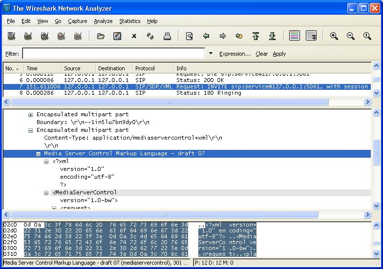

# Media Server Control Markup Language (MSCML)

Media Server Control Markup Language (MSCML) is a markup language used in conjunction with [SIP](/SIP) to provide advanced conferencing and interactive voice response ([IVR](http://en.wikipedia.org/wiki/Ivr)) functions. MSCML presents an application-level control model, as opposed to device-level control models. One use of this protocol is for communications between a conference focus and mixer in the IETF [SIP](/SIP) Conferencing Framework.

## History

  - 15-Nov-2006 - First release in Wireshark

## Protocol dependencies

  - [SIP](/SIP): Typically, MSCML uses [SIP](/SIP) as its transport protocol.

## Example traffic

## Wireshark

The MSCML dissector is partially functional, for draft-07 version of MSCML. It needs to be updated for latest drafts and coming RFC.

## Preference Settings

Not Applicable.

## Example capture file

  - [SampleCaptures/MSCML.pcap](uploads/__moin_import__/attachments/SampleCaptures/MSCML.pcap)

## External links

  - [MSCML drafts](http://ietfreport.isoc.org/idref/draft-vandyke-mscml/)

## Discussion

See [this message](http://wireshark.org/lists/ethereal-dev/200605/msg02351.html) that points some limitations of the DTD implementation in Wireshark.

---

Imported from https://wiki.wireshark.org/MSCML on 2020-08-11 23:16:57 UTC
