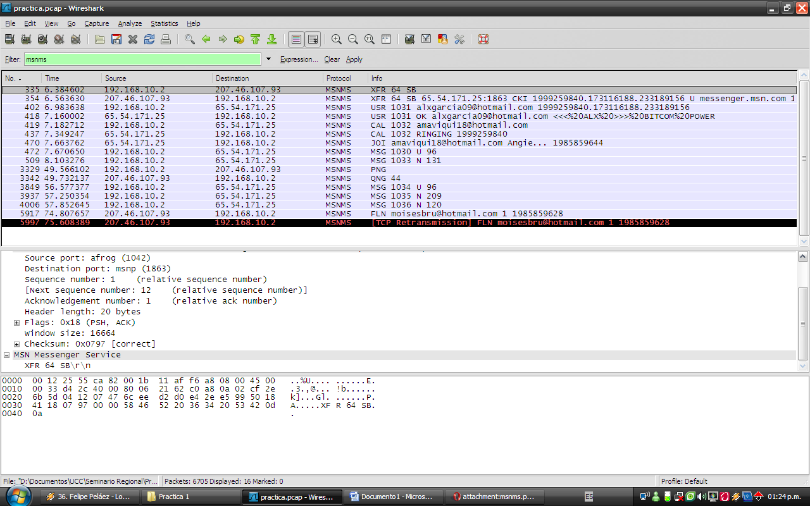

# MSN Messenger Service (MSNMS)

XXX - add a brief MSNMS description here

## History

XXX - add a brief description of MSNMS history

## Protocol dependencies

  - [TCP](/TCP): Typically, MSNMS uses [TCP](/TCP) as its transport protocol. The default TCP port for MSNMS traffic is 1863.

## Example traffic



## Wireshark

The MSNMS dissector is (fully functional, partially functional, not existing, ... whatever the current state is). Also add info of additional Wireshark features where appropriate, like special statistics of this protocol.

## Preference Settings

(XXX add links to preference settings affecting how MSNMS is dissected).

## Example capture file

XXX - Add a simple example capture file to the [SampleCaptures](/SampleCaptures) page and link from here (see below). Keep this file short, it's also a good idea to gzip it to make it even smaller, as Wireshark can open gzipped files automatically.

  - [SampleCaptures/msnms.pcap](uploads/__moin_import__/attachments/SampleCaptures/msnms.pcap)

## Display Filter

A complete list of MSNMS display filter fields can be found in the [display filter reference](http://www.wireshark.org/docs/dfref/m/msnms.html)

Show only the MSNMS based traffic:

``` 
 msnms
```

## Capture Filter

You cannot directly filter MSNMS protocols while capturing. However, if you know the [TCP](/TCP) port used (see above), you can filter on that one.

Capture only the MSNMS traffic over the default port (1863):

``` 
 tcp port 1863
```

## External links

  - <http://en.wikipedia.org/wiki/.NET_Messenger_Service>

  - <http://en.wikipedia.org/wiki/MSNP>

  - <http://www.hypothetic.org/docs/msn/index.php>

## Discussion

---

Imported from https://wiki.wireshark.org/MSNMS on 2020-08-11 23:16:59 UTC
