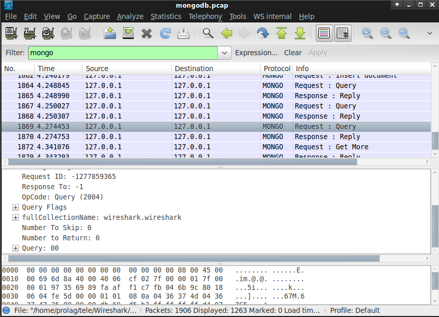

# Mongo Wire Protocol (MONGO)

MongoDB bridges the gap between key-value stores (which are fast and highly scalable) and traditional RDBMS systems (which provide rich queries and deep functionality).

## History

The Mongo Wire Protocol is a simple socket-based, request-response style protocol. Clients communicate with the database server through a regular TCP/IP socket.

## Protocol dependencies

  - [TCP](/TCP): Typically, Mongo uses [TCP](/TCP) as its transport protocol. The well known TCP port for Mongo traffic is 27017.

## Example traffic



## Wireshark

The Mongo dissector is partially functional.(Not support to display BSON Data)

## Example capture file

  - [SampleCaptures/mongodb.pcap](uploads/__moin_import__/attachments/SampleCaptures/mongodb.pcap) Sample of MongoDB Traffic (Query, Reply, Insert, Update, Delete...)

## Display Filter

A complete list of MONGO display filter fields can be found in the [display filter reference](http://www.wireshark.org/docs/dfref/m/mongo.html)

Show only the MONGO based traffic:

``` 
 mongo 
```

## Capture Filter

You cannot directly filter Mongo protocols while capturing. However, if you know the [TCP](/TCP) port used (see above), you can filter on that one.

Capture only the Mongo traffic over the default port (27017):

``` 
 tcp port 27017 
```

## External links

  - [Mongo Wire Protocol](http://www.mongodb.org/display/DOCS/Mongo+Wire+Protocol) - Documentation about Mongo Wire Protocol

## Discussion

---

Imported from https://wiki.wireshark.org/Mongo on 2020-08-11 23:16:51 UTC
