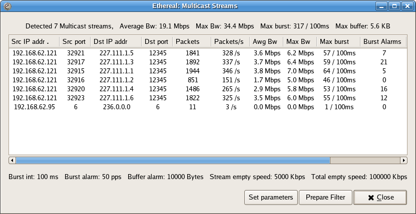
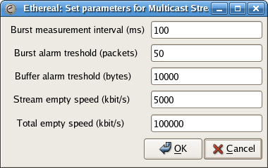

# Multicast Streams

To access the Multicast streams analysis use the menu entry "Statistics-\>Multicast Streams".

To try out this dialog, a capture file containing MPEG2 Multicast streams can be found at [SampleCaptures/video\_multicast.cap.gz](uploads/__moin_import__/attachments/SampleCaptures/video_multicast.cap.gz)

## What you can do with Multicast stream analysis?

  - Detect multicast streams
  - Measure how big the bursts inside video streams are (sliding window algorithm)
  - Measure how big the output buffer should be at a certain output speed (Leaky bucket algorithm)

## Multicast streams dialog window

## Procedure

  - the TAP system waits for UDP packets
  - every UDP packet is checked whether destination MAC address starts with "01:00:5E" (ethernet multicast address)
  - a new entry is created for every new multicast stream
  - based on sliding window algorythm max burst and max bandwidth is calculated
  - a counter shows how many times the number of packets in a burst was higher then limit specified
  - a leaky bucket algorithm calculates how big the output queue should be that no packet drop will occur
  - a counter shows how many times the demanded output queue was bigger then the one available
  - also for every stream total number of packets, pps, average BW, max BW are calculated
  - the same calculation is done for all multicast streams together

## Parameters window

Inside this window dialog it is possible to specify the burst interval, the alarm limits and output speeds

## Columns explanation

  - Max burst - the highest number of packets inside a sliding window time interval. The time interval can be specified inside the Set parameters window
  - Max Bw - same as the above one, only in Mbps instead of pps
  - Burst Alarms - how many times the bursts exceeded the limit set inside the Parameters dialog
  - Max buffer - how big the output queue should be that no packet will be dropped at specified output speed
  - Buff alarms - how many times this was not the case (the required buffer was higher than available one)

---

Imported from https://wiki.wireshark.org/Multicast_streams on 2020-08-11 23:17:03 UTC
