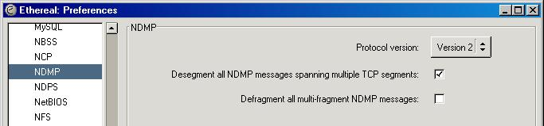

# NDMP Preferences

These are the preferences that control how Wireshark dissects the [NDMP](/NDMP) protocol.

## Protocol version

This preference setting controls which version of NDMP that Wireshark will attempt to decode the packet as. The default is for Wireshark to assume all NDMP packets being version 2, but this can be changed using this option. Versions 3, 4 and 5 can be selected in these preferences but be aware that versions 3, 4 and 5 are likely to be incomplete in Wireshark at this point in time.  
  
Wireshark does not (yet) autodetect which version is used, even if the packets where the version is negotiated exist in the capture. This can be semi-easily added if example captures are provided.

You must specify in the preferences which version of NDMP you use (unless it is version 2) or some packets will be misdissected.

\-- someone should donate NDMP captures of different versions to the sample captures page and link to them from here.

### Different version support

The first version of NDMP implemented in Wireshark was for NDMP version 2. Support for NDMP version 2 is belived to be fairly complete and accurate. Some changes for versions 3, 4 and 5 were added to the dissector at a later time but is belived to be far from complete. It is therefore not unlikely that some, in particular, version 4 and version 5 traces fail to dissect properly.  
  
Please feel free to send such example captures to the wireshark-dev mailing list or give it a try and add these versions to Wireshark.  
Wireshark developers would also be interested in example captures of all 4 versions of NDMP for display at the sample capture page.

## Desegment all NDMP messages spanning multiple TCP segments

When you activate this preference, Wireshark will attempt to reassembly all NDMP PDUs that span multiple TCP segments into one fully reassembled PDU.  
This is useful for example if a specific implementation only sends the NDMP header and the actual NDMP command in two separate packets.  
In order to make this preference take effect, you must also enable reassembly in [TCP\_Reassembly](/TCP_Reassembly).

\-- someone should donate a capture with ndmp segments spanning multiple segments and link to it as an example from here.

## Defragment all multi-fragment NDMP messages

NDMP can also be fragmented in the NDMP layer itself by use of the Last/More fragments bit in the recordmarked. This is different from when NDMP is fragmented in the TCP layer which the previous option manages.  
By enabling this option Wireshark will reassemble even these packets.

\-- someone should even here donate a sample capture.

## Preference Strings

Protocol version  
Desegment all NDMP messages spanning multiple TCP segments  
Defragment all multi-fragment NDMP messages

---

Imported from https://wiki.wireshark.org/NDMP_Preferences on 2020-08-11 23:17:10 UTC
