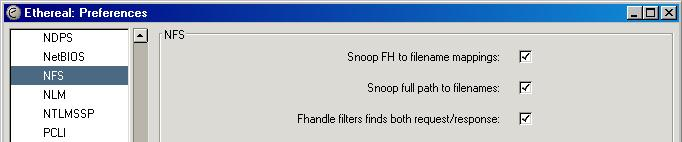
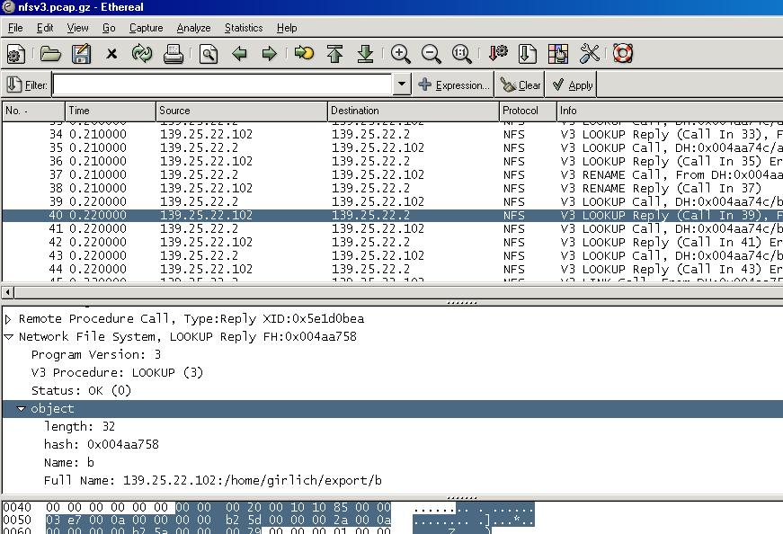

## NFS Preferences

Wireshark contains several preferences which affects how NFS and NFS related protocols are dissected.   
These settings affect not only NFS but all other NFS-related protocols that use NFS filehandles, such as NFS-ACL, MOUNT, NLM, KLM.

### Snoop FH to filename mappings

When this preference is set, Wireshark will snoop all LOOKUP, CREATE, etc NFS commands and build an internal mapping between the filehandle and the actual filename.  
When the name of a filehandle is known to Wireshark and Wireshark later encounters that filehandle again in the capture, Wireshark will insert an extra field in the dissect pane containing the name of the file the filehandle refers to. In the example below, since the filehandle was known, Wireshark inserted the extra field 'Name: b' to inform the user that the name of this file/filehandle was 'b'.  
This field can also be filtered upon using the display filter name

    nfs.name

This field will only be displayed if the actual name of the filehandle is known. If there were no matching LOOKUP, CREATE, etc that wireshark could learn the mapping from, then it will not be displayed.

### Snoop full path to filenames

In addition to snooping filehandles, Wireshark can also attempt to keep track of the full pathname of the actual file. This only works if ALL filehandles, from the initial MOUNT filehandle throughout all the subdirectories down to the actual file were learnt by Wireshark.  
In the example below, since we had the original MOUNT call in the trace as well as LOOKUP calls telling us the name of all the subdirectories in the path, Wireshark here adds the field 'Full Name: 139.25.22.102:/home/girlich/export/b' to the dissection of the filehandle.  
This field can also be filtered on using the display filter name

    nfs.full_name

Keep in mind, this field is only present in the dissection if the full path of the file is known.

### Fhandle filters find both request/response

This final and third option tells Wireshark to maintain state between Requests and Responses for NFS and related protocols regarding filehandles. This is to allow more advanced/useful filtering of NFS packets.  
If you are experienced with NFS you might have seen that the filehandle for a specific file is only really present in one of the packets of a request/response pair. The filehandle only occurs in either the request or the response but not in both of them.  
Thus when we filter for

    nfs.name=="b"

we would only really see the packets containing the actual filehandle. This is usually not really that helpful, what we want most of the time is to see BOTH the request and also the response for all such calls operating on that filehandle.  
When this option is enabled, Wireshark will keep state for all request/response pairs to remember which filehandles are acceessed across the entire request/response pair. Then if we filter on

    nfs.name=="b"

and that would match packet 40 in the example, this option would make the filter also match packet 39 since that was the request associated to the response in 40.  
This preference makes the following filters apply across the full request/response pair instead of individual packets

    nfs.name
    nfs.full_name
    nfs.hash

### Example

This example below is using the sample capture nfsv3.pcap.gz from the sample captures page.  
  

Load this example capture and try filtering for

    nfs.name=="b"

when all the preferences are enabled and you will see how it works.

### Preference Strings

Snoop FH to filename mappings  
Snoop full path to filenames  
Fhandle filters find both request/response

---

Imported from https://wiki.wireshark.org/NFS_Preferences on 2020-08-11 23:17:28 UTC
