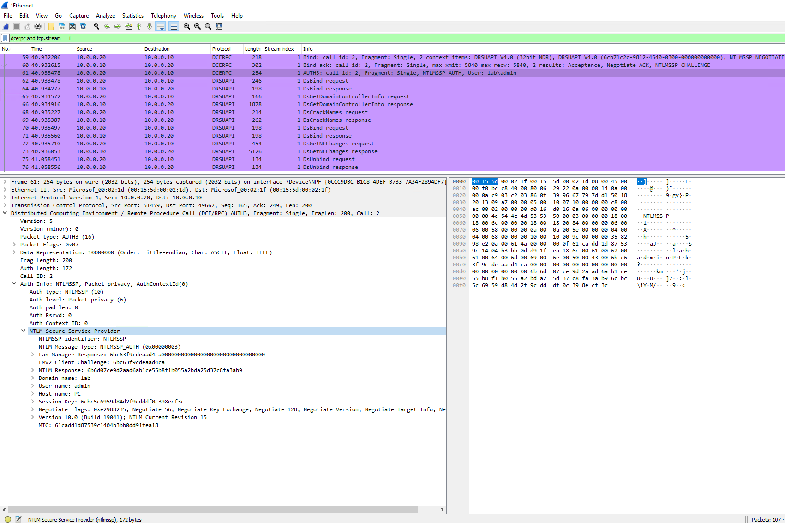
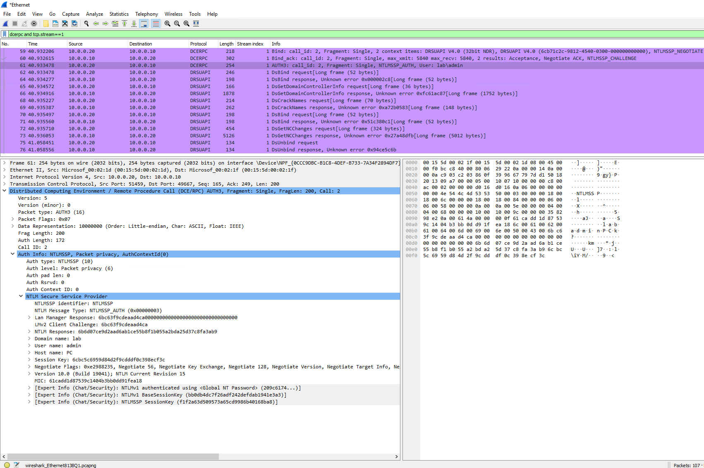
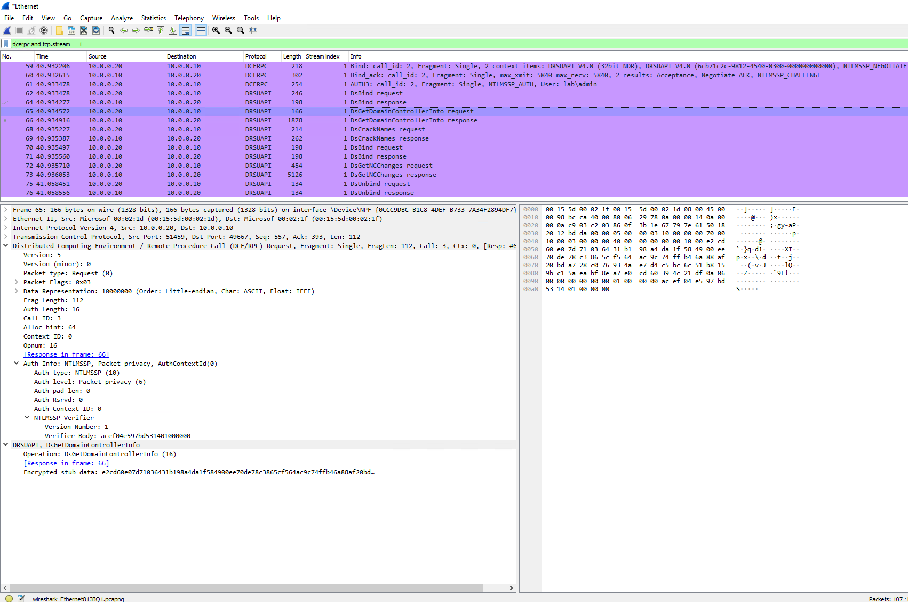
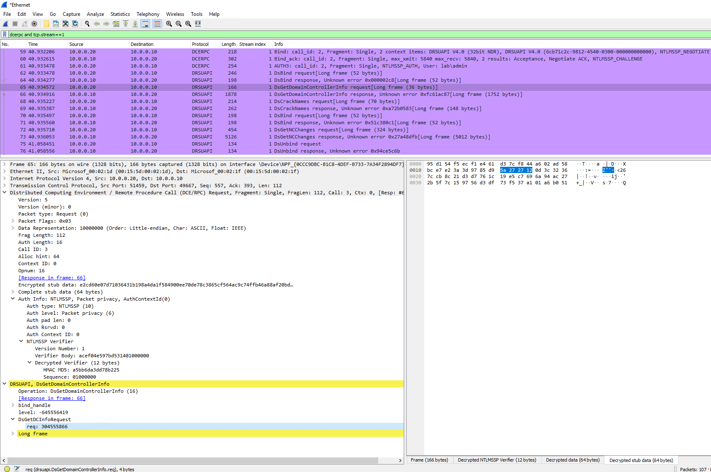

# NTLM Security Support Provider

NTLMSSP is a Microsoft protocol for authentication using the NTLM protocol.

Open specification: [\[MS-NLMP\]](https://docs.microsoft.com/en-us/openspecs/windows_protocols/ms-nlmp/b38c36ed-2804-4868-a9ff-8dd3182128e4)

## "NT Password" setting allowing decryption

The "NT Password" setting can contain a password used to decrypt NTLM exchanges: both the NTLM challenge/response and further protocol payloads (like [DCE/RPC](/DCE/RPC) that may be encrypted with keys derived from the NTLM authentication.

Just input the user's password in the field. According to the source-code, only ASCII passwords are supported (due to the simple method for Unicode encoding). It doesn't seem to support NTLM hashes so make sure to use the cleartext password.

Here's how the NTLM authentication at the beginning of a [DRSUAPI](/DRSUAPI) ([DCE/RPC](/DCE/RPC)) session looks like before providing the password:

And after providing the password, notice the additional info highlighted in blue:

Then, before providing the password, the DsGetDomainControllerInfo request payload is not readable since it's "encrypted stub data":

But after providing the password, it becomes "decrypted stub data" (even though it seems invalid so there's potentially a bug):

