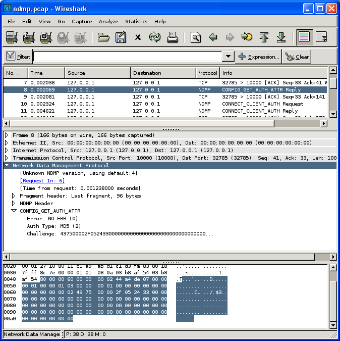
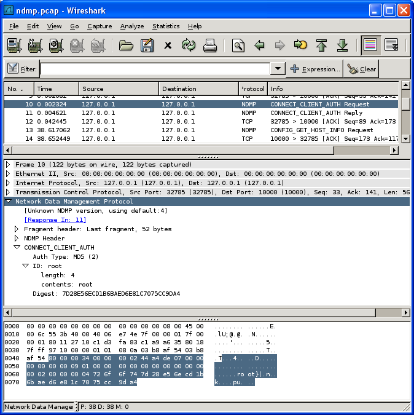

# Network Data Management Protocol (NDMP)

NDMP is a protocol to manage network backups for mid and enterprise class environments.  

## History

NDMP was initially developed by the storage vendor Network Appliance but has since gained popularity in the industry and is now developed jointly by some industry vendors.  
There are 4 popular versions of NDMP in use today, versions 2, 3, 4 and 5.

## Protocol dependencies

  - [TCP](/TCP): NDMP always uses [TCP](/TCP) as its transport protocol. The well known TCP port for NDMP traffic is 10000. NDMP uses the same recordmarker as [ONC-RPC](/ONC-RPC) to distinguish between PDU bondaries.

  - [SCSI](/SCSI): SCSI is sometimes transported ontop of certain NDMP packets, in particular when the backup application wants to talk directly to the tape library behind the NDMP box.

## Example traffic

 

## Wireshark

The dissector has full support for version 2 of NDMP. This version is also the default version in Wireshark.  
Wireshark also contains a dissector for the SCSI protocol(s) which allows dissection of the SCSI payload for those NDMP commands that transport raw scsi.  
Wireshark has limited and very likely incomplete support for the changes in the protocol added after version 2.  
  
Please help wireshark become better at dissecting NDMP by donating example captures of non- version 2 uses and patches to the sourcecode to implement more of version 3, 4 and 5.

## Preference Settings

See [NDMP\_Preferences](/NDMP_Preferences).

## Example capture file

\* [SampleCaptures/ndmp.pcap.gz](uploads/__moin_import__/attachments/SampleCaptures/ndmp.pcap.gz)

## Display Filter

A complete list of NDMP display filter fields can be found in the [display filter reference](http://www.wireshark.org/docs/dfref/n/ndmp.html)

Show only the NDMP based traffic:

``` 
 ndmp 
```

## Capture Filter

You cannot directly filter NDMP protocols while capturing. However, if you know the [TCP](/TCP) port used (see above), you can filter on that one.

## External links

  - [NDMP.ORG homepage](http://www.ndmp.org)

## Discussion

---

Imported from https://wiki.wireshark.org/Network_Data_Management_Protocol on 2020-08-11 23:17:21 UTC
