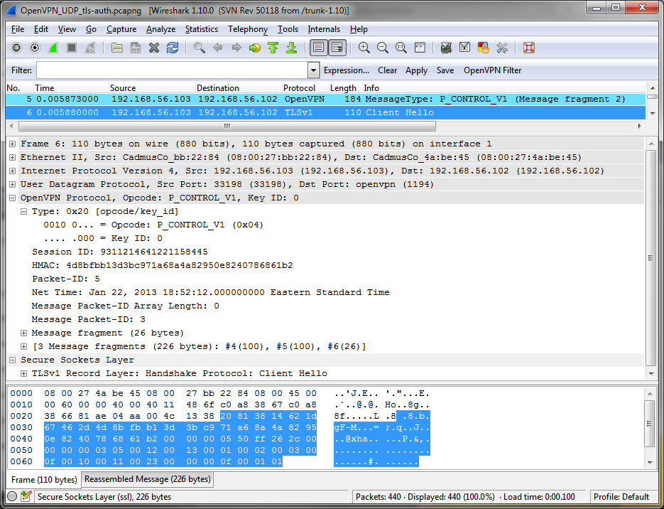
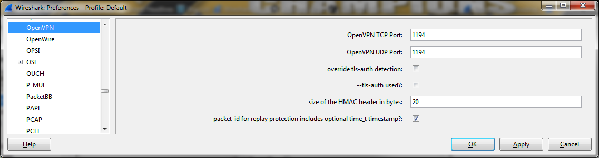

# OpenVPN Protocol (OpenVPN)

With OpenVPN, you can tunnel any [IP](/IP) subnetwork or virtual ethernet adapter over a single [UDP](/UDP) or [TCP](/TCP) port. It uses all of the encryption, authentication, and certification features of the [OpenSSL](http://www.openssl.org/) library to protect your private network traffic as it transits the internet.

OpenVPN has two authentication modes:

  - Static Key - Use a pre-shared static key
  - TLS - Use SSL/TLS + certificates for authentication and key exchange

For TLS authentication OpenVPN uses a custom security protocol which is described here on this WIKI page. This protocol provides the SSL/TLS connection with a reliable transport layer (as it is designed to operate over). It's second job is to multiplex the SSL/TLS session used for authentication and key exchange with the actual encrypted tunnel data stream.

    SSL/TLS -> Reliability Layer -> \
               --tls-auth HMAC       \
                                      \
                                       > Multiplexer ----> UDP
                                      /                    Transport
    IP        Encrypt and HMAC       /
    Tunnel -> using OpenSSL EVP --> /
    Packets   interface.

## History

I couldn't find any historical information about this protocol.

## Protocol dependencies

  - [UDP](/UDP): Typically, OpenVPN uses [UDP](/UDP) as its transport protocol. The well known UDP port for OpenVPN traffic is 1194.

  - [TCP](/TCP): Additionally, OpenVPN can be configured to use [TCP](/TCP) as its transport protocol. The well known TCP port for OpenVPN traffic is 1194.

## Example traffic



## Wireshark

The OpenVPN dissector is fully functional and included with Wireshark as of version 1.10.0.

## Preference Settings



  - ***OpenVPN TCP Port:*** The dissector automatically tries to dissect TCP packets as OpenVPN traffic on this port.

  - ***OpenVPN UDP Port:*** The dissector automatically tries to dissect UDP datagrams as OpenVPN traffic on this port.

  - ***override tls-auth detection:*** If tls-auth detection fails, you can choose to override detection and set the tls-auth options manually.
    
      - ***--tls-auth used?:*** If the parameter --tls-auth is used, the following preferences must also be defined.
        
          - ***size of the HMAC header in bytes:*** The default HMAC algorithm is SHA-1 which generates a 160 bit HMAC, therefore 20 bytes should be ok.
        
          - ***packet-id for replay protection includes optional time\_t timestamp?:*** If the parameter --tls-auth is used, an additional packet-id for replay protection is inserted after the HMAC signature. This field can either be 4 bytes or 8 bytes including an optional time\_t timestamp long. The default value is True.

## Example capture file

  - [SampleCaptures/OpenVPN\_UDP\_tls-auth.pcapng](uploads/__moin_import__/attachments/SampleCaptures/OpenVPN_UDP_tls-auth.pcapng)

  - [SampleCaptures/OpenVPN\_TCP\_tls-auth.pcapng](uploads/__moin_import__/attachments/SampleCaptures/OpenVPN_TCP_tls-auth.pcapng)

## Display Filter

A complete list of OpenVPN display filter fields can be found in the [display filter reference](http://www.wireshark.org/docs/dfref/o/openvpn.html)

Show only the OpenVPN based traffic:

``` 
 openvpn 
```

## Capture Filter

You cannot directly filter OpenVPN protocols while capturing. However, if you know the [UDP](/UDP) or [TCP](/TCP) port used (see above), you can filter on that one.

Capture only the openvpn traffic over the default port (1194):

``` 
 udp port 1194 
```

or

``` 
 tcp port 1194 
```

## External links

  - <http://openvpn.net/> *OpenVPN* - Official Website.

  - <http://openvpn.net/index.php/open-source/documentation/security-overview.html> *OpenVPN - Security Overview* - The OpenVPN protocol explained.

  - <http://www.openssl.org/> *OpenSSL* - Official Website.

## Discussion

---

Imported from https://wiki.wireshark.org/OpenVPN on 2020-08-11 23:17:42 UTC
