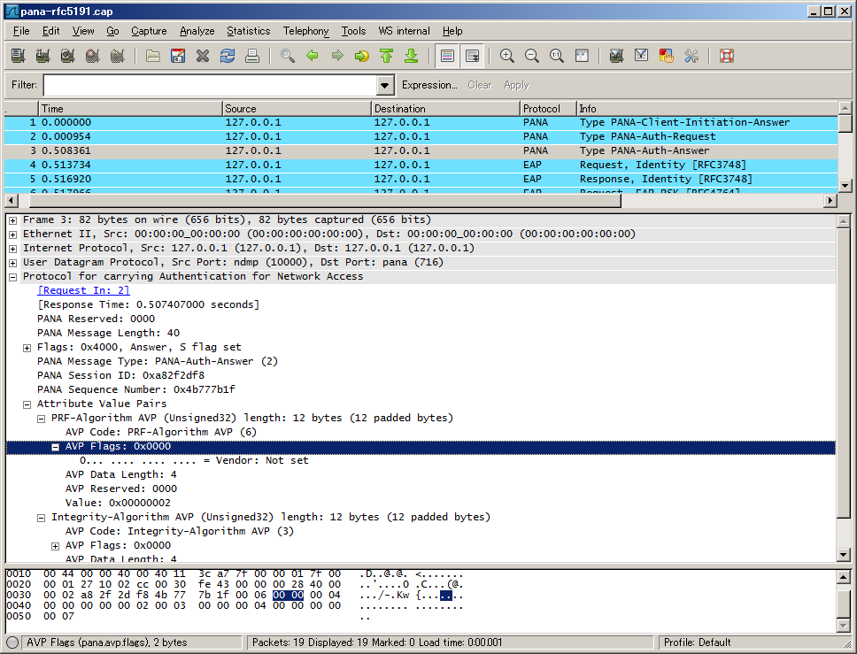

# Protocol for carrying Authentication for Network Access (PANA)

PANA is a protocol used to authenticate users before granting network access. PANA is an IP based protocol and it enables the client to interact with a back-end AAA server, deployed in the network provide's domain. It enables the client to authenticate against the AAA server without using link-layer specific mechanisms or knowing the specific AAA protocol. PANA can be used on both multi-access and point-to-point links and it supports various authentication methods, dynamic network provider selection, and roaming clients. PANA does not define any new authentication mechanism but uses EAP to transfer authentication related data. Any authentication method on top of EAP can be used in PANA.

## History

XXX - add a brief description of PANA history

## Protocol dependencies

  - [UDP](/UDP): PANA uses [UDP](/UDP) as its transport protocol. The well known UDP port for PANA traffic is 716.

## Example traffic



The depicted trace is available here: [SampleCaptures/pana-rfc5191.cap](uploads/__moin_import__/attachments/SampleCaptures/pana-rfc5191.cap)

## Wireshark

The PANA dissector is fully functional.

## Preference Settings

There are no PANA related preference settings.

## Example capture file

  - [SampleCaptures/pana-rfc5191.cap](uploads/__moin_import__/attachments/SampleCaptures/pana-rfc5191.cap) PANA authentication and re-authentication sequences.

## Display Filter

A complete list of PANA display filter fields can be found in the [display filter reference](http://www.wireshark.org/docs/dfref/p/pana.html)

Show only the PANA based traffic:

``` 
 pana 
```

## Capture Filter

XXX

## External links

IETF PANA Working Group

  - <http://ietf.org/html.charters/pana-charter.html>

Current RFCs

  - [RFC5191](http://www.ietf.org/rfc/rfc5191.txt) Protocol for Carrying Authentication for Network Access (PANA)

  - [RFC4016](http://www.ietf.org/rfc/rfc4016.txt) Protocol for Carrying Authentication and Network Access (PANA) - Threat Analysis and Security Requirements

  - [RFC4058](http://www.ietf.org/rfc/rfc4058.txt) Protocol for Carrying Authentication for Network Access (PANA) - Requirements

## Discussion

Q:I don't think a capture filter named "pana" will work. - *[UlfLamping](/UlfLamping)*

R:It will work if packets are decoded as pana.

R:As display filter yes, but not as capture filter. - [JaapKeuter](/JaapKeuter)

Q:In the [pana\_draft\_17](http://www.ietf.org/internet-drafts/draft-ietf-pana-pana-17.txt) the pana header contains a session identifier. Wireshark dont take car of it. is it a interpretation error?

R:pana.sid is used for session ID. If there is an error please file a bug report with a capture file showing it. - [JaapKeuter](/JaapKeuter)

---

Imported from https://wiki.wireshark.org/PANA on 2020-08-11 23:17:48 UTC
