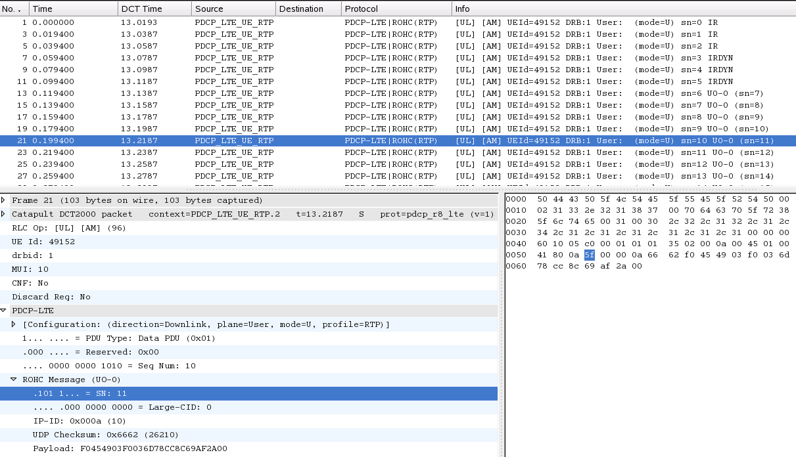

# Packet Data Convergence Protocol (PDCP) for LTE

This protocol sits between the RLC and RRC layers in the LTE air interface (connecting an LTE UE with an eNodeB).

## Protocol dependencies

The dissection of RRC and IP payloads are controlled by preference settings. This dissector may be called by the [RLC-LTE](/RLC-LTE) dissector for signalling plane messages (if preference settings are enabled).

A UDP framing format for PDCP-LTE has been defined (described in [packet-pdcp-lte.h](https://gitlab.com/wireshark/wireshark/-/blob/master/epan/dissectors/packet-pdcp-lte.h), purely for use with Wireshark)

## Example traffic



## Wireshark

The PDCP-LTE dissector is mostly functional. It can decode the PDCP-LTE headers but has limited support for ROHC payloads. Deciphering of EEA2 (AES) messages is supported where Wireshark is built with libgcrypt. There is support for reading PDCP-LTE frames from:

  - [RLC-LTE](/RLC-LTE) SDUs, which may have been reassembled from multiple segments, OR

  - [DCT2000](/DCT2000) log files, OR

  - using the UDP format defined in [packet-pdcp-lte.h](https://gitlab.com/wireshark/wireshark/-/blob/master/epan/dissectors/packet-pdcp-lte.h). This (BSD-licensed) [program](https://gitlab.com/martin.r.mathieson/uu-logging-for-wireshark/-/blob/master/pdcp_lte_logger.c) gives an example of how you might send PDCP-LTE frames in this format.

## Preference Settings

  - Show User-Plane uncompessed data as IP. Default is Off.
  - Show unciphered Signalling-Plane data as RRC. Default if Off.
  - Attempt to decode ROHC data. Default is Off.
  - Try Heuristic LTE-PDCP over UDP framing. Default is Off. Starting from Wireshark 2.0, heuristic activation is moved to Enabled Protocols window.
  - Which layer info to show in Info column. Default is RLC.
  - PDCP UE security keys. A table of (UEId, RRCKey, UPKeys) entries.
  - Attempt to decipher Signalling (RRC) SDUs. Default is Off.
  - Attempt to decipher User-plane (IP) SDUs. Default is Off.

## Example capture file

XXX - Add a simple example capture file to the [SampleCaptures](/SampleCaptures) page and link from here (see below). Keep this file short, it's also a good idea to gzip it to make it even smaller, as Wireshark can open gzipped files automatically.

  - [SampleCaptures/PROTO.pcap](uploads/__moin_import__/attachments/SampleCaptures/PROTO.pcap)

## Display Filter

A complete list of PDCP-LTE display filter fields can be found in the [display filter reference](http://www.wireshark.org/docs/dfref/p/pdcp-lte.html)

Show only the PDCP-LTE based traffic:

``` 
 pdcp-lte 
```

## Capture Filter

You cannot directly filter PDCP-LTE protocols while capturing.

## External links

  - [3GPP TS 36.323](http://www.3gpp.org/ftp/Specs/html-info/36323.htm) Evolved Universal Terrestrial Radio Access (E-UTRA); Packet Data Convergence Protocol (PDCP) specification

  - [RFC 3095](http://www.ietf.org/rfc/rfc3095.txt) *RObust Header Compression (ROHC): Framework and four profiles: RTP, UDP, ESP, and uncompressed*

  - [Example program](https://gitlab.com/martin.r.mathieson/uu-logging-for-wireshark/-/blob/master/pdcp_lte_logger.c) that generates and sends frames using the supported UDP framing format

## Discussion

It is recommended that you use current sources or a recent automated build for this and other LTE dissectors.

---

Imported from https://wiki.wireshark.org/PDCP-LTE on 2020-08-11 23:17:51 UTC
