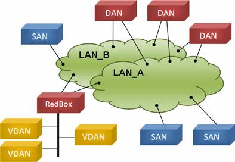
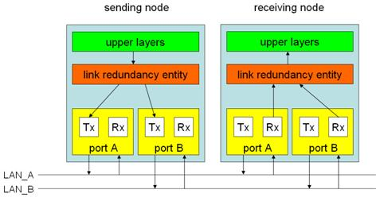
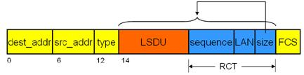
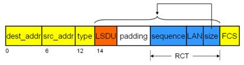
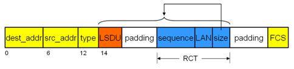
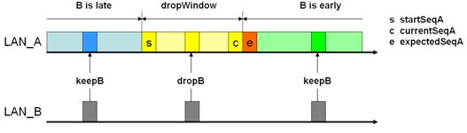
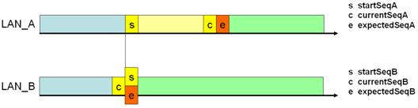
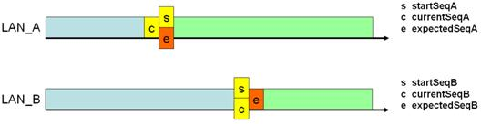
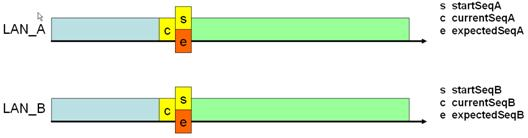

# Parallel Redundancy Protocol (PRP)

## Overview

PRP implements layer 2 network redundancy by sending two copies of the same frame over two independent networks. A redundancy control trailer (RCT) is added to each frame (which include a sequence number to discard duplicates).

Important: the PRP dissector is disabled by default. You have to enable it to dissect the PRP trailer (edit-\>preferences-\>protocols-\>prp). Only supervision frames are dissected by default. This is because the trailer dissector can produce false positives, e.g. detect a PRP-0 trailer just because the payload happens to end with the right 2 bytes (4 bytes with PRP-1).

The current Wireshark dissector recognizes both PRP-0 (PRP 2010, IEC 62439-3 (2010)) and PRP-1 (PRP 2012, IEC 62439-3 (2012)), which are two versions of the same protocol with different frame format. You can find a sample frames attached to [this bugreport](https://bugs.wireshark.org/bugzilla/show_bug.cgi?id=5730).

The text below describes the older PRP-0 protocol. While much of it still applies, the trailer format has changed, as well as the sequence numbering. The newer 2012 version of PRP is very similar to the [HSR](/HSR) protocol. Please also refer to the [Wikipedia Article about PRP](http://en.wikipedia.org/wiki/Parallel_Redundancy_Protocol).

## Basics

### 1 PRP principle of operations

#### 1.1 Network and network elements

PRP implements redundancy functions in the end nodes rather than in network elements. This is one mayor difference to protocols like RSTP or MRP. An end node is attached to two similar LANs of arbitrary topology, which are disjoint and operated in parallel. The LANs must be laid out so that the two LANs fail independently e.g. redundant LANs must not be powered out of the same source. No direct connection can be made between the two LANs. Figure1 depicts the general network as two switched networks, which can have any topology, e.g. tree, ring or meshed.



The two LANs, named LAN\_A and LAN\_B, are identical in protocol at the MAC level, but they can differ in performance and topology. Transmission delays may also be different. The LANs have no direct connection among them and they are assumed to be fail-independent. In some applications, only availability-critical nodes need a double attachment, while others do not. In order to meet the specific requirements, PRP defines different kinds of end nodes.

  - The Dual Attached Node (DAN) is connected to both LANs.

  - Uncritical nodes can be attached to only one LAN and are therefore called Single Attached Nodes (SAN). SANs that need to communicate with each other are on the same LAN.

  - The Redundancy Box ([RedBox](/RedBox)) is used when a single interface node has to be attached to both networks. Such a node can communicate with all other nodes. Since a node behind a [RedBox](/RedBox) appears for other nodes like a DAN, it is called Virtual DANs (VDAN). The [RedBox](/RedBox) itself is a DAN and acts as a proxy on behalf of its VDANs. The [RedBox](/RedBox) has its own IP address for management purposes.

#### 1.2 Structure of a DAN

Each DAN has two ports that operate in parallel, and that are attached to the same upper layers of the communication stack through the link redundancy entity (LRE), as figure 2 shows.



When an upper layer protocol sends a frame, the LRE replicates the frame and sends it through both its ports at nearly the same time. The two frames transit through the two LANs with different delays. Ideally they arrive at the at the destination node within a small time frame. When receiving, a node’s LRE forwards the first received frame to its upper layers and discards the duplicate frame. The LRE generates and handles duplicates. This layer presents toward its upper layers the same interface as the network adapter of a non-redundant adapter. The LRE has two tasks: handling of duplicates and management of redundancy. To supervise redundancy, the LRE appends to each sent frame a 32-bit redundancy control trailer (RCT) and removes that RCT at reception. A DAN has the same MAC address on both ports, and only one set of IP addresses. This makes redundancy transparent to the upper layers. Especially, this allows the Address Resolution Protocol (ARP) to work the same as with a SAN.

#### 1.3 Communication between SANs and DANs

SANs can be connected to any LAN. A SAN connected to one LAN can not communicate directly to a SAN connected to the other LAN. Since SANs do not implement any redundancy features, DANs have to generate frames that these SANs understand. The condition is however that the SANs ignore the RCT in the frames, which should be the case since a SAN cannot distinguish the RCT from IEEE 802.3 padding. Conversely, DANs understand the frames generated by SANs, since these do not append an RCT. They only forward just one frame to their upper layers since the SAN traffic uses one LAN only. If a DANP cannot identify that the remote node is a DAN, it inserts no RCT.

### 2 Methods for handling duplicates

Since a DAN receives the same frame over both adapters (if both are operational), it should keep one and ignore the duplicate. There are two methods for handling duplicates:

  - Duplicate accept, in which the sender uses the original frame and the receiver forwards both frames it receives to its upper protocol layers and
  - Duplicate discard, in which the sender appends a redundancy control trailer to both frames it sends and the receiver uses that redundancy control trailer to filter out duplicates.

#### 2.1 Duplicate accept

This method does not attempt to discard duplicates at the link layer. The sender sends the same frame as it would in the non-redundant case over both LANs. The receiver’s LRE forwards both frames of a pair (if both arrive) to its upper layers, assuming that well-designed network protocols and applications are able to handle duplicates (IEEE 802.1D explicitly states that higher layer protocols have to cope with duplicates). The internet transport protocols UDP and TCP are assumed to be resilient against duplicates. The TCP protocol is designed to reject duplicates, so it will discard the second frame of a pair. The UDP layer is by definition connectionless and unacknowledged. All applications that use UDP must be capable of handling duplicates, since duplication of frames can occur in any network. In particular, a UDP frame is assumed to be idempotent, i.e. sending it twice has the same effect as sending it once. Administrative protocols such as ICMP and ARP are not affected by duplicates, since they have their own sequence numbering. Therefore, one can assume that handling of duplicates is taken care of by the standard network protocols, but one has to check if each application complies with these assumptions and delivers the expected performance under these conditions. This simple duplicate accept method has the disadvantage of not providing network supervision, since it does not keep track of correct reception of both frames.

#### 2.2 Duplicate discard in the link layer

It is advantageous to discard duplicates already at the link layer for the purpose of offloading the application processor and for improving the redundancy supervision. The LRE can perform duplicate rejection, possibly with an independent pre-processor or an intelligent Ethernet controller. The duplicate discard protocol uses an additional four octet wide field in the frame, the redundancy control trailer (RCT), which the LRE inserts into each frame that it receives from the upper layers, as figure 3 shows. The RCT consists of the following parameters:

  - a 16-bit sequence number
  - a 4-bit LAN identifier, 1010 (0xA) for LAN\_A and 1011 (0xB) for LAN\_B
  - a 12 bit frame size

Appending the RCT could generate oversize frames that exceed the maximum frame size allowed by IEEE 802.3-2005. To maintain compliance with the IEEE 802.3-2005 standard, the communication software in a DAN using RCT shall be configured for a maximum payload size of 1496 octets.



Each time the link layer sends a frame to a particular destination the sender increases the sequence number corresponding to that destination and sends the (nearly) identical frames over both LANs. The receiving node can then detect duplicates based on the RCT. To allow the receiver to distinguish easily frames coming from nodes that obey to the PRP from the non-redundant ones, the sender appends to the frame the length of the link service data unit (LSDU) in octets in the 12-bit frame size field. In VLANs, frame tags may be added or removed during transit through a switch. To make the length field independent of tagging, only the LSDU and the RCT are considered in the size. The receiver scans the frames starting from the end. If it detects that the 12 bits before the end correspond to the frame size, and that the LAN identifier matches the identifier of the LAN it is attached to, the frame is a candidate for rejection. Since short frames need padding to meet the minimum frame size of 64 octets, the sender already includes the padding to speed up scanning from behind, as figure 4 shows.



A special situation has to be considered: A sender generates a VLAN tagged short frame padded to the size of 64 octets. This frame transits an intermediate node where the tag is removed and therefore a second padding after the RTC is applied, as depicted in figure 5. If the minimum size of a VLAN tagged frame is set to 68 octets instead of 64, this situation should never happen.



#### 2.3 Duplicate discard algorithm

The receiver assumes that frames coming from each source that obeys to the PRP are sent in sequence with increasing sequence numbers. The sequence number expected for the next frame is kept in the variables ExpectedSeqA, resp. ExpectedSeqB. At reception, the correct sequence can be checked by comparing ExpectedSeqA, resp. expectedSeq with the received sequence number in the RCT, currentSeq. Regardless of the result, expectedSeq is set to one more than currentSeq to allow checking the next expected sequence number on that line. Both LANs thus maintain a sliding drop window of contiguous sequence numbers, the upper bound being expectedSeq (the next expected sequence number on that LAN), excluding that value, the lower bound being startSeq (the lowest sequence number that will lead to a discard on that LAN) as figure 6 shows for LAN\_A.



After checking the correct sequence number, the receiver decides whether to discard the frame or not. Assuming that LAN\_A has established a non-void drop window, a frame from LAN\_B whose sequence number fits into the drop window of A will be discarded (dropB on figure 6). In all other cases, the frame is kept and forwarded to the upper protocol layers (keepB on figure 6). Discarding the frame (dropB on figure 6) shrinks the drop window size on LAN\_A since no more frames from LAN\_B with an earlier sequence number are expected, thus startSeqA is increased to one more than the received currentSeqB. Also, the drop window on B is reset to a size of 0 (startSeqB = expectedSeqB), since obviously LAN\_B lags behind LAN\_A and no frames from LAN\_A should be discarded, as figure 7 shows.



In the situation of figure Figure 8, if several frames come in sequence over the same LAN\_A, but none on LAN\_B, they will be kept since their currentSeq is outside the drop window of LAN\_B, and the drop window of LAN\_A grows by one position. If frames keep on coming over LAN\_A but not LAN\_B when the maximum drop window size is reached, startSeqA is also incremented to slide the drop window. When a received frame is out of the drop window of the other LAN, it will be kept and the drop window of that line is reduced to a size of 1, meaning that only a frame from the other line with the same sequence number will be discarded, while the drop window of the other line is reset to 0, meaning that no frame will be discarded, as figure 8 shows.



The most common situation is when the two lines are synchronized and both drop windows are reduced to 0, meaning that the first frame to come next will be kept and the drop window will be opened by one to allow only a frame with the same sequence number as the one already received, as figure 9 shows.



The sequence counter has 16 bits, which allows a drop window size of 32768, a size large enough so that even under the worst case network delays and highest frame rate the sequence numbers do not wrap-around. There is no change to this algorithm when frames arrive out of sequence. This can happen if layer 2 prioritization is applied. Because of the LAN identifier field in the RCT, the duplicate frames differ in one bit (and in the FCS). The receiver checks that the frame comes from the correct LAN. It will not reject a frame that comes from the wrong LAN, since this could be a legitimate frame which happens to have the length information in its last 12 bits, but it will count an error cntWrongLanA or cntWrongLanB since this could hint at a configuration error. Since this kind of error is permanent, it will be detected rapidly.

#### 2.4 Nodes table

A node shall maintain a table with an entry for each node (SAN or DAN) to which it sends or from which it receives frames. The nodes table’s purpose is to support the discard algorithm and allow for network integrity monitoring. The table will contain one row for each unicast, multicast, and broadcast address this node is sending to. Table 1 lists the entries maintained per destination.

Parameter Description sendSeq a 16-bit sequence number used by this node for sending to that remote node or multicast or broadcast address (wrapping through zero) expectedSeqA expectedSeqB for each adapter A and B, a 16-bit sequence number indicating the sequence number used last by the remote node to communicate with this node on that LAN, incremented by one (wrapping through zero) cntErrOutOfSequenceA cntErrOutOfSequenceB for each adapter A and B, a 32-bit error counter indicating that a frame from the remote node was not received in sequence over that LAN startSeqA startSeqB for each adapter A and B, a 16-bit cursor that limits the drop window cntReceivedA cntReceivedB for each adapter A and B, a 32-bit counter indicating the number of frames received over the adapter cntErrWrongLanA cntErrWrongLanB for each adapter A and B, a 32-bit counter indicating the number of mismatches on each adapter timeLastSeenA timeLastSeenB for each adapter A and B, a time field indicating when this node received last a frame from the remote node sanA sanB for each adapter A and B, a boolean indicating that the remote node is probably a SAN and/or that the remote node uses Duplicate Accept Table 1: Nodes table entries

### 3 Network supervision

The health status of each LAN and its attached devices (end nodes and switches) must be monitored, otherwise redundancy helps little. The receiver checks that all frames come in sequence and that frames are correctly received over both channels. It maintains error counters that network management can read. To this effect, all senders and receivers maintain tables of nodes with which they communicate that record the last time a frame was sent or received from that node and other protocol information. At the same time, these tables allow to establish connections to synchronize the sequence numbers and detect sequence gaps and missing nodes. Since the protocol is loosely connection oriented, the sequence numbers corresponding to non-existent nodes must be cleaned up. Supervision relies on each DAN sending periodically a supervision frame that allows checking the integrity of the network and the presence of the nodes. At the same time, these frames allow checking which devices are DAN, the MAC addresses they use and which operating mode they support, duplicate accept or duplicate discard.

## History

**IEC 65C/495/FDIS** in progress

## Protocol dependencies

  - [Ethernet](/Ethernet): Uses Ethertype 0x88FB for Supervision frames.

  - [Ethernet](/Ethernet): Appends a trailer to every frame bevore the FCS

## Example traffic

XXX - Add example traffic here (as plain text or Wireshark screenshot).

## Wireshark

The PRP dissector is fully functional. The dissector is disabled by default.

## Preference Settings

No Preferences Settings available

## Example capture file

  - Sample Capture: [prp\_capture.cap](uploads/__moin_import__/attachments/PRP/prp_capture.cap)

## Display Filter

A complete list of PRP display filter fields can be found in the [display filter reference](http://www.wireshark.org/docs/dfref/p/prp.html)

Show only PRP Supervision frames:

``` 
 prp
```

## Capture Filter

You can filter PRP frames while capturing

PRP Supervision frames only:

``` 
 ether proto 0x88fb
```

## External links

  - [Wikipedia Article](http://en.wikipedia.org/wiki/Parallel_Redundancy_Protocol) about PRP.

  - [International Electrotechnical Commission](http://iec.ch)

  - [Tutorial](http://ines.zhwin.ch/fileadmin/user_upload/high_availability/PRP/PRP_Tutorial.pdf) Tutorial about PRP.

## Discussion

---

Imported from https://wiki.wireshark.org/PRP on 2020-08-11 23:23:41 UTC
