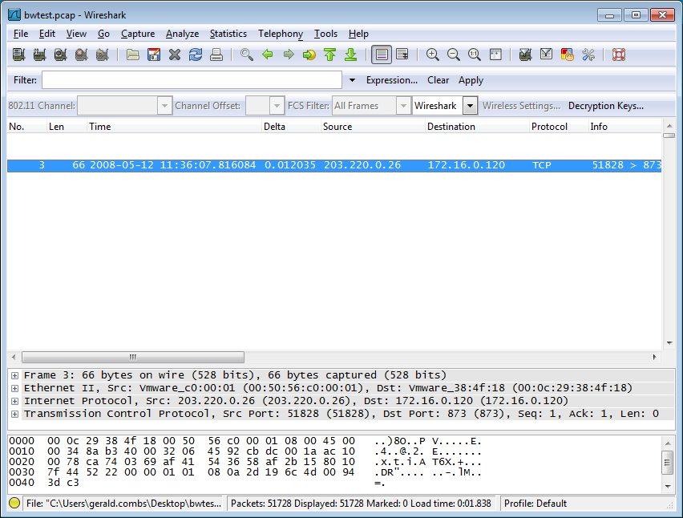

# Practical Jokes

Wireshark has many configuration options, and it can be configured to behave in completely unexpected ways. Assuming you can get access to someone's workstation when they're not looking, the following methods can cause quite a bit of confusion.

## Disappearing Packets

Select *View→Coloring Rules* from the menu and create the following rule:

  - Name: (doesn't matter)
  - Filter string: frame
  - Foreground color: white
  - Background color: white

Make sure the filter is at the very top of the list. You'll end up with a display that looks like this:

The packets disappear because the display filter "frame" matches every packet. Setting the foreground and background to the same color (whether it's white, black, purple, or pink) makes the packet list unreadable.

## Disappearing Protocols

Select *Analyze→Enabled Protocols* from the menu, click *Disable All*, and save. Wireshark will display everything it knows about each packet, but it won't be much:

## Disappearing captures

Open the *View* menu and uncheck *Packet List*, *Packet Details* and *Packet Bytes*. Whenever your target opens a file or starts a capture nothing will show up, except for a count in the statusbar.

## Fun in translation

When you know that people are working on captures files with predictable IP addresses (you know them all, like 192.168.1.x) you can install a hosts file with some fun network name translations. Be sure to enable network name translation in the preferences.

Next time they load up Wireshark to look at the capture from the SuperDandy SIP GW to the SuperDuper SIP phone they see Santa and Rudolph chatting.

---

Imported from https://wiki.wireshark.org/PracticalJokes on 2020-08-11 23:18:17 UTC
