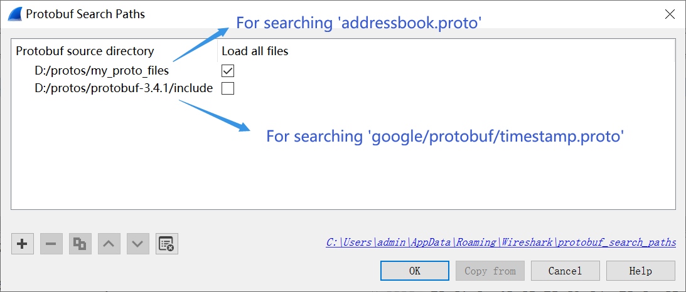
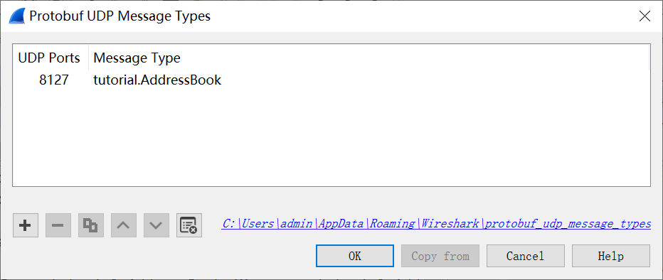
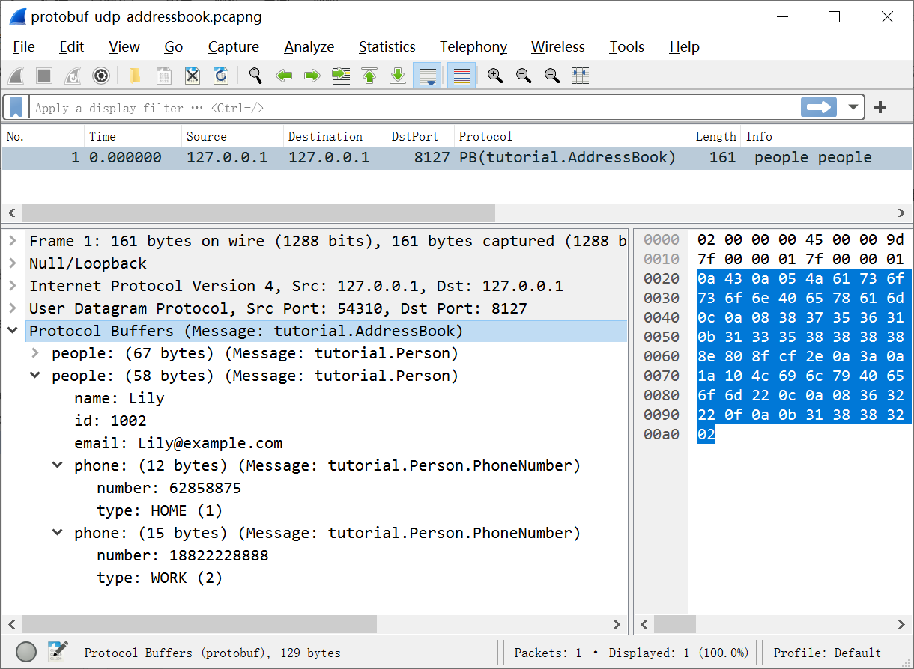
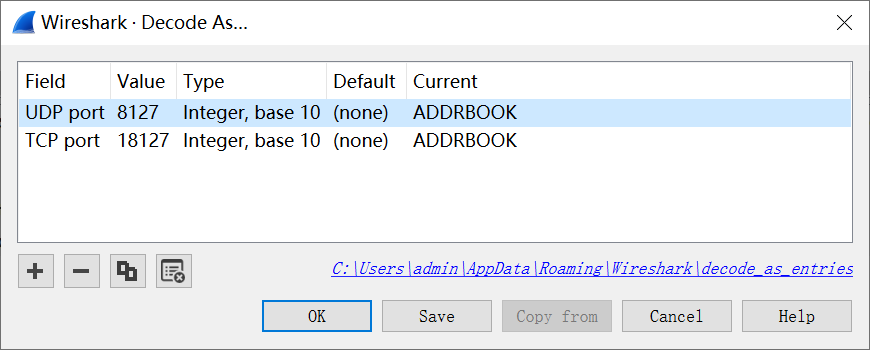
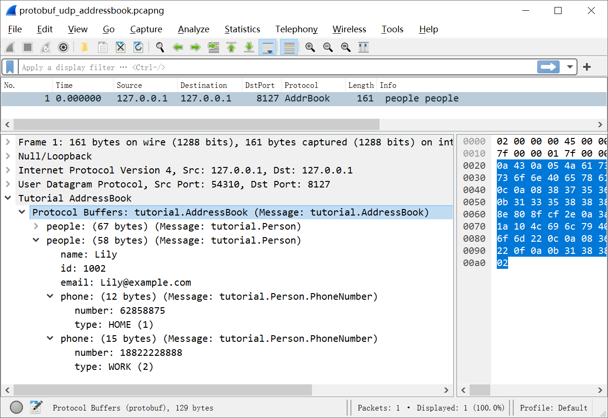
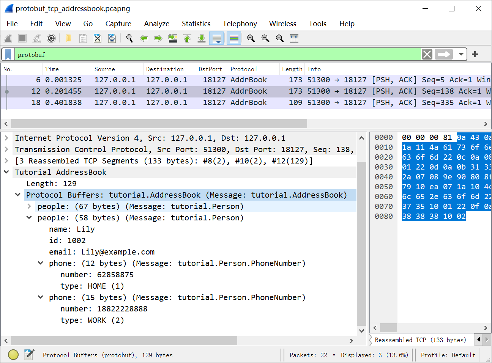
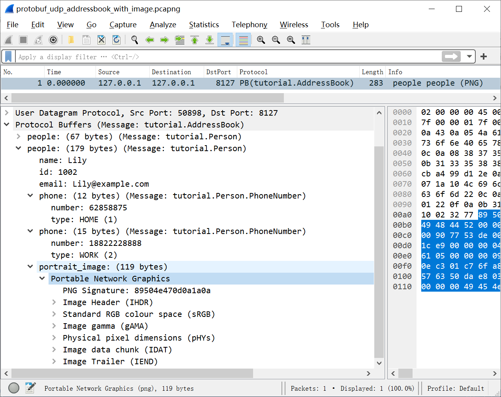
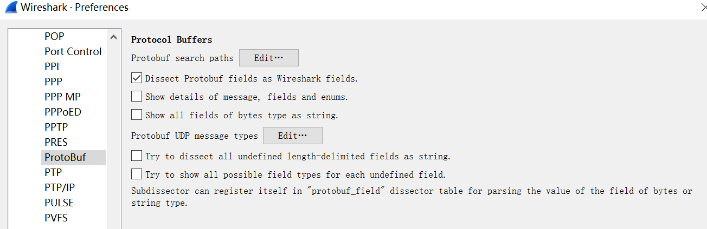
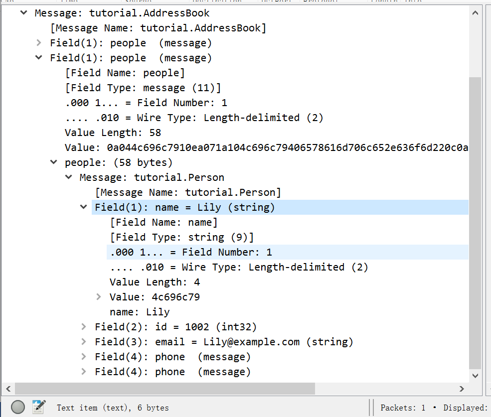

# Protocol Buffers (Protobuf)

Google Protocol Buffers are a language-neutral, platform-neutral extensible mechanism for serializing structured data. For a description of Protobuf refer to [Protocol Buffers home page](https://developers.google.com/protocol-buffers).

Change log about Wireshark supporting Protobuf:
- Wirshark 2.6.0 - initial support.
- Wirshark 3.2.0 - supports *.proto file.
- Wirshark 3.3.0 - supports dissecting Protobuf fields as Wireshark fields and `'protobuf_field'` subdissector table features, fixes bugs about parsing *.proto file.

## Protocol dependencies

Protobuf content is normally dissected by Wireshark from some higher layer dissectors including gRPC or other UDP/TCP based dissectors. You can add Protobuf processing support to your dissector written in C via:

```c++
dissector_handle_t  protobuf_handle = find_dissector("protobuf");
...
call_dissector_with_data(protobuf_handle, tvb, pinfo, tree, "message,tutorial.AddressBook");
```
or dissector written in Lua via:

```lua
local protobuf_dissector = Dissector.get("protobuf")
...
pinfo.private["pb_msg_type"] = "message,tutorial.AddressBook"
pcall(Dissector.call, protobuf_dissector, tvb, pinfo, tree)
```

Higher layer dissectors can give protobuf message type information by the data argument or `private_table["pb_msg_type"]`. The format of message type information is:\
&nbsp;&nbsp;&nbsp;&nbsp;**"message," message_type_name**\
The `message_type_name` is the full name of message type, prefixed by the package name.
When parsing a Protobuf content, the Protobuf dissector will search the message definition file (*.proto) from the *'Protobuf Search Paths'* preferences based on the given `message_type_name`.

## An example about using Protobuf dissector

We use an example to show how to use the protobuf dissector.

### The example of Protobuf message definition file

The binary wire format of Protocol Buffers (Protobuf) messages are not self-described protocol. Wireshark should be configured with Protocol Buffers language files (*.proto) to enable proper dissection of Protobuf data based on the message, enum and field definitions. Wireshark supports *.proto files written in Protocol Buffers language version 2 or 3 syntax.
Following is an example of *.proto file, named `addressbook.proto`:

```protobuf
// This file comes from the official Protobuf example with a little modification.
syntax = "proto3";
package tutorial;
import "google/protobuf/timestamp.proto";

message Person {
  string name = 1;
  int32 id = 2;  // Unique ID number for this person.
  string email = 3;

  enum PhoneType {
    MOBILE = 0;
    HOME = 1;
    WORK = 2;
  }

  message PhoneNumber {
    string number = 1;
    PhoneType type = 2;
  }

  repeated PhoneNumber phone = 4;
  google.protobuf.Timestamp last_updated = 5;
  bytes portrait_image = 6;
}

message AddressBook {
  repeated Person people = 1;
}
```

According to the line `'import "google/protobuf/timestamp.proto"'`, the file `addressbook.proto` depends on the official *.proto library of Protobuf.

### Protobuf Search Paths Settings

You can tell Wireshark where to find *.proto files by setting Protobuf Search Paths at the Protobuf protocol preferences. If the full path of `addressbook.proto` file is `d:/protos/my_proto_files/addressbook.proto` and the real path of the dependent file `"google/protobuf/timestamp.proto"` is `d:/protos/protobuf-3.4.1/include/google/protobuf/timestamp.proto` (in Protobuf official library directory `d:/protos/protobuf-3.4.1/include`). You should add the `d:/protos/protobuf-3.4.1/include/` and `d:/protos/my_proto_files` paths into *'Protobuf Search Paths'* table and make the *'Load all files'* option of the `'d:/protos/my_proto_files'` record enabled for preloading the message definitions from the `addressbook.proto` file:

This preferences dialog can be found by menu 'Edit->Preferences->Protocols->ProtoBuf->Protobuf search paths'.

### Built-in Protobuf UDP dissector

If your protocol is over UDP and the payload of each UDP is a Protobuf message, you can use Wireshark's built-in Protobuf UDP dissector directly. For example, If the payload of UDP on port 8127 is the message type of `'tutorial.AddressBook'` defined in `addressbook.proto` file which can be found in *'Protobuf Search Paths'*, you can add a record about UDP port and message type mapping to the *'Protobuf UDP Message Types'* table in Protobuf preferences:

>Note, The field of 'UDP ports' might be a range, for example, "8127,8200-8300,9127".

Then, you can find the parsed Protobuf details on open the sample capture file [protobuf_udp_addressbook.pcapng](uploads/f41df2a5b4c029020ed83beb8b298644/protobuf_udp_addressbook.pcapng) on the [SampleCaptures page](/SampleCaptures) with Wireshark:


Another way to parse Protobuf UDP packets is to write a simple script with Lua to create a dissector for each root message type, that allows you to use "Decode as..." feature on UDP packets. This method will be introduced in the next section.

### Write your own Protobuf UDP or TCP dissectors

If the root message type of a Protouf UDP and TCP protocol is the `'tutorial.AddressBook'` in `addressbook.proto`, and the whole payload of an UDP package is a `'tutorial.AddressBook'` message, and each message of the protocol over TCP is a `'tutorial.AddressBook'` message prefixed by 4 bytes length in big-endian ([4bytes length][a message][4bytes length][a message]...), then you can put following file named `'create_protobuf_dissector.lua'` in your 'plugins' subdirectory of 'Personal configuration' directory:
```lua
do
    local protobuf_dissector = Dissector.get("protobuf")

    -- Create protobuf dissector based on UDP or TCP.
    -- The UDP dissector will take the whole tvb as a message.
    -- The TCP dissector will parse tvb as format:
    --         [4bytes length][a message][4bytes length][a message]...
    -- @param name  The name of the new dissector.
    -- @param desc  The description of the new dissector.
    -- @param for_udp  Register the new dissector to UDP table.(Enable 'Decode as')
    -- @param for_tcp  Register the new dissector to TCP table.(Enable 'Decode as')
    -- @param msgtype  Message type. This must be the root message defined in your .proto file.
    local function create_protobuf_dissector(name, desc, for_udp, for_tcp, msgtype)
        local proto = Proto(name, desc)
        local f_length = ProtoField.uint32(name .. ".length", "Length", base.DEC)
        proto.fields = { f_length }

        proto.dissector = function(tvb, pinfo, tree)
            local subtree = tree:add(proto, tvb())
            if for_udp and pinfo.port_type == 3 then -- UDP
                if msgtype ~= nil then
                    pinfo.private["pb_msg_type"] = "message," .. msgtype
                end
                pcall(Dissector.call, protobuf_dissector, tvb, pinfo, subtree)
            elseif for_tcp and pinfo.port_type == 2 then -- TCP
                local offset = 0
                local remaining_len = tvb:len()
                while remaining_len > 0 do
                    if remaining_len < 4 then -- head not enough
                        pinfo.desegment_offset = offset
                        pinfo.desegment_len = DESEGMENT_ONE_MORE_SEGMENT
                        return -1
                    end

                    local data_len = tvb(offset, 4):uint()

                    if remaining_len - 4 < data_len then -- data not enough
                        pinfo.desegment_offset = offset
                        pinfo.desegment_len = data_len - (remaining_len - 4)
                        return -1
                    end
                    subtree:add(f_length, tvb(offset, 4))

                    if msgtype ~= nil then
                        pinfo.private["pb_msg_type"] = "message," .. msgtype
                    end
                    pcall(Dissector.call, protobuf_dissector, 
                           tvb(offset + 4, data_len):tvb(), pinfo, subtree)

                    offset = offset + 4 + data_len
                    remaining_len = remaining_len - 4 - data_len
                end
            end
            pinfo.columns.protocol:set(name)
        end

        if for_udp then DissectorTable.get("udp.port"):add(0, proto) end
        if for_tcp then DissectorTable.get("tcp.port"):add(0, proto) end
        return proto
    end

    -- default pure protobuf udp and tcp dissector without message type
    create_protobuf_dissector("protobuf_udp", "Protobuf UDP")
    create_protobuf_dissector("protobuf_tcp", "Protobuf TCP")
    -- add more protobuf dissectors with message types
    create_protobuf_dissector("AddrBook", "Tutorial AddressBook",
                              true, true, "tutorial.AddressBook")
end
```

>Note, You can find the 'Personal configuration' directory from your Wireshark 'About' dialog by menu 'About->Folders->Personal configuration'.

Now you can clear the *'Protobuf UDP Message Types'* table in Protobuf preferences, and then reopen the [protobuf_udp_addressbook.pcapng](uploads/f41df2a5b4c029020ed83beb8b298644/protobuf_udp_addressbook.pcapng) file, and click the 'Decode As' menu to select the ADDRBOOK protocol:


The UDP packet will be parsed as the AddrBook protocol which takes the Protobuf `'tutorial.AddressBook'` message as the root message:


To test the Protobuf TCP dissector, you can open the [protobuf_ tcp_ addressbook.pcapng](uploads/b5e241ea7007912e14a37b2949a02768/protobuf_tcp_addressbook.pcapng) on the [SampleCaptures page](/SampleCaptures) and click the 'Decode As' menu to select the ADDRBOOK protocol (on 18127 TCP port). The 4 bytes length field and the AddressBook message will be dissected like:


If you have a new Protobuf TCP dissector using root message type like 'package.NewMessage', and each message is also prefixed by 4 bytes length field, you can just add following line to 
'create_protobuf_dissector.lua' file:
```lua
    create_protobuf_dissector("NewProtocolName", "New Protocol Name",
                              true, true, "package.NewMessage")
```

### Protobuf field subdissectors

A subdissector can register itself in `"protobuf_field"` dissector table for parsing the value of the field of bytes or string type. The key of record in `"protobuf_field"` table is the full name of the field.

For example, there is a bytes type field for carrying a portrait image in Person message type of `addressbook.proto`. We can put following Lua script `'protobuf_portrait_field.lua'` into the 'plugins' subdirectory of 'Personal configuration' directory:

```lua
do
    local protobuf_field_table = DissectorTable.get("protobuf_field")
    local png_dissector = Dissector.get("png")
    protobuf_field_table:add("tutorial.Person.portrait_image", png_dissector)
end
```

Then, open the sample capture file [protobuf_udp_addressbook_with_image.pcapng](uploads/bcb1665b9647314b5fbdbdbe1f068a6c/protobuf_udp_addressbook_with_image.pcapng) on the [SampleCaptures page](/SampleCaptures), and you will find that the 'portait_image' Protobuf field is dissected as PNG image data:


### Preference Settings

The *'Protobuf Search Paths'* and *'Protobuf UDP Message Types'* tables are introduced in previous sections, there are some other preferences:


- Dissect Protobuf fields as Wireshark fields:

If this option is turnned on, the Protobuf messages and fields will be dissected as Wireshark  fields . The names of all these Wireshark fields will be prefixed with "pbf." (for fields) or "pbm." (for messages) followed by their full names. For example, you can input 'pbf.tutorial.Person.name == "Lily"' as a display filter to search protobuf message including persons who named "Lily" in capture files mentioned in previous sections.

- Show details of message, fields and enums:

If this option is turnned on, the details of messages and fields will be shown, that includes the wire type and field number format of field, value nodes of field and enum_value, etc. It is recommended to turn it off because too many details are displayed that might bother you.


- Show all fields of bytes type as string:

Show all fields of bytes type as string. For example, ETCD string is defined as type of bytes, we can turn this option on to check the string content of these kind of fields.

- Try to dissect all undefined length-delimited fields as string:
- Try to show all possible field types for each undefined field:

These two options are only used when the message type or field definitions cannot be found in the *'Protobuf Search Paths'*. It is recommended to turn them off by default.

## Example capture file

- [protobuf_udp_addressbook.pcapng](uploads/f41df2a5b4c029020ed83beb8b298644/protobuf_udp_addressbook.pcapng) Protobuf UDP example.
- [protobuf_tcp_addressbook.pcapng](uploads/b5e241ea7007912e14a37b2949a02768/protobuf_tcp_addressbook.pcapng) Protobuf TCP example. (prefixed by 4 bytes length field)
- [protobuf_udp_addressbook_with_image.pcapng](uploads/bcb1665b9647314b5fbdbdbe1f068a6c/protobuf_udp_addressbook_with_image.pcapng) Protobuf UDP example with image field.
