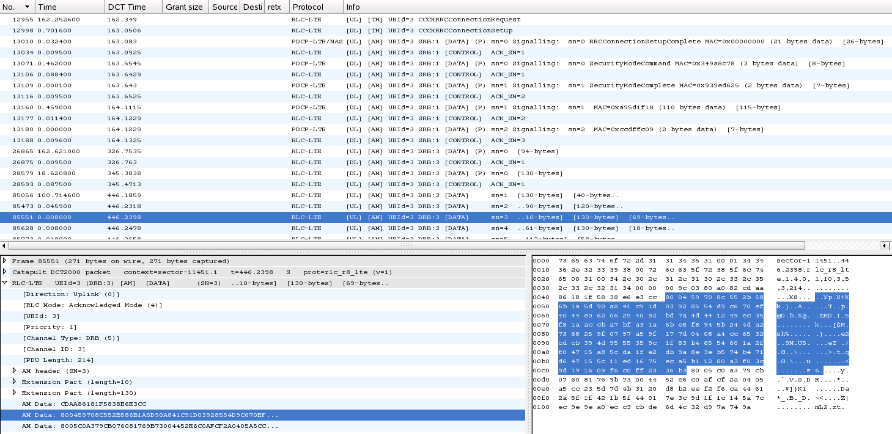
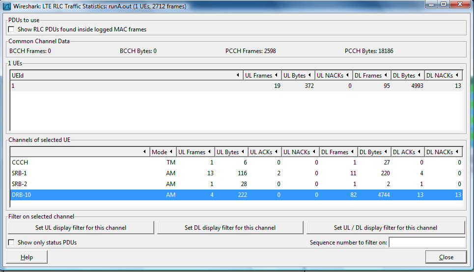
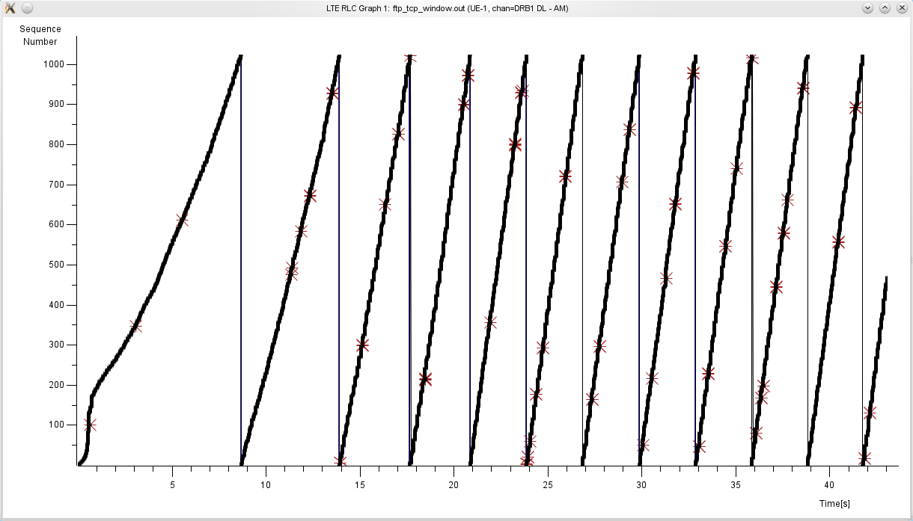

# Radio Link Control (RLC) for LTE

This protocol sits between the MAC and PDCP layers in the LTE air interface (connecting an LTE UE with an eNodeB).

## Protocol dependencies

The [MAC-LTE](/MAC-LTE) dissector can call the RLC-LTE dissector for srb1 and srb2 (since it is known that these should be AM). For signalling PDUs, the RLC-LTE dissector can call [PDCP-LTE](/PDCP-LTE) for SRB channels, or [LTE\_RRC](/LTE_RRC) for CCCH channels. This is controlled by preferences (see below).

A UDP framing format for RLC-LTE has been defined (described in [packet-rlc-lte.h](https://gitlab.com/wireshark/wireshark/-/blob/master/epan/dissectors/packet-rlc-lte.h), purely for use with Wireshark)

## Example traffic



## Wireshark

The RLC-LTE dissector is fully functional. There is support for reading RLC-LTE frames from:

  - [DCT2000](/DCT2000) log files, or

  - using the UDP format defined in [packet-rlc-lte.h](https://gitlab.com/wireshark/wireshark/-/blob/master/epan/dissectors/packet-rlc-lte.h). This (BSD-licensed) [program](https://gitlab.com/martin.r.mathieson/uu-logging-for-wireshark/-/blob/master/rlc_lte_logger.c) gives an example of how you might send RLC-LTE frames in this format.

There is an LTE RLC stats window, available from the Telephony menu. This can be useful for finding channels where problems are happening, and setting appropriate display filters.

The same statistics are available from tshark, using the option -zrlc-lte,stats



Also available from the Telephony menu is an RLC Time/Sequence graph.



## Preference Settings

  - Do sequence analysis for AM channels. Can be done for either standalone RLC frames, or those found inside MAC frames. Default is OFF.
  - Do sequence analysis for UM channels. Can be done for either standalone RLC frames, or those found inside MAC frames. Default is OFF.
  - Call PDCP dissector for SRB PDUs. Default is OFF.
  - Call RRC dissector for CCCH PDUs. Default is OFF.
  - Try heuristic LTE-RLC framing over UDP. Default is OFF. Starting from Wireshark 2.0, heuristic activation is moved to Enabled Protocols window.
  - May see RLC headers only. Default is OFF.
  - Attempt SDU reassembly. Default if OFF. Will not currently work with out-of-order PDUs or resegmentation.

## Example capture file

XXX - Add a simple example capture file to the [SampleCaptures](/SampleCaptures) page and link from here (see below). Keep this file short, it's also a good idea to gzip it to make it even smaller, as Wireshark can open gzipped files automatically.

  - [SampleCaptures/PROTO.pcap](uploads/__moin_import__/attachments/SampleCaptures/PROTO.pcap)

## Display Filter

A complete list of RLC-LTE display filter fields can be found in the [display filter reference](http://www.wireshark.org/docs/dfref/r/rlc-lte.html)

Show only the RLC-LTE based traffic:

``` 
 rlc-lte 
```

## Capture Filter

You cannot directly filter RLC-LTE protocols while capturing.

## External links

  - [3GPP TS 36.322](http://www.3gpp.org/ftp/Specs/html-info/36322.htm) Evolved Universal Terrestrial Radio Access (E-UTRA) Radio Link Control (RLC) protocol specification

  - [Example program](https://gitlab.com/martin.r.mathieson/uu-logging-for-wireshark/-/blob/master/rlc_lte_logger.c) that generates and sends frames using the supported UDP framing format

## Discussion

It is recommended that you use current sources or a recent automated build for this and other LTE dissectors.

---

Imported from https://wiki.wireshark.org/RLC-LTE on 2020-08-11 23:23:59 UTC
