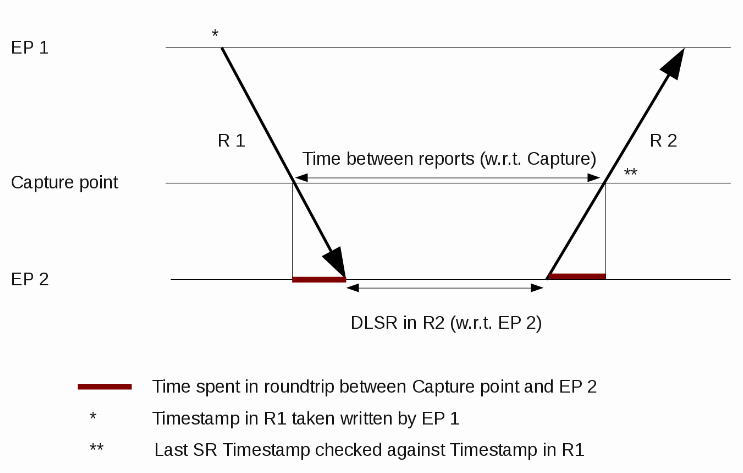

# Real-time Control Protocol (RTCP)

RTCP is used together with [RTP](/RTP) e.g. for VoIP (see also [VOIPProtocolFamily](/VOIPProtocolFamily)).

## History

RTCP was first specified in [RFC1889](http://www.ietf.org/rfc/rfc1889.txt) which is obsoleted by [RFC3550](http://www.ietf.org/rfc/rfc3550.txt).

## Protocol dependencies

  - [UDP](/UDP): Typically, RTCP uses [UDP](/UDP) as its transport protocol. RTCP does not have a well known UDP port. Instead, the ports are allocated dynamically and then signaled using a different protocol such as [SDP](/SDP) and [H245](/H245).

## Example traffic

    Real-time Transport Control Protocol (Sender Report)
        [Stream setup by H245 (frame 51)]
            [Setup frame: 51]
            [Setup Method: H245]
        10.. .... = Version: RFC 1889 Version (2)
        ..0. .... = Padding: False
        ...0 0001 = Reception report count: 1
        Packet type: Sender Report (200)
        Length: 12 (52 bytes)
        Sender SSRC: 0xbcdc0094 (3168534676)
        Timestamp, MSW: 11 (0x0000000b)
        Timestamp, LSW: 22544384 (0x01580000)
        [MSW and LSW as NTP timestamp: Feb  7, 2036 06:28:27,0052 UTC]
        RTP timestamp: 49823528
        Sender's packet count: 166
        Sender's octet count: 9960
        Source 1
            Identifier: 0xf5e33db0 (4125310384)
            SSRC contents
                Fraction lost: 0 / 256
                Cumulative number of packets lost: 0
            Extended highest sequence number received: 28620
                Sequence number cycles count: 0
                Highest sequence number received: 28620
            Interarrival jitter: 0
            Last SR timestamp: 0 (0x00000000)
            Delay since last SR timestamp: 0 (0 milliseconds)
    Real-time Transport Control Protocol (Source description)
        [Stream setup by H245 (frame 51)]
            [Setup frame: 51]
            [Setup Method: H245]
        10.. .... = Version: RFC 1889 Version (2)
        ..0. .... = Padding: False
        ...0 0001 = Source count: 1
        Packet type: Source description (202)
        Length: 11 (48 bytes)
        Chunk 1, SSRC/CSRC 0xBCDC0094
            Identifier: 0xbcdc0094 (3168534676)
            SDES items
                Type: CNAME (user and domain) (1)
                Length: 14
                Text: IP200A@0.0.0.0
                Type: NAME (common name) (2)
                Length: 6
                Text: IP200A
                Type: TOOL (name/version of source app) (6)
                Length: 11
                Text: innovaphone
                Type: END (0)
    [RTCP frame length check: OK - 100 bytes]

## Wireshark

The RTCP dissector is fully functional.

## Preference Settings

There are four preference settings affecting RTCP.

\* Show stream setup information. Default ON.

\* Try to decode RTCP outside of conversations. default OFF,

\* Show relative roundtrip calculation. Default OFF.

\* Minimum roundtrip calculations to report(ms). Default is 10

## Example capture file

[SampleCaptures/rtp\_example.raw.gz](uploads/__moin_import__/attachments/SampleCaptures/rtp_example.raw.gz) (libpcap) A VoIP sample capture of a [H323](/H323) call (including [H225](/H225), [H245](/H245), [RTP](/RTP) and RTCP).

## Display Filter

A complete list of RTCP display filter fields can be found in the [display filter reference](http://www.wireshark.org/docs/dfref/r/rtcp.html)

Show only the RTCP based traffic:

``` 
 rtcp 
```

## Capture Filter

You cannot directly filter RTCP protocols while capturing. However, if you know the [UDP](/UDP) port used (see above), you can filter on that one.

## Calculation of Roundtrip Delay

The RTCP dissector can do this calculation (see preference settings above) which is described in 6.4.1 of RFC3550. Here is a diagram explaining how this calculation is performed.



## Mathematical background

Mathematical background could be read in section I. and II.A) in paper [Optimization of Large-Scale RTCP Feedback Reporting in Fixed and Mobile Networks](https://www.researchgate.net/profile/Dan_Komosny/publication/224690674_Optimization_of_Large-Scale_RTCP_Feedback_Reporting_in_Fixed_and_Mobile_Networks/links/02e7e533957301b676000000/Optimization-of-Large-Scale-RTCP-Feedback-Reporting-in-Fixed-and-Mobile-Networks.pdf)

## Further research and development of RTCP

  - [Realtime control protocol and its improvements for Internet Protocol Television](https://www.researchgate.net/publication/292746893_Real-time_control_protocol_and_its_improvements_for_internet_protocol_television)

  - [Optimization of Large-Scale RTCP Feedback Reporting in Fixed and Mobile Networks](https://www.researchgate.net/profile/Dan_Komosny/publication/224690674_Optimization_of_Large-Scale_RTCP_Feedback_Reporting_in_Fixed_and_Mobile_Networks/links/02e7e533957301b676000000/Optimization-of-Large-Scale-RTCP-Feedback-Reporting-in-Fixed-and-Mobile-Networks.pdf)

  - [Dan Komosny publications](https://www.researchgate.net/profile/Dan_Komosny)

## External links

  - [RFC3550](http://www.ietf.org/rfc/rfc3550.txt) *RTP: A Transport Protocol for Real-Time Applications* also describes RTCP

  - [RFC3611](http://www.ietf.org/rfc/rfc3611.txt) *RTP Control Protocol Extended Reports (RTCP XR)*

  - [RFC1890](http://www.ietf.org/rfc/rfc1890.txt) *RTP Profile for Audio and Video Conferences with Minimal Control*

  - <http://www.ietf.org/internet-drafts/draft-ietf-avt-rtcpssm-13.txt> *RTCP Extensions for Single-Source Multicast Sessions with Unicast Feedback*

  - [PoC User Plane](http://www.openmobilealliance.org/release_program/docs/CopyrightClick.asp?pck=PoC&file=V1_0-20060609-A/OMA-TS-PoC-UserPlane-V1_0-20060609-A.pdf) *Talk Burst Control Protocol*

## Discussion

I hope this is this an appropriate place to discuss possible enhancements to the Wireshark RTCP parser.

  - RTCP supports multiple reports in a single UDP packet (a compound packet). The parser currently seems to only display/analyze the first packet.
    
      - *.... This isn't true (see e.g. the sample SIP\_CALL\_RTP\_G711 on this wiki - it contains a single RTCP packet with 3 reports). Do you have a compound packet example that doesn't parse properly? (martinm)*
    
      - ... Ahh, your right, I found one that parsed multiple sub-packets as well. Perhaps the case I'm seeing is related to the encryption situation below. How would I best provide an example? ([BurtHarris](/BurtHarris))
    
      - \- You could mail it to the developers list, or create a bug and attach it. The other reason for the dissector not parsing all of the reports is if it detects a length discrepency - in this case the problem should be clearly reported though.

  - RTCP & [SRTP](http://tools.ietf.org/html/rfc3711#section-1) (RFC 3711) can be used together, producing SRTCP. The current parser is unaware of the additional , fields in SRTCP, and may, if encryption is enabled, display meaningless values.
    
    SRT(C)P handling was recently added to both dissectors. ([JaapKeuter](/JaapKeuter))

---

Imported from https://wiki.wireshark.org/RTCP on 2020-08-11 23:24:09 UTC
