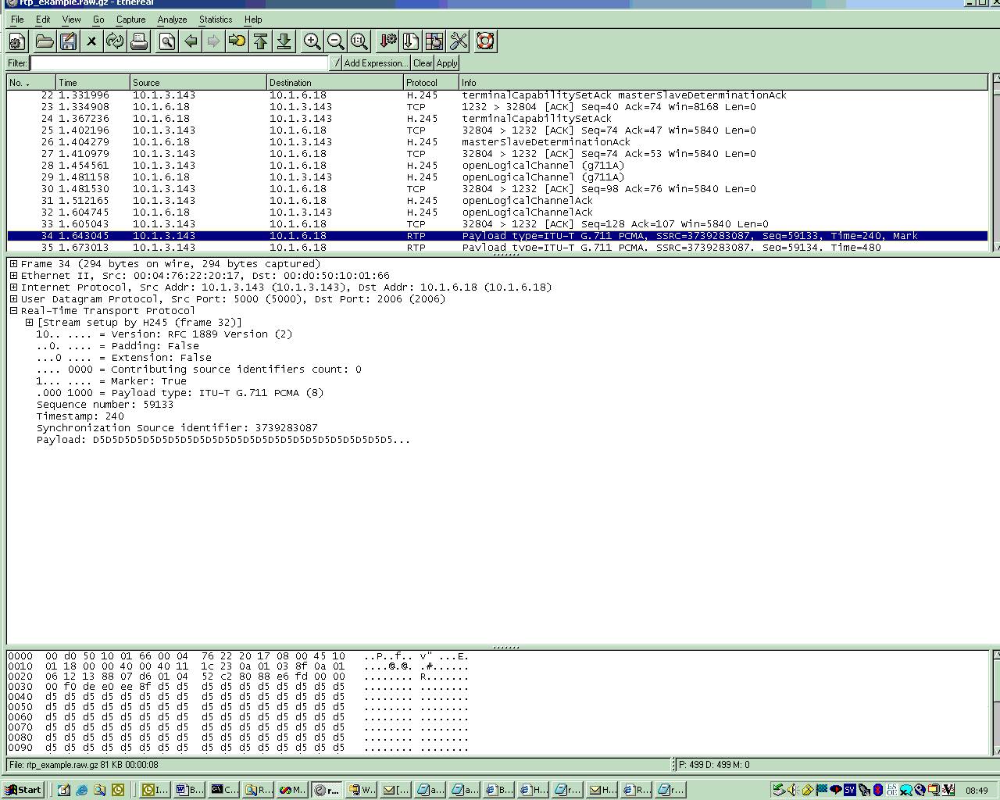

# Real-time Transport Protocol (RTP)

RTP, the real-time transport protocol. RTP provides end-to-end network transport functions suitable for applications transmitting real-time data, such as audio, video or simulation data, over multicast or unicast network services. RTP does not address resource reservation and does not guarantee quality-of-service for real-time services. The data transport is augmented by a control protocol (RTCP) to allow monitoring of the data delivery in a manner scalable to large multicast networks, and to provide minimal control and identification functionality. RTP and RTCP are designed to be independent of the underlying transport and network layers. The protocol supports the use of RTP-level translators and mixers.

## History

The current RTP RFC is 3550, dated July 2003. This obsoleted RFC 1889.

## Protocol dependencies

- [UDP](/UDP): Typically, RTP uses [UDP](/UDP) as its transport protocol. RTP does not have a well known UDP port (although the [IETF](/IETF) recommend ports 6970 to 6999). Instead, the ports are allocated dynamically and then signalled using a different protocol such as [SIP](/SIP) or [H245](/H245). In [SIP](/SIP) and other protocols a RTP session is described by [SDP](/SDP) (Session Description Protocol), which is not really a protocol itself but rather a formalised way to describe a media session.

## Example traffic

Screen shot of a RTP frame from [SampleCaptures](/SampleCaptures) file: rtp_example.raw.gz



## Wireshark

The RTP dissector is functional. There are detailed [RTP_statistics](/RTP_statistics) available.

## Preference Settings

- Show stream setup information. Default ON
- Treat RTP version 0 packets as (Invalid RTP or ZRTP packets | STUN packets | T.38 packets). Default Invalid RTP or ZRTP packets
- Payload type for RFC 2198 (Redundant Audio Data). Default 99
- Try to decode RTP outside of conversations, i.e. heuristic dissection. Default OFF (set this preference in "Analyze -\> Enabled Protocols" - [explanation](https://ask.wireshark.org/question/20159/how-wireshark-decodes-rtp-packets-from-udp/#:\~:text=Analyze%20%2D%3E%20Enabled%20Protocols) [moved](https://ask.wireshark.org/question/25010/there-used-to-be-an-option-to-enable-heuristic-detection-for-dnp3-packets-it-seems-to-be-missing-as-of-349-has-it-been-removed/#:\~:text=Analyze%20%2D%3E%20Enabled%20Protocols%20dialog))

## Example capture file

A VoIP sample capture of a [H323](/H323) call (including [H225](/H225), [H245](/H245), [RTP](/RTP) and [RTCP](/RTCP)): [SampleCaptures/rtp_example.raw.gz](uploads/__moin_import__/attachments/SampleCaptures/rtp_example.raw.gz)

## Display Filter

A complete list of RTP display filter fields can be found in the [display filter reference](http://www.wireshark.org/docs/dfref/r/rtp.html)

Show only the RTP based traffic:

```plaintext
 rtp 
```

## Capture Filter

You cannot directly filter RTP protocols while capturing. However, if you know the [UDP](/UDP) port used (see above), you can filter on that one.

## Extracting Sound files

You can extract sound files. See [RTP_statistics](/RTP_statistics)

## External links

- [RFC3550](http://www.ietf.org/rfc/rfc3550.txt) _RTP: A Transport Protocol for Real-Time Applications_
- [RFC3551](http://www.ietf.org/rfc/rfc3551.txt) _RTP Profile for Audio and Video Conferences with Minimal Control_
- [IANA rtp-parameters](http://www.iana.org/assignments/rtp-parameters) _IANA regestry of rtp-parameters_
- http://www.cs.columbia.edu/\\\~hgs/rtp/faq.html _Some Frequently Asked Questions about RTP, Columbia University_

## Discussion

---

Imported from https://wiki.wireshark.org/RTP on 2020-08-11 23:24:11 UTC
