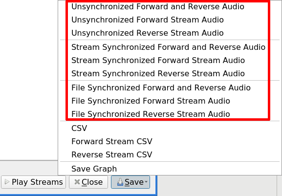
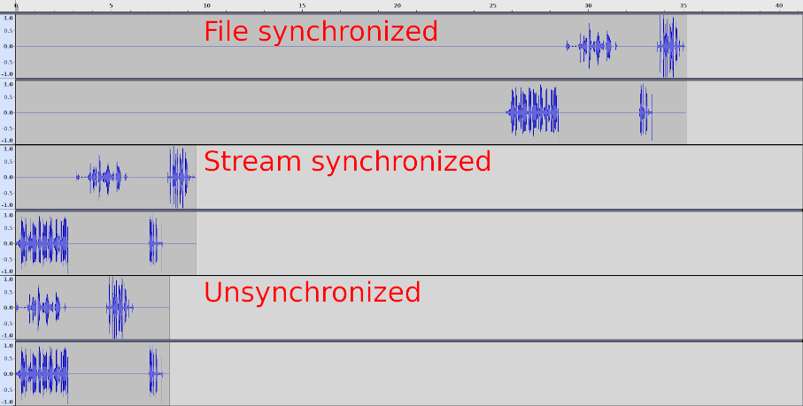
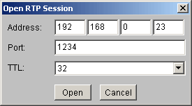
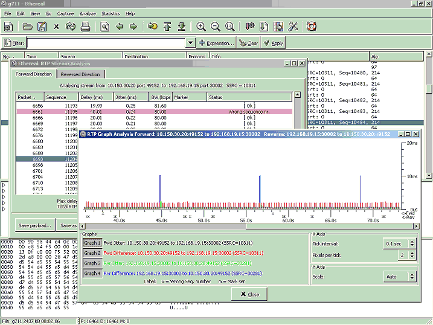

# RTP statistics

## Saving RTP audio streams

### Supported codecs with 8000 Hz sample rate

You can save the content of an [RTP](/RTP) audio stream to an [Au-file](http://en.wikipedia.org/wiki/Au_file_format) directly from Wireshark. This is done from the "RTP Stream Analysis" dialog by pressing the "Save" button and select one of '... Audio' options, then select 'Sun Audio' file format.



When one RTP stream is selected, a mono audio file is produced. When two RTP streams are selected, a stereo audio file is produced.

An RTP stream can begin at the start of a packet capture, but usually it begins later, e.g. after call signalling. The forward and reverse streams can start at different times for the same reason. When two RTP streams are saved, you can select three options for way in which the audio streams in the capture are written as audio streams in the file:

  - File synchronized - the saved audio starts at the beginning of the capture; both streams are prepended with silence to start them at the beginning of the capture. The second stream is delayed to maintain the correct time relationship to the first one, so the two streams are synchronized.
  - Stream synchronized - the saved audio starts at the beginning of the first stream. The first stream starts at the beginning of the audio file; the second stream is delayed to maintain correct the time relationship to the first one, so the two streams are synchronized.
  - Unsynchronized - both streams start at the beginning of the audio file, and the time relationship between the two streams is destroyed.



Note: Waves were collected with audacity and combined with gimp.

Wireshark prior 3.2.0 is able to save audio for G.711 codec only. Wireshark 3.2.0 and later is able to save audio for any supported codec with 8000 Hz sample rate.

In addition, from Wireshark 0.99.4 onwards, it is possible to listen to RTP streams from within Wireshark. See [VoIP\_calls](/VoIP_calls).

### Other codec types

It is possible to save in [rtpdump](/rtpdump) format for any codec (both audio and video) and use e.g. rtplay program from [rtptools](http://www.cs.columbia.edu/IRT/software/rtptools/) to replay the RTP stream towards [JMF JMstudio](http://java.sun.com/products/java-media/jmf/), Apple [QuickTime](/QuickTime) player and similar if they support the codec. But unfortunately there is no support for G.729 in those programs (maybe due to high license fees for G.729).

Here is a small example:

  - Install JMF (JMstudio is included)

  - Download rtptools

  - Open the RTP capture file with Wireshark

  - Select the proper UDP and force its decoding as RTP: Menu Analyze \>\> Decode As... RTP.

  - Menu Statistics(Wireshark 1.0) or Telephony \>\> RTP \>\> Show all streams. Select the one of your interest, and press button Save, select one of '... Audio' options for single (forward or reverse) stream and then select 'Raw' formatted file.

  - Start JMstudio

  - Menu File \>\> Open RTP Session and insert your local IP address (it didn't work with 127.0.0.1 for me) like this:
    
    

  - Press button "Open" - now JMstudio waits for the stream

  - Open a terminal and type:

<!-- end list -->

``` 
  user@host$ rtpplay -T -f /path/to/your/captured.rtpdump 192.168.0.23/1234
```

You should now hear what you've captured. **Note:**JMstudio does not support <span class="u">every</span> codec, but some commonly used for RTP (worked perfect for me to listen to a captured kphone-session using GSM as codec).

#### G.729

The ITU-T includes software routines to convert PCM audio (*G.729 bitstream format*) to and from PCM. If you buy such software package you can compile the decoder to extract the PCM audio from G.729 *bitstream*. This *G.729AB bitstream* is rather cumbersome (G.729AB packets are composed of several voice or silence chunks; in the ITU-T routines each chunk is identified by a leading sync pattern; further more, each bit in the payload must be coded as a 16-bit long word), so a modified version of [rtpdump](/rtpdump) is required to extract *G.729AB bitstream* from the rtpdump file from Wireshark; download the sources of the version 1.18 of [rtpdump](/rtpdump), apply the patch [rtpdump.c.1.18.patch](uploads/__moin_import__/attachments/RTP_statistics/rtpdump.c.1.18.patch), compile and follow these steps:

  - Open the RTP capture file with Wireshark

  - Select the proper UDP and force its decoding as RTP: Menu Analyze \>\> Decode As... RTP.

  - Filter the G.729AB payload with display filter rtp.p\_type==18.

  - Menu Statistics(Wireshark 1.0) or Telephony \>\> RTP \>\> Show all streams. Select the one with G.729 of your interest, and press button Save, select one of '... Audio' options for single (forward or reverse) stream and then select 'Raw' formatted file.

  - rtpdump -F itut -f file.rtpdump -o file.rtp

  - decoder file.rtp file.pcm

  - Import the file.pcm in Goldwave or Audacity (for example) as 16 bit signed mono, sampling ratio of 8000 Hz.

The flag "itut" for rtpdump is new to allow the decoding of rtpdump in ITU-T G.729AB format described above.

#### G.723.1

Once again the ITU-T includes software routines to convert between PCM audio and G.723.1 format. Fortunately the bitstream format expected by the ITU-T software routine "lbccodec" is simpler than in the case of G.729AB above, so the rtpdump program can be used as is with flag "payload":

  - Open the capture file with Wireshark.

  - Menu Analyze \>\> Decode As... RTP.

  - Filter the G.723.1 payload with display filter rtp.p\_type==8.

  - Menu Statistics(Wireshark 1.0) or Telephony \>\> RTP \>\> Show all streams. Select the one with G.723.1 of your interest, and press button Save, select one of '... Audio' options for single (forward or reverse) stream and then select 'Raw' formatted file.

  - rtpdump -F payload -f file.rtpdump -o file.rtp

  - lbccodec -d file.rtp file.pcm

  - Import the file.pcm in Goldwave as 16 bit signed mono, sampling ratio of 8000 Hz:

You can save an RTP stream in rtpdump format from the "RTP streams" dialog by selecting the stream and pressing the "Save As "button.

## RTP stream analysis

If you want to analyze an [RTP](/RTP) stream, there are two ways to select the one to analyze:

  - use the menu entry Statistics(Wireshark 1.0) or Telephony \>\> RTP \>\> Show All Streams... and select a stream in the upcoming "RTP Streams" dialog

  - select an RTP packet in the Packet List Pane and use Statistics(Wireshark 1.0) or Telephony \>\> RTP \>\> Stream Analysis...

... both ways will lead to the same "RTP Stream Analysis" dialog.

You can get the delay, jitter, bandwidth, etc. of that RTP stream. Also get general statistics like [packet loss](/PacketLoss), maximum delay and sequence errors. Use the "Graph" button to see the jitter and difference between packets over time.



### How jitter is calculated

Wireshark calculates jitter according to [RFC3550 (RTP)](http://tools.ietf.org/rfcmarkup?rfc=3550&draft=&url=#section-6.4.1):

If Si is the RTP timestamp from packet i, and Ri is the time of arrival in RTP timestamp units for packet i, then for two packets i and j, D may be expressed as

D(i,j) = (Rj - Ri) - (Sj - Si) = (Rj - Sj) - (Ri - Si)

The interarrival jitter SHOULD be calculated continuously as each data packet i is received from source SSRC\_n, using this difference D for that packet and the previous packet i-1 in order of arrival (not necessarily in sequence), according to the formula

J(i) = J(i-1) + (|D(i-1,i)| - J(i-1))/16

**RTP timestamp:** RTP timestamp is based on the sampling frequency of the codec, 8000 in most audio codecs and 90000 in most video codecs. As the sampling frequency must be known to correctly calculate jitter it is problematic to do jitter calculations for dynamic payload types as the codec and it's sampling frequency must be known which implies that the setup information for the session must be in the trace and the codec used must be known to the program(with the current implementation).

Developers with time to spend could change the current implementation to also record the sampling frequency in the SDP data and add that to the RTP conversation data and use that in the RTP analysis.

**Example:**

[http://wiki.wireshark.org/SampleCaptures\#head-6f6128a524888c86ee322aa7cbf0d7b7a8fdf353](/SampleCaptures#head-6f6128a524888c86ee322aa7cbf0d7b7a8fdf353) file: aaa.pcap, stream: SSRC = 932629361

This is what we have in the packets and what we will use in the formula:

R0 = frame 624: frame.time = Jul 4, 2005 11:56:25.348411000

S0 = frame 624: rtp.timestamp = 1240

R1 = frame 625: frame.time = Jul 4, 2005 11:56:25.418358000

S1 = frame 625: rtp.timestamp = 1400

R2 = frame 626: frame.time = Jul 4, 2005 11:56:25.421891000

S2 = frame 626: rtp.timestamp = 1560

we also have rtp.p\_type = ITU-T G.711 PCMA (8) and thus we know sampling clock is 8000Hz and thus the unit of rtp.timestamp is 1/8000 sec = 0.000125 sec .

Now the calculation:

frame 624:

J(0) = 0

frame 625:

D(0,1) = (R1 - R0) - (S1 - S0)

\= \[in seconds\] (.418358000 sec - .348411000 sec) - (1400 \* 0.000125 sec - 1240 \* 0.000125 sec) = 0.049947

J(1) = J(0) + (|D(0,1)| - J(0))/16

\= \[in seconds\] 0 + (|0.049947| - 0)/16 = 0.0031216875

frame 626:

D(1,2) = (R2 - R1) - (S2 - S1)

\= \[in seconds\] (.421891000 sec - .418358000 sec) - (1560 \* 0.000125 sec - 1400 \* 0.000125 sec) = -0.016467

J(2) = J(1) + (|D(1,2)| - J(1))/16

\= \[in seconds\] 0.0031216875 + (|-0.016467| - 0.0031216875)/16 = 0.00395576953125

### How bandwidth (BW) is calculated

The BW column in RTP Streams and RTP Statistics dialogs shows the bandwidth at IP level for the given RTP stream. It is the sum of all octets, including IP and UDP headers (20+8 bytes), from all the packets of the given RTP stream over the last second.

For more details, see the function *rtp\_packet\_analyse* in file [tap-rtp-common.c](http://anonsvn.wireshark.org/viewvc/trunk/tap-rtp-common.c?view=markup).

---

Imported from https://wiki.wireshark.org/RTP_statistics on 2020-08-11 23:24:14 UTC
