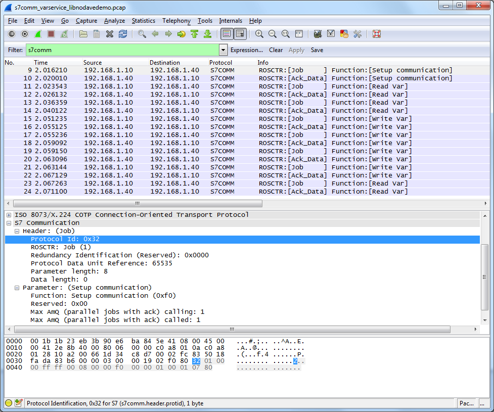

# S7 Communication (S7comm)

S7comm (S7 Communication) is a Siemens proprietary protocol that runs between programmable logic controllers (PLCs) of the Siemens S7-300/400 family.

It is used for PLC programming, exchanging data between PLCs, accessing PLC data from SCADA (supervisory control and data acquisition) systems and diagnostic purposes.

The S7comm data comes as payload of COTP data packets. The first byte is always 0x32 as protocol identifier. Special communication processors for the S7-400 series (CP 443) may use this protocol without the TCP/IP layers.

<div>

<table>
<tbody>
<tr class="odd">
<td></td>
<td><p><strong>OSI layer</strong></p></td>
<td><p><strong>Protocol</strong></p></td>
</tr>
<tr class="even">
<td><p>7</p></td>
<td><p>Application Layer</p></td>
<td><p>S7 communication</p></td>
</tr>
<tr class="odd">
<td><p>6</p></td>
<td><p>Presentation Layer</p></td>
<td><p>S7 communication</p></td>
</tr>
<tr class="even">
<td><p>5</p></td>
<td><p>Session Layer</p></td>
<td><p>S7 communication</p></td>
</tr>
<tr class="odd">
<td><p>4</p></td>
<td><p>Transport Layer</p></td>
<td><p>ISO-on-TCP (RFC 1006)</p></td>
</tr>
<tr class="even">
<td><p>3</p></td>
<td><p>Network Layer</p></td>
<td><p>IP</p></td>
</tr>
<tr class="odd">
<td><p>2</p></td>
<td><p>Data Link Layer</p></td>
<td><p>Ethernet</p></td>
</tr>
<tr class="even">
<td><p>1</p></td>
<td><p>Physical Layer</p></td>
<td><p>Ethernet</p></td>
</tr>
</tbody>
</table>

</div>

To establish a connection to a S7 PLC there are 3 steps:

1.  Connect to PLC on TCP port 102
2.  Connect on ISO layer (COTP Connect Request)
3.  Connect on S7comm layer (s7comm.param.func = 0xf0, Setup communication)

Step 1) uses the IP address of the PLC/CP.

Step 2) uses as a destination TSAP of two bytes length. The first byte of the destination TSAP codes the communication type (1=PG, 2=OP). The second byte of the destination TSAP codes the rack and slot number: This is the position of the PLC CPU. The slot number is coded in Bits 0-4, the rack number is coded in Bits 5-7.

Step 3) is for negotiation of S7comm specific details (like the PDU size).

## History

The protocol is used by Siemens since the Simatic S7 product series was launched in 1994. The protocol is also used on top of other physical/network layers, like RS-485 with MPI (Multi-Point-Interface) or Profibus.

## Protocol dependencies

S7 communication consists of (at least) the following protocols:

  - [COTP](/COTP): ISO 8073 COTP Connection-Oriented Transport Protocol (spec. available as [RFC905](http://www.ietf.org/rfc/rfc0905.txt))

  - [TPKT](/TPKT): [RFC1006](http://www.ietf.org/rfc/rfc1006.txt) "ISO transport services on top of the TCP: Version 3", updated by RFC2126

  - [TCP](/TCP): Typically, TPKT uses [TCP](/TCP) as its transport protocol. The well known TCP port for TPKT traffic is 102.

## Example traffic



## Wireshark

The S7comm dissector is partially functional.

## Preference Settings

(XXX add links to preference settings affecting how PROTO is dissected).

## Example capture file

  - [SampleCaptures/s7comm\_downloading\_block\_db1.pcap](uploads/__moin_import__/attachments/SampleCaptures/s7comm_downloading_block_db1.pcap) s7comm: connecting and downloading program block DB1 into PLC

  - [SampleCaptures/s7comm\_program\_blocklist\_onlineview.pcap](uploads/__moin_import__/attachments/SampleCaptures/s7comm_program_blocklist_onlineview.pcap) s7comm: connecting and getting a list of all available block in the PLC

  - [SampleCaptures/s7comm\_reading\_plc\_status.pcap](uploads/__moin_import__/attachments/SampleCaptures/s7comm_reading_plc_status.pcap) s7comm: connecting and viewing the PLC status

  - [SampleCaptures/s7comm\_reading\_setting\_plc\_time.pcap](uploads/__moin_import__/attachments/SampleCaptures/s7comm_reading_setting_plc_time.pcap) s7comm: connecting, reading and setting the time of the PLC

  - [SampleCaptures/s7comm\_varservice\_libnodavedemo.pcap](uploads/__moin_import__/attachments/SampleCaptures/s7comm_varservice_libnodavedemo.pcap) s7comm: running libnodave demo with S7-300 PLC, using variable-services with several areas

  - [SampleCaptures/s7comm\_varservice\_libnodavedemo\_bench.pcap](uploads/__moin_import__/attachments/SampleCaptures/s7comm_varservice_libnodavedemo_bench.pcap) s7comm: running libnodave demo benchmark with S7-300 PLC using variable-services to check the communication capabilities

## Display Filter

A complete list of PROTO display filter fields can be found in the [display filter reference](https://www.wireshark.org/docs/dfref/s/s7comm.html)

Show only the S7comm based traffic:

``` 
 s7comm 
```

## Capture Filter

You cannot directly filter S7comm protocols while capturing.

S7comm uses port 102, so it is possible to capture S7comm data by using the capture filter

    tcp port 102 

## External links

  - [RFC1006](http://www.ietf.org/rfc/rfc1006.txt) *ISO Transport Service on top of the TCP Version: 3*, based on ISO 8073

  - [RFC905](http://www.ietf.org/rfc/rfc0905.txt) *ISO Transport Protocol Specification ISO DP 8073*

  - [Siemens - Information about the properties of the S7 protocol](https://support.industry.siemens.com/cs/ww/en/view/26483647) *What properties, advantages and special features does the S7 protocol offer* - Siemens Industry Online Support

## Discussion

---

Imported from https://wiki.wireshark.org/S7comm on 2020-08-11 23:24:17 UTC
