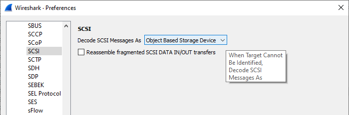
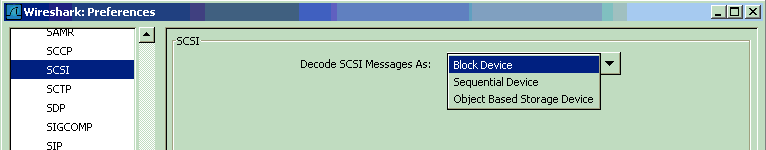

# Preferences/Protocols/SCSI

As of **Wireshark 3.2.6** -  

### Decode SCSI Messages As

Wireshark will try to determine which type of device the [SCSI](/Small_Computer_System_Interface) session is operating on, and thus which set of commands are being used by inspecting [SCSI](/Small_Computer_System_Interface) PDUs such as Inquiry.  
This is not foolproof and will for example not work at all if these Inquiry PDUs are missing from the capture.  
Using this preference setting it is possible to tell Wireshark which commandset to assume the [SCSI](/Small_Computer_System_Interface) PDUs belong to and how the PDUs are to be dissected for those cases.  
  
The [SCSI](/Small_Computer_System_Interface) dissector in wireshark currently only handles some of the commandsets for [SCSI](/Small_Computer_System_Interface). Some of the supported commandsets are SBC (harddisks) SSC (tapedrives) MMS (cdrom) and OSD (object based storage).

### Preference String

Decode SCSI Messages As

---

Imported from https://wiki.wireshark.org/SCSI_Preferences on 2020-08-11 23:24:29 UTC
