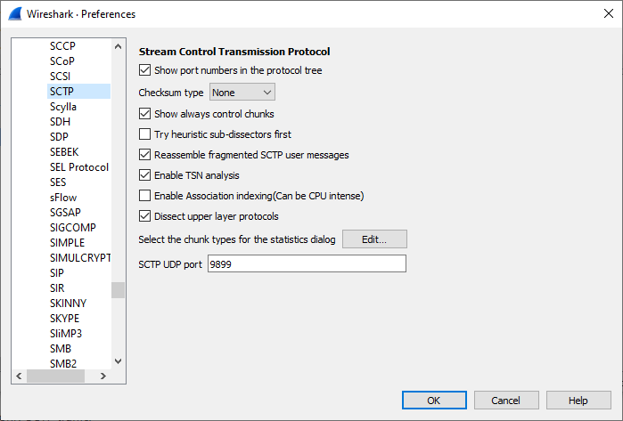

# Stream Control Transmission Protocol (SCTP)

Transport Protocol for call signalling, created to overcome several lacks and problems of TCP when used for signalling between telephony nodes.

## History

  - [RFC2960](https://tools.ietf.org/html/rfc2960) "Stream Control Transmission Protocol" released October 2000

## Protocol dependencies

  - [IP](/Internet_Protocol): Typically, SCTP uses [IP](/Internet_Protocol) as its underlying protocol. The [assigned protocol number](https://www.iana.org/assignments/protocol-numbers/protocol-numbers.xhtml) for SCTP on IP is 132.

## Example traffic

    Frame 3 (70 bytes on wire, 70 bytes captured)
        Arrival Time: Jul  1, 2004 17:44:49.872282000
        Time delta from previous packet: 0.087355000 seconds
        Time since reference or first frame: 0.087704000 seconds
        Frame Number: 3
        Packet Length: 70 bytes
        Capture Length: 70 bytes
    Ethernet II, Src: 00:01:af:0c:06:96, Dst: 00:a0:80:00:5e:46
        Destination: 00:a0:80:00:5e:46 (00:a0:80:00:5e:46)
        Source: 00:01:af:0c:06:96 (00:01:af:0c:06:96)
        Type: IP (0x0800)
    Internet Protocol, Src Addr: 10.28.6.42 (10.28.6.42), Dst Addr: 10.28.6.44 (10.28.6.44)
        Version: 4
        Header length: 20 bytes
        Type of service: 0x00 (None)
            000. .... = Precedence: routine (0)
            ...0 .... = Delay: Normal
            .... 0... = Throughput: Normal
            .... .0.. = Reliability: Normal
            .... ..0. = Cost: Normal
        Total Length: 56
        Identification: 0xca40 (51776)
        Flags: 0x00
            0... = Reserved bit: Not set
            .0.. = Don't fragment: Not set
            ..0. = More fragments: Not set
        Fragment offset: 0
        Time to live: 64
        Protocol: SCTP (0x84)
        Header checksum: 0x8f74 (correct)
        Source: 10.28.6.42 (10.28.6.42)
        Destination: 10.28.6.44 (10.28.6.44)
    Stream Control Transmission Protocol
        Source port: 2905
        Destination port: 2905
        Verification tag: 0x00000e50
        Checksum: 0x53c3055f (correct Adler32)
        HEARTBEAT chunk (Information: 20 bytes)
            Chunk type: HEARTBEAT (4)
                0... .... = Bit: Stop processing of the packet
                .0.. .... = Bit: Do not report
            Chunk flags: 0x00
            Chunk length: 24
            Heartbeat info parameter (Information: 16 bytes)
                Parameter type: Heartbeat info (0x0001)
                    0... .... .... .... = Bit: Stop processing of chunk
                    .0.. .... .... .... = Bit: Do not report
                Parameter length: 20
                Heartbeat information: 40E44B920A1C062C1B66AF7E00000000
    
    Frame 4 (70 bytes on wire, 70 bytes captured)
        Arrival Time: Jul  1, 2004 17:44:49.872631000
        Time delta from previous packet: 0.000349000 seconds
        Time since reference or first frame: 0.088053000 seconds
        Frame Number: 4
        Packet Length: 70 bytes
        Capture Length: 70 bytes
    Ethernet II, Src: 00:a0:80:00:5e:46, Dst: 00:01:af:0c:06:96
        Destination: 00:01:af:0c:06:96 (00:01:af:0c:06:96)
        Source: 00:a0:80:00:5e:46 (00:a0:80:00:5e:46)
        Type: IP (0x0800)
    Internet Protocol, Src Addr: 10.28.6.44 (10.28.6.44), Dst Addr: 10.28.6.42 (10.28.6.42)
        Version: 4
        Header length: 20 bytes
        Type of service: 0x00 (None)
            000. .... = Precedence: routine (0)
            ...0 .... = Delay: Normal
            .... 0... = Throughput: Normal
            .... .0.. = Reliability: Normal
            .... ..0. = Cost: Normal
        Total Length: 56
        Identification: 0xbb81 (48001)
        Flags: 0x04 (Don't Fragment)
            0... = Reserved bit: Not set
            .1.. = Don't fragment: Set
            ..0. = More fragments: Not set
        Fragment offset: 0
        Time to live: 255
        Protocol: SCTP (0x84)
        Header checksum: 0x9f32 (correct)
        Source: 10.28.6.44 (10.28.6.44)
        Destination: 10.28.6.42 (10.28.6.42)
    Stream Control Transmission Protocol
        Source port: 2905
        Destination port: 2905
        Verification tag: 0x0d53e6fe
        Checksum: 0x8c8e0746 (correct Adler32)
        HEARTBEAT_ACK chunk (Information: 20 bytes)
            Chunk type: HEARTBEAT_ACK (5)
                0... .... = Bit: Stop processing of the packet
                .0.. .... = Bit: Do not report
            Chunk flags: 0x00
            Chunk length: 24
            Heartbeat info parameter (Information: 16 bytes)
                Parameter type: Heartbeat info (0x0001)
                    0... .... .... .... = Bit: Stop processing of chunk
                    .0.. .... .... .... = Bit: Do not report
                Parameter length: 20
                Heartbeat information: 40E44B920A1C062C1B66AF7E00000000

## Wireshark

The [SCTP dissector](https://gitlab.com/wireshark/wireshark/-/blob/master/epan/dissectors/packet-sctp.c) is functional.

## Preference Settings
  

Three preference settings exist for SCTP:  (XXX - update needed)

  - Checksum type
  - If Control chunks should be shown or not
  - If Heuristic sub-dissectors should be shown first

If the wrong checksum type is selected, the checksum might show up as incorrect.

## Example capture file

[SampleCaptures/sctp.cap](uploads/__moin_import__/attachments/SampleCaptures/sctp.cap) - A simple capture file containing a few SCTP PDUs.

## Display Filter

A complete list of SCTP display filter fields can be found in the [display filter reference](http://www.wireshark.org/docs/dfref/s/sctp.html)

Show only the SCTP based traffic:

``` 
 sctp 
```

## Capture Filter

Recent versions of libpcap/WinPcap support filtering SCTP traffic:

Capture only SCTP traffic:

``` 
 sctp 
```

If that doesn't work, because Wireshark is using an older version of libpcap/WinPcap, you can explicitly specify the IP protocol number of SCTP:

Capture only SCTP traffic:

``` 
 ip proto 132 
```

## External links

  - <http://www.iana.org/assignments/sctp-parameters>

  - [www.sctp.org](https://web.archive.org/web/20120205041302fw_/http://www.sctp.org/index.html) (Wayback Machine)

  - <http://www.sctp.de/>

  - [Better networking with SCTP](https://web.archive.org/web/20061231013052/http://www-128.ibm.com/developerworks/linux/library/l-sctp/?ca=dgr-lnxw07SCTP) (Wayback Machine)

## Discussion

---

Imported from https://wiki.wireshark.org/SCTP on 2020-08-11 23:24:29 UTC
