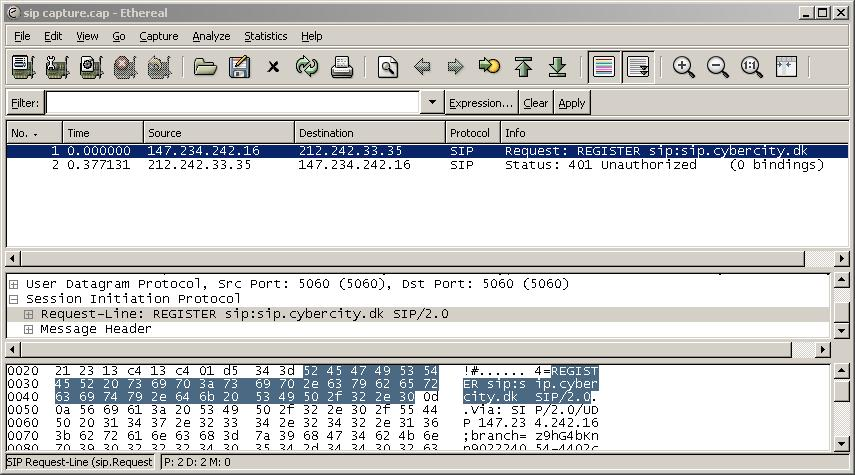

# Session Initiation Protocol (SIP)

The Session Initiation Protocol (SIP) is an application-layer control (signaling) protocol for sessions.

These sessions include Internet telephone calls, multimedia distribution, and multimedia conferences. SIP can create, modify, and terminate sessions with one or more participants.

The SIP protocol is a member of the [VOIPProtocolFamily](/VOIPProtocolFamily).

## History

XXX - add a brief description of SIP history

## Protocol dependencies

  - SIP is commonly uses as its transport [UDP](/UDP) (default port 5060), [TCP](/TCP) (default port 5060) or [TLS](/TLS) (default TCP port 5061). SIP signalling may also be compressed and delivered by [Sigcomp](/Sigcomp)

  - SIP is commonly used to establish media sessions, e.g. [RTP](/RTP)/[RTCP](/RTCP) streams carrying audio or video data, where session details are commonly negociated using [SDP](/SDP) offers/answers

  - PINTs and SPIRITS - Service interworking

  - Number resolution - TRIP and ENUM ([IETF Charter for ENUM](http://www.ietf.org/html.charters/enum-charter.html))

  - Seamless signaling - [SIGTRAN](/SIGTRAN) and [SIP-T](/SIP-T)

  - IMPP - Instant Messaging and Presence

  - SIMPLE - SIP for Instant Messaging and Presence Leveraging Extensions [IETF Charter for SIMPLE](http://www.ietf.org/html.charters/simple-charter.html)

## Example traffic



## Wireshark

The SIP dissector is fully functional. You can also view SIP message statistics (Statistics | SIP...) or view SIP call flow graphs (Statistics | VoIP Calls)

## Preference Settings

  - Display raw text for SIP message. Default OFF
  - Enforce strict SIP version check (SIP/2.0). Default ON
  - Reassemble SIP headers spanning multiple TCP segments. Default ON
  - Reassemble SIP bodies spanning multiple TCP segments. Default ON

## Example capture file

[SampleCaptures/aaa.pcap](uploads/__moin_import__/attachments/SampleCaptures/aaa.pcap) Sample SIP and RTP traffic.

## Display Filter

A complete list of SIP display filter fields can be found in the [display filter reference](http://www.wireshark.org/docs/dfref/s/sip.html)

Show only the SIP based traffic:

``` 
 sip 
```

## Capture Filter

You cannot directly filter SIP protocols while capturing. However, if you know the [UDP](/UDP) or [TCP](/TCP) or port used (see above), you can filter on that one.

## External links

[IETF](/IETF) Charters:

  - [SIP](http://www.ietf.org/html.charters/sip-charter.html) *Session Initiation Protocol (sip)*

  - [SIPPING](http://www.ietf.org/html.charters/sipping-charter.html) *Session Initiation Proposal Investigation (sipping)*

  - [SIP](http://blog.eukhost.com/2006/11/13/sip-session-initiation-protocol) *More info on Session Initiation Protocol(SIP)*

RFC:

  - [RFC3261](http://www.ietf.org/rfc/rfc3261.txt?number=3261) *SIP: Session Initiation Protocol*

  - [RFC3262](http://www.ietf.org/rfc/rfc3262.txt?number=3262) *Reliability of Provisional Responses in the Session Initiation Protocol (SIP)*

  - [RFC3263](http://www.ietf.org/rfc/rfc3263.txt?number=3263) *Session Initiation Protocol (SIP): Locating SIP Servers*

Implementations:

  - [osip](http://www.gnu.org/software/osip/osip.html) The GNU oSIP library

  - [SIPp](http://sipp.sourceforge.net/) "SIPp is a free Open Source test tool / traffic generator for the SIP protocol" (GPL)

## Discussion

---

Imported from https://wiki.wireshark.org/SIP on 2020-08-11 23:24:44 UTC
