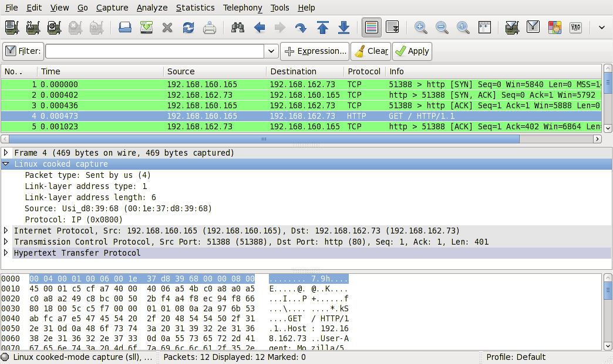

# Linux cooked-mode capture (SLL)

This is the pseudo-protocol used by libpcap on Linux to capture from the "any" device and to capture on some devices where the native link layer header isn't available or can't be used. (For example, the Linux PPP code doesn't reliably supply a PPP header to libpcap - it's usually either absent, meaning that the packet type isn't available, or contains extra random gunk in some but not all packets, as happens on some PPP-over-ISDN interfaces - so the SLL pseudo-link-layer is used on PPP interfaces. It's used on the "any" device because not all interfaces on a machine necessarily have the same link-layer type, but, in order for capture filters to work, all packets on an interface must have the same type of link-layer header.)

When capturing from the "any" device, or from one of those other devices, in Linux, the libpcap doesn't supply the link-layer header for the real "hardware protocol" like [Ethernet](/Ethernet), but instead supplies [a fake link-layer header for this pseudo-protocol](https://www.tcpdump.org/linktypes/LINKTYPE_LINUX_SLL.html).

(For those who are curious, "SLL" stands for "sockaddr\_ll"; capturing in "cooked mode" is done by reading from a PF\_PACKET/SOCK\_DGRAM socket rather than the PF\_PACKET/SOCK\_RAW socket normally used for capturing. Using SOCK\_DGRAM rather than SOCK\_RAW means that the Linux socket code doesn't supply the packet's link-layer header. This means that information such as the link-layer protocol's packet type field, if any, isn't available, so libpcap constructs a synthetic link-layer header from the address supplied when it does a `recvfrom()` on the socket. On PF\_PACKET sockets, that address is of type `sockaddr_ll`, where "ll" presumably stands for "link layer"; the fields in that structure begin with `sll_`. See the packet(7) man page on a Linux system for more details.)

## History

XXX - add a brief description of SLL history

## Protocol dependencies

  - This is a pseudo protocol, so there's no lower layer (the next upper layer will be IP for example)

## Example traffic

Screen shot of a SLL frame from [SampleCaptures](/SampleCaptures) file: sll.pcap  
(Note: file missing. Leave reference for now.)  



## Wireshark

The SLL dissector is fully functional.

## Preference Settings

There are no SLL specific preference settings.

## Example capture file

XXX - Add a simple example capture file to the [SampleCaptures](/SampleCaptures) page and link from here (see below). Keep this file short, it's also a good idea to gzip it to make it even smaller, as Wireshark can open gzipped files automatically.

  - SampleCaptures/sll.pcap (Note: file missing)    
  

## Display Filter

A complete list of SLL display filter fields can be found in the [display filter reference](http://www.wireshark.org/docs/dfref/s/sll.html)

Show only the SLL-based traffic:

``` 
 sll 
```

## Capture Filter

You cannot directly filter SLL protocols while capturing; if you're capturing on the "any" device or on any network interface where libpcap uses cooked mode, **all** traffic is SLL traffic.

## External links

## Discussion

---

Imported from https://wiki.wireshark.org/SLL on 2020-08-11 23:24:47 UTC
