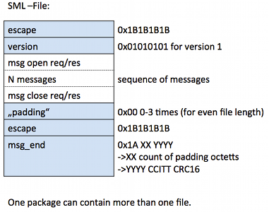
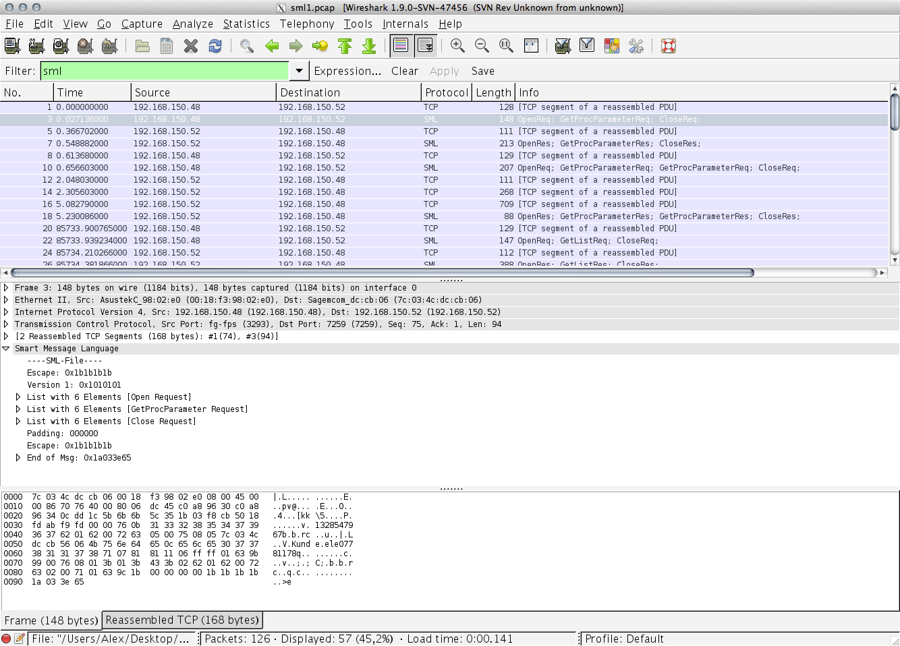

# Smart Message Language (SML)

The SML dissector based on Version 1.03 of the SML protocol.



## History

## Protocol dependencies

SML can be transported with various transport protocols.

## Example traffic



## Wireshark

The SML dissector is fully functional.

## Preference Settings

  - Turn on/off reassemble
  - Turn on/off CRC check
  - define UDP/TCP port

## Example capture file

[SampleCaptures/sml1.pcap](uploads/__moin_import__/attachments/SampleCaptures/sml1.pcap)

## Display Filter

Show only the SML based traffic:

``` 
 sml 
```

## External links

  - SML specification <http://www.vde.com/de/fnn/arbeitsgebiete/messwesen/Sym2/infomaterial/seiten/sml-spezifikation.aspx>

---

Imported from https://wiki.wireshark.org/SML on 2020-08-11 23:25:43 UTC
