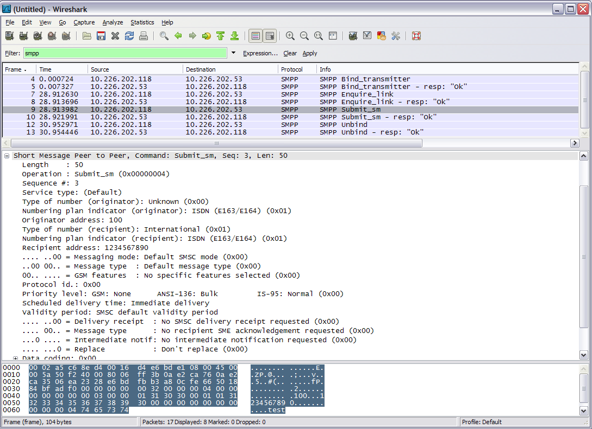

# Short Message Peer to Peer (SMPP)

This protocol is specifically targetted at transferring Short Messages between a Short Message Service Centre (SMSC) and an application using transport like TCP or X.25. With this you can thus, using plain TCP, indirectly submit Short Messages to a mobile (cell phone) or receive from them.

## History

Specifications for a standard digital cellular network were finalized in the late 80's by the GSM association. It included provisionings for a Short Message Service. How these short messages were transported into and out-of the cellular network was not specified, a Short Message Service Centre was envisioned that could store-and-forward these messages.

Commercial companies started to build and sell these SMSC's and devised protocols to enable applications to submit and receive these messages over other networks like IP and X.25. One of these was an Irish company called Aldiscon that specified this protocol.

Later on, they made it into an open protocol and transferred the rights to the independent SMPP developers forum. SMPP forum was subsequently renamed to SMS Forum to indicate a wider scope of work. On July 31st 2007, it was announced that SMS Forum would disband since the forum had served its purpose and the published protocols did not need further changes.

Currently, the most widely used specification is probably version 3.4. The specification is at version 5.0 right now.

## Protocol dependencies

  - [TCP](/TCP): Typically, SMPP uses [TCP](/TCP) as its transport protocol (though it is no stranger to X.25 as well). No well known port is defined for this protocol. The dissector will use heuristics to determine from the fixed header whether the captured packet is SMPP or not.

## Example traffic



## Wireshark

The SMPP dissector currently dissects most of the version 3.4 specific fields. Basic support for SMPP 5.0 should become available in release 1.1.x onwards.

## Preference Settings

There is currently one preference settings affecting how SMPP is dissected: - Reassemble SMPP over TCP messages spanning multiple TCP segments.

## Example capture file

[SampleCaptures/smpp.cap](uploads/__moin_import__/attachments/SampleCaptures/smpp.cap)

## Display Filter

A complete list of SMPP display filter fields can be found in the [display filter reference](http://www.wireshark.org/docs/dfref/s/smpp.html)

Show only the SMPP based traffic:

``` 
 smpp
```

## Capture Filter

You cannot directly filter SMPP protocols while capturing. However, if you know the [TCP](/TCP) port used (see above), you can filter on that one.

## External links

  - SMS forum (smsforum dot net)

  - [SMS Forum Completes Objectives...](http://www.clickpress.com/releases/Detailed/27303005cp.shtml)

## Discussion

---

Imported from https://wiki.wireshark.org/SMPP on 2020-08-11 23:25:43 UTC
