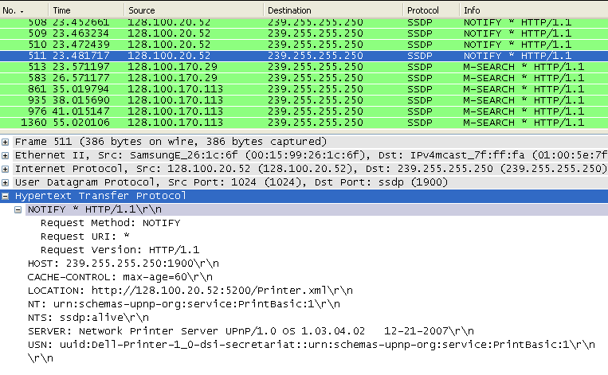

# Simple Service Discovery Protocol (SSDP)

The SSDP protocol can discover Plug & Play devices, with uPnP (Universal Plug and Play). SSDP uses unicast and multicast adress (239.255.255.250). SSDP is HTTP like protocol and work with NOTIFY and M-SEARCH methods.

SSDP can be used over IPv4 and IPv6.

## History

[IETF Draft Revision 3](http://quimby.gnus.org/internet-drafts/draft-cai-ssdp-v1-03.txt)

[IETF Draft Revision 2](http://quimby.gnus.org/internet-drafts/draft-cai-ssdp-v1-02.txt)

## Protocol dependencies

  - SSDP uses UDP transport protocol on port 1900

## Example traffic



## Wireshark

The SSDP dissector is based on the HTTP one. Since Wireshark 2.2, one can use the `ssdp` display filter.

In older versions one can use the `http` filter, but that would show both HTTP and SSDP traffic. To restrict the capture, one can:

  - filter with the destination port (see Display filter)
  - or filter based on packet contents (see Display filter)

## Preference Settings

SSDP has no preference setting.

## Example capture file

Nothing yet

## Display Filter

``` 
 udp.dstport == 1900
```

``` 
 ssdp
```

In Wireshark versions before 2.2, there was no special `ssdp` filter and one has to use `http` instead.

All UDP packets containing HTTP header:

    udp contains "HTTP/1.1"

All UDP packets containing both HTTP header and UPnP search type header ("\\nST:"), eg. UPnP search request:

    (udp contains "HTTP/1.1") and (udp contains 0a:53:54:3a)

## Capture Filter

``` 
 udp port 1900
```

## External links

  - [SSDP on Wikipedia](http://en.wikipedia.org/wiki/Simple_Service_Discovery_Protocol)

## Discussion

---

Imported from https://wiki.wireshark.org/SSDP on 2020-08-11 23:25:52 UTC
