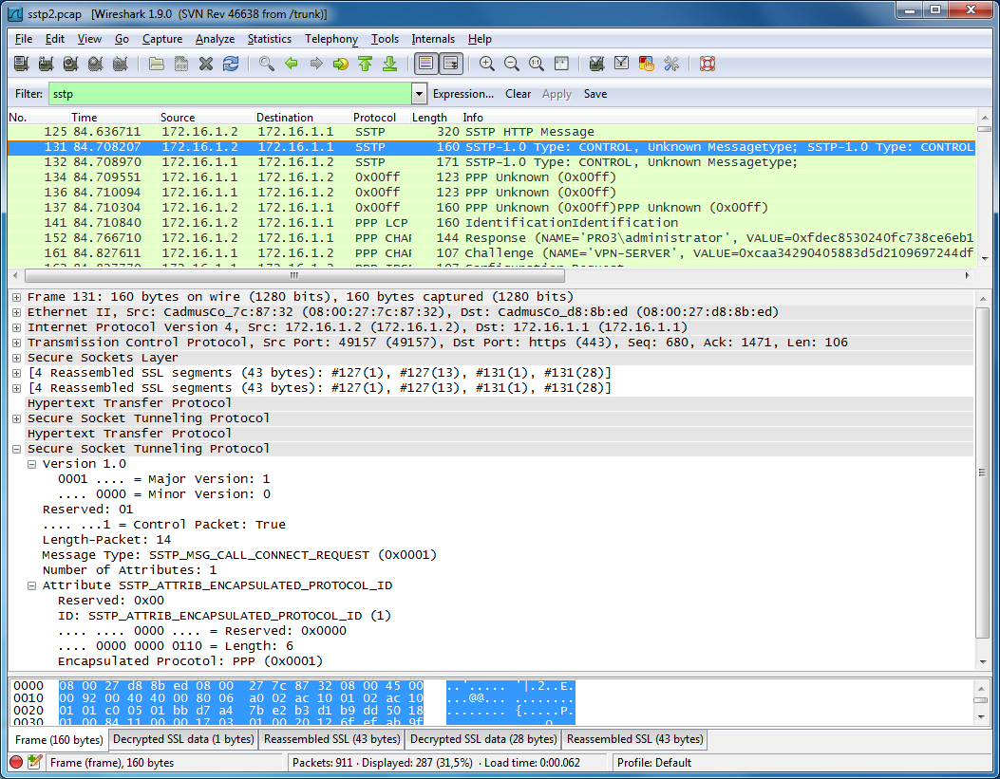
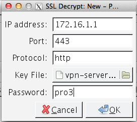

# Secure Socket Tunnel Protocol (SSTP)

SSTP encapsulates transport data-link layer (L2) frames on a Hypertext Transfer Protocol over Secure Sockets Layer (HTTPS) connection. The protocol currently supports only the Point-to-Point Protocol (PPP) link layer. SSL provides transport-level security with key-negotiation, encryption and traffic integrity checking.

## History

  - 04/03/2007 - Initial Availability

Since then, there have been no changes to the SSTP message syntax.

## Protocol dependencies

Since SSTP uses [HTTP](/HTTP) over [SSL](/SSL) to encapsulate L2 frames, [TCP](/TCP) is used as Transport Protocol. The well known port for [HTTP](/HTTP) over SSL is 443.

## Example traffic



## Preference Settings

There are no preferences for SSTP.

## Example capture file

To use the sample captures file, you must use the pfx file to decrypt the ssl traffic.



Both the pfx file and the sample capture are in the archive below.

  - [SampleCaptures/sstp.zip](uploads/__moin_import__/attachments/SampleCaptures/sstp.zip)

## Display Filter

  - Show only the SSTP based traffic:
    
    ``` 
     sstp
    ```

  - Show only the SSTP messages with a certain major version
    
    ``` 
     sstp.majorversion
    ```

  - Show only the SSTP messages with a certain minor version
    
    ``` 
     sstp.minorversion
    ```

  - Show only SSTP control messages
    
    ``` 
     sstp.iscontrol
    ```

  - Show only SSTP messages with a certain length
    
    ``` 
     sstp.length
    ```

  - Show only SSTP messages with a certain message type
    
    ``` 
     sstp.messagetype
    ```

  - Show only the SSTP messages with a certain encapsulated protocol
    
    ``` 
     sstp.encapsulatedprotocol
    ```

## Capture Filter

You cannot directly filter SSTP protocols while capturing. However, you can filter on [TCP](/TCP) port 443. Since this will also capture regular https traffic, it's not recommended.

Capture SSTP traffic over the default port (443):

``` 
 tcp port 443
```

## SSTP dissector availability

The SSTP dissector was merged into Wireshark in February of 2015. Thus it is available in versions 1.99.3 and later.

## External links

  - [MS-SSTP](http://msdn.microsoft.com/en-us/library/cc247338.aspx) *Secure Socket Tunneling Protocol (SSTP)* - MSDN Documentation of SSTP.

## Discussion

---

Imported from https://wiki.wireshark.org/SSTP on 2020-08-11 23:25:54 UTC
