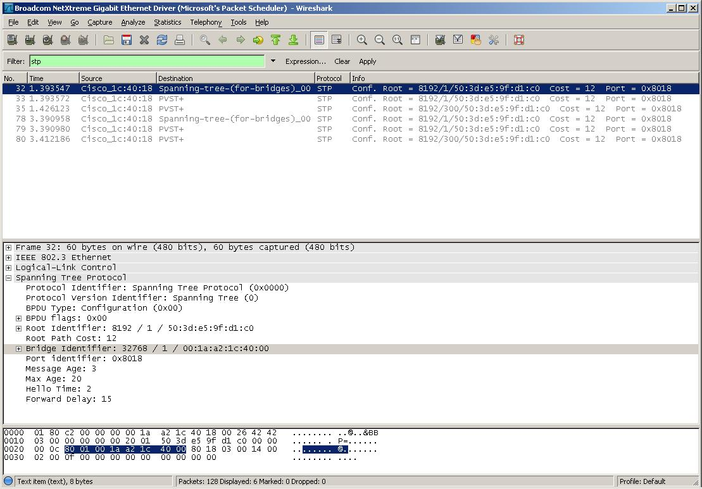

# Spanning Tree Protocol (STP)

The **Spanning Tree Protocol** (**STP**) is a network protocolthat ensures a loop-free topology for any bridged Ethernet local area network.

## History

STP is a Data Link Layer protocol. It is standardized as IEEE 802.1D. As the name suggests, it creates a spanning tree within a mesh network of connected layer-2 bridges (typically Ethernet switches), and disables those links that are not part of the spanning tree, leaving a single active path between any two network nodes.

## Protocol dependencies

  - [LLC](/LLC): Typically, STP uses [802.2 LLC](/LLC) as its transport protocol, running on link-layer protocols in the [LanProtocolFamily](/LanProtocolFamily) such as [Ethernet](/Ethernet).

## Example traffic



## Wireshark

The STP dissector is fully functional and supports IEEE 802.1D BPDU, Rapid Spanning-Tree BPDUs, and MST/MSTI BPDUs. Also add info of additional Wireshark features where appropriate, like special statistics of this protocol.

Cisco has a custom TLV extension called Per Vlan Spanning Tree (PVST+). The extension is added to 802.1D and RST BPDUs sent on 802.1Q VLAN trunks. The extension at the end of the BPDU advertises the VLAN ID (PVID) that the BPDU was sent on. The extension has the following format. It should be noted that only 802.1D and not RST BPDUs include the one padding byte for alignment.

  - Even byte padding (802.1D only): 1 byte
  - Type (only PVID type 0x00 is supported): 2 bytes
  - Length: 2 bytes
  - Data: PVID is 2 bytes

## Preference Settings

There are no STP specific preference settings.

## Example capture file

\* [SampleCaptures/stp.pcap](uploads/8d3d0627231ab1e2fa5d3fe8be2390a7/stp.pcap)

## Display Filter

A complete list of STP display filter fields can be found in the [display filter reference](http://www.wireshark.org/docs/dfref/s/stp.html)

Show only the STP based traffic:

``` 
 stp
```

## Capture Filter

Capture only the STP based traffic:

``` 
 stp
```

## External links

  - IEEE 802.1D: [IEEE standard for local and metropolitan area networks--Media access control (MAC) Bridges](http://standards.ieee.org/getieee802/download/802.1D-2004.pdf) (for STP and RSTP).

  - IEEE 802.1Q: [IEEE Standards for local and metropolitan area networks-—Virtual Bridged Local Area Networks](http://standards.ieee.org/getieee802/download/802.1Q-2003.pdf) (for MSTP).

## Discussion

---

Imported from https://wiki.wireshark.org/STP on 2020-08-11 23:25:59 UTC
