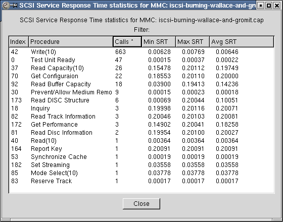

# Small Computer System Interface (SCSI)

SCSI is a protocol used principally to talk to storage devices such as hard disks and tape drives. Since TCP/IP is replacing many transports in all areas, SCSI is now commonly transported on top of [iSCSI](/iSCSI).

## History

SCSI was originally developed in the early to mid-80s as a new standardized bus and protocol to attach devices to a host. It was originally deviced to be used to attach many different types of devices such as hard-disks, tape drives, printers, scanners and even processor devices (so one could run for example IP or something similar ontop of SCSI between two hosts) but is mainly used to disk and tape access.

It was used in Macintosh computers for many years as the only external drive/scanner connection available.

It is still today a very popular protocol to use for high-end workstations and hosts since SCSI devices often have better reliability and performance than lower end [ATA](/ATA) devices.

Originally SCSI defined the entire stack from the electrical layer all the way up to the application layer but has since been broken up into three layers: SCSI Command Sets, SCSI protocol and SCSI transport. The SCSI Architecture Model defines an abstract procedure call model. The various SCSI command sets, protocols and transport standards each define specific implementations of the layers of this architecture.

Common transports for SCSI today are [FibreChannel](/FibreChannel), [iSCSI](/iSCSI), [USB](/USB), [FireWire](/FireWire) , parallel SCSI, and ATAPI over ATA.

## Protocol dependencies

  - [HyperSCSI](/HyperSCSI): HyperSCSI is a protocol to transport SCSI directly on top of Ethernet frames

  - [NDMP](/NDMP): SCSI is sometimes transported ontop of [NDMP](/NDMP), in particular when the backup application wants to talk to a tape library attached to the other NDMP host

  - [iSCSI](/iSCSI): iSCSI is a recent protocol to transport SCSI on top of TCP/IP, thus creating an IP [SAN](/SAN)

  - [FibreChannel](/FibreChannel): Fibre Channel is a high end transport protocol for SCSI which is mainly used to build enterprise level [SAN](/SAN)s

  - [USB](/USB): SCSI uses USB as a transport for mass storage devices such as memory sticks, mp3 players and many digital cameras.

## Example traffic

    No.     Time        Source                Destination           Protocol Info
         36 1.630854    10.1.1.2              10.1.1.101            iSCSI    SCSI: Data In LUN: 0x00 (Get Configuraion Response Data) SCSI: Response LUN: 0x00 (Get Configuraion) (Good)
    Frame 36 (98 bytes on wire, 98 bytes captured)
    Ethernet II, Src: 00:04:e2:22:5a:03 (00:04:e2:22:5a:03), Dst: 00:30:bd:b2:54:09 (00:30:bd:b2:54:09)
    Internet Protocol, Src: 10.1.1.2 (10.1.1.2), Dst: 10.1.1.101 (10.1.1.101)
    Transmission Control Protocol, Src Port: 3260 (3260), Dst Port: 1086 (1086), Seq: 745, Ack: 757, Len: 44
    Reassembled TCP Segments (92 bytes): #34(48), #36(44)
    iSCSI (SCSI Data In)
    SCSI Payload (Get Configuraion Response Data)
        LUN: 0x0000
        Command Set:CD-ROM (0x05)
        MMC Opcode: Get Configuraion (0x46)
        Request in: 33
        Response in: 36
        Data Length: 40
        Current Profile: DVD-R (0x0011)
        Feature: Profile List (0x0000)
        ..00 00.. = Version: 0
        .... ..1. = Persistent: 0x01
        .... ...1 = Current: 0x01
        Additional Length: 32
        Profile:CD-ROM
        Profile:CD-R
        Profile:CD-RW
        Profile:DVD-ROM
        Profile:DVD-R  [CURRENT PROFILE]
        Profile:DVD-RW Sequential recording
        Profile:DVD+RW
        Profile:DVD+R
    SCSI Response (Get Configuraion)
        LUN: 0x0000
        Command Set:CD-ROM (0x05)
        MMC Opcode: Get Configuraion (0x46)
        Request in: 33
        Time from request: 0.201103000 seconds
        Status: Good (0x00)

From a capture burning a DVD on a iSCSI/MMS emulator I wrote a few years ago.

## Wireshark

The SCSI dissector is partially functional, it implements a large set of the SCSI commands for SBC(hard disk), SSC (tape drive), OSD (object based storage) and MMC (cdrom/dvd) devices.

Wireshark can also calculate service response time statistics for SCSI :  


## Preference Settings

See [SCSI\_Preferences](/SCSI_Preferences)

## Example capture file

[SampleCaptures/iscsi-scsi-data-cdrom.zip](uploads/__moin_import__/attachments/SampleCaptures/iscsi-scsi-data-cdrom.zip) contains a complete log of iSCSI traffic between MS iSCSI Initiator and Linux iSCSI Enterprise Target with a real SCSI CD-ROM exported. The CD-ROM has a Fedora Core 3 installation CD in it.

[SampleCaptures/iscsi-scsi-10TB-data-device.zip](uploads/__moin_import__/attachments/SampleCaptures/iscsi-scsi-10TB-data-device.zip) contains a complete log of iSCSI traffic between MS iSCSI Initiator and Linux iSCSI Enterprise Target with a 10TB block device exported. See the use of READ\_CAPACITY\_16, READ\_16, and WRITE\_16.

[SampleCaptures/iscsi-tapel.gz](uploads/__moin_import__/attachments/SampleCaptures/iscsi-tapel.gz) contains some operation log of iSCSI traffic between Linux open-iscsi initiator and Linux iSCSI Enterprise Target. The target is a EXABYTE EXB480 Tape library. Various mtx operations are executed.

[scsi-osd-example-001.pcap](uploads/__moin_import__/attachments/Small_Computer_System_Interface/scsi-osd-example-001.pcap) is a trace of the IBM osd\_initiator\_3\_1\_1 (an OSD tester application) exercising IBM's ibm-osd-sim (an emulation of an OSD target device). The transport involved is iSCSI, and makes use of the relatively unusual new SCSI feature of bidirectional data transfer. The trace captures the initial iSCSI Logins, through INQUIRY and REPORT LUNS, followed by a number of commands from the SCSI-OSD command set such as FORMAT OSD, LIST, CREATE PARTITION, CREATE, WRITE, READ, REMOVE, REMOVE PARTITION, and SET KEY.

## Display Filter

A complete list of SCSI display filter fields can be found in the [display filter reference](http://www.wireshark.org/docs/dfref/SCSI/SCSI.html)

Show only the traffic containing SCSI PDUs:

``` 
 scsi 
```

## Capture Filter

You cannot directly filter SCSI while capturing. However you can often use capture filters for some of the transports for SCSI.

## External links

  - [Technical committee T10](http://www.t10.org)

## Discussion

Can someone look through the mailinglist and see if there are any [FibreChannel](/FibreChannel) or NDMP captures posted that contain SCSI? Then ask the posters if it is ok to put these already made public captures on the sample captures page? Alternatively, does anyone have any captures containing SCSI to donate? --ronnie A capture containing IP over SCSI over iSCSI over IP would be interesting.

-----

---

Imported from https://wiki.wireshark.org/Small_Computer_System_Interface on 2020-08-11 23:24:48 UTC
