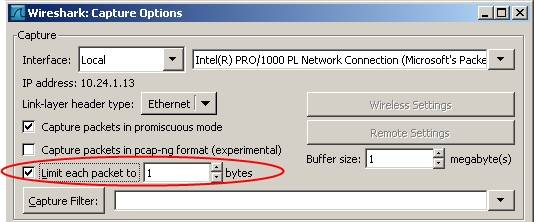

## SnapLen

SnapLen, Snap Length, or snapshot length is the amount of data for each frame that is actually captured by the network capturing tool and stored into the [CaptureFile](/CaptureFile). This is sometimes called [PacketSlicing](/PacketSlicing).

By default, both Wireshark and TShark will capture the entire content of the packet as it was received across the wire; however, this can generate very large files for very long captures. In this case it may be useful to reduce the total amount of storage used by the capture file by limiting the amount of data from each frame that is actually saved.

This feature can be enabled when you start the capture by the controls in the capture dialog:

The benefit from using this feature is that long capture files will take up much less space than if SnapLen is not specified, and less CPU time and bus bandwidth will be used copying packets and saving them to a file, so fewer packets might be dropped. The drawback is that packets that are longer than the SnapLen will be truncated and not all the data from these packets will be saved in the capture file. When this feature is used, it might not be possible to do reassembly of higher-level packets split across link-layer packets, such as [IP\_Reassembly](/IP_Reassembly), any more.

Other network capturing tools often also support this type of capturing. For example, the standard tool [TcpDump](/TcpDump) will by default use a SnapLen of 68 bytes for IPv4 packets and 96 bytes for IPv6 packets.

This feature can also be controlled by a command line switch -s \<number\> which incidentally is the same switch that [TcpDump](/TcpDump), [snoop](/snoop) and most other tools also use to control the exact same behaviour.

If you want to use SnapLen, how much data should you save from each packet and what should you set it to? That is a good question, it all depends on what protocols you are looking at and what part of the packets you are interested in looking at. In general, you shouldn't really need to use this option unless you are running very long captures that are expectd to create HUGE capture files, i.e. [Trolling](/Trolling).

---

Imported from https://wiki.wireshark.org/SnapLen on 2020-08-11 23:25:45 UTC
