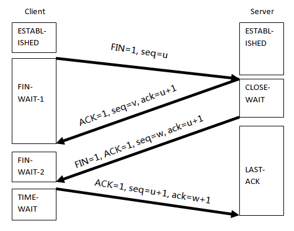
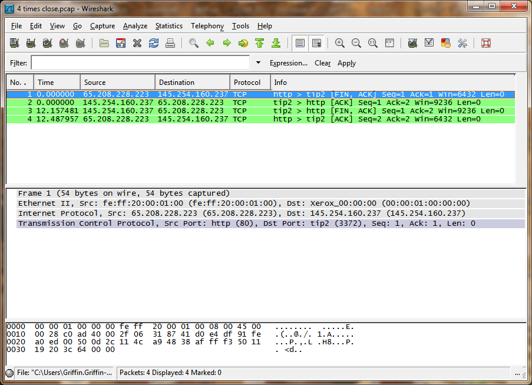

## TCP 4-times close

1\. Client send finish datagram to the server, indicated that client will close the transmission from client to server. This is called **active close**. (FIN=1, seq=u)

2\. Server acknowledged the FIN datagram. (ACK=1, seq=v, ack=u+1)

3\. Server contiues to transmit, if the server finishs the transmission it will close transmission from server to client. This is called **passive close**.(FIN=1, ACK=1, seq=w, ack=u+1)

4\. Client acknowledged the FIN datagram to the server.\[1\] (ACK=1, seq=u+1, ack=w+1)

\[1\]. After the ACK send, the client will not release the resource immediately, it will turn into TIME-WAIT status and wait 2-MSL (*Maximum Segment Lifetime*) time to release resource.

### Example

### Capture Example

[4 times close.pcap](uploads/__moin_import__/attachments/TCP-4-times-close/4-times-close.pcap)

---

Imported from https://wiki.wireshark.org/TCP%204-times%20close on 2020-08-11 23:26:26 UTC
