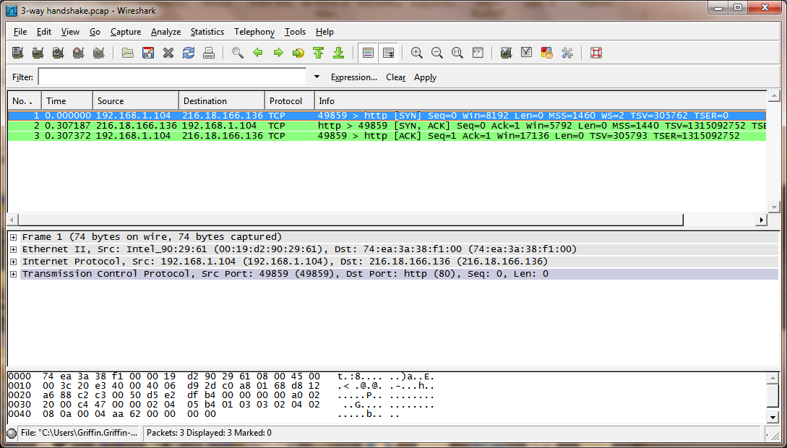

## TCP 3-way handshake

We assume that both host (A) and server (B) side start from CLOSED status.

1\. The server process create a ***TCB*** \[1\] and use ***TCB*** prepares to accept the host's request. After **TCB** born the server change status to LISTEN.

2\. The host does the same thing, create a ***TCB*** and use this ***TCB*** to send request, set the "SYN=1" in the request header, and initates a arbitrary sequence number, ***seq=x***. SYN paccket (which means SYN=1) can not take any data content, but it will **consume a sequence number**. After request sent, the host goes into SYN-SENT status.

3\. After receiving the host's request:

  - i. If the server accept to this connection, it will send back a confirm response. In the response both SYN and ACK bits should be '1', and server side also initiates a SEQ number, ***seq=y***. The server will send its sequence number within packet which is used to be acknowledged to the clinet's SYN packet. This packet can not take any data content either, but it **consumes a sequence number**. So in this packet ***seq=y, ack=x+1***. And the server goes into SYN-RCVD status.

  - ii. If the server rejects the connection, it just responses a RST packet to reset the connection.

4\. After the host received the server's response, it will send back also a confirm packet with ACK bit sets to '1' and **seq=x+1, ack=y+1**. \[2\]

After that, both side gose into ESTABLISHED status. This is what we called three-way handshake.

### Example

### Capture Example

[3-way handshake.pcap](uploads/__moin_import__/attachments/TCP_3_way_handshaking/3-way-handshake.pcap)

\[1\]. TCB---Transmission Control Block, something like PCB, it stores some significant info like, TCP connectio table, the pointer for the sending and receiving buffer, retransmission queue pointer, the current sequence number and acknowledge number and ext.

\[2\]. ACK packet could take data content, if not, this packet will not consume SYN number. So the sequence number of the confirm packet is *seq=x+1*. But in practice, at times, TCP 3-way handshake not only just initiates the connection, but also negotiate some very important parameters. MSS (*maximum segment size*) negotiation occurs in this steps.

---

Imported from https://wiki.wireshark.org/TCP_3_way_handshaking on 2020-08-11 23:26:28 UTC
