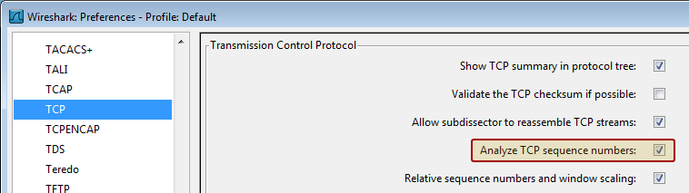

## TCP Analyze Sequence Numbers

This page might not be accurate. See the [TCP Analysis](https://www.wireshark.org/docs/wsug_html_chunked/ChAdvTCPAnalysis.html) section of the User's Guide for more up to date documentation.

By default Wireshark and TShark will keep track of all TCP sessions and implement its own crude version of [Sliding\_Windows](/Sliding_Windows). This requires some extra state information and memory to be kept by the dissector but allows much better detection of interesting [TCP](/TCP) events such as retransmissions. This allows much better and more accurate measurements of packet-loss and retransmissions than is available in any other protocol analyzer. (But it is still not perfect)

This feature should not impact too much on the run-time memory requirements of Wireshark but can be disabled if required.

When this feature is enabled the sliding window monitoring inside Wireshark will detect and trigger display of interesting events for TCP such as :

  - [TCP Retransmission](/TCP-Retransmission) - Occurs when the sender retransmits a packet after the expiration of the acknowledgement.

  - [TCP Fast Retransmission](/TCP-Fast-Retransmission) - Occurs when the sender retransmits a packet before the expiration of the acknowledgement timer. Senders receive some packets which sequence number are bigger than the acknowledged packets. Senders should Fast Retransmit upon receipt of 3 duplicate ACKs.

  - [TCP\_Out-of-order](/TCP_Out-of-order) - Occurs when a packet is seen with a sequence number lower than the previously received packet on that connection.

  - [TCP Previous segment lost](/TCP-Previous-segment-lost) - Occurs when a packet arrives with a sequence number greater than the "next expected sequence number" on that connection, indicating that one or more packets prior to the flagged packet did not arrive. This event is a good indicator of packet loss and will likely be accompanied by "TCP Retransmission" events.

  - [TCP\_ACKed\_lost\_segment](/TCP_ACKed_lost_segment) -

  - [TCP Keep-Alive](/TCP-Keep-Alive) - Occurs when the sequence number is equal to the last byte of data in the previous packet. Used to elicit an ACK from the receiver.

  - [TCP Keep-Alive ACK](/TCP-Keep-Alive-ACK) - Self-explanatory. ACK packet sent in response to a "keep-alive" packet.

  - [TCP DupACK](/TCP-DupACK) - Occurs when the same ACK number is seen AND it is lower than the last byte of data sent by the sender. If the receiver detects a gap in the sequence numbers, it will generate a duplicate ACK for each subsequent packet it receives on that connection, until the missing packet is successfully received (retransmitted). A clear indication of dropped/missing packets.

  - [TCP ZeroWindow](/TCP-ZeroWindow) - Occurs when a receiver advertises a receive window size of zero. This effectively tells the sender to stop sending because the receiver's buffer is full. Indicates a resource issue on the receiver, as the application is not retrieving data from the TCP buffer in a timely manner.

  - [TCP ZerowindowProbe](/TCP-ZerowindowProbe) - The sender is testing to see if the receiver's zero window condition still exists by sending the next byte of data to elicit an ACK from the receiver. If the window is still zero, the sender will double his persist timer before probing again.

  - [TCP ZeroWindowViolation](/TCP-ZeroWindowViolation) - The sender has ignored the zero window condition of the receiver and sent additional bytes of data.

  - [TCP WindowUpdate](/TCP-WindowUpdate) - This indicates that the segment was a pure [WindowUpdate](/WindowUpdate) segment. A [WindowUpdate](/WindowUpdate) occurs when the application on the receiving side has consumed already received data from the RX buffer causing the TCP layer to send a [WindowUpdate](/WindowUpdate) to the other side to indicate that there is now more space available in the buffer. Typically seen after a TCP [ZeroWindow](/ZeroWindow) condition has occurred. Once the application on the receiver retrieves data from the TCP buffer, thereby freeing up space, the receiver should notify the sender that the TCP [ZeroWindow](/ZeroWindow) condition no longer exists by sending a TCP [WindowUpdate](/WindowUpdate) that advertises the current window size.

  - [TCP WindowFull](/TCP-WindowFull) - This flag is set on segments where the payload data in the segment will completely fill the RX buffer on the host on the other side of the TCP session. The sender, knowing that it has sent enough data to fill the last known RX window size, must now stop sending until at least some of the data is acknowledged (or until the acknowledgement timer for the oldest unacknowledged packet expires). This causes delays in the flow of data between sender and receiver and lowers throughput. When this event occurs, a [ZeroWindow](/ZeroWindow) condition might occur on the other host and we might see [TCP ZeroWindow](/TCP-ZeroWindow) segments coming back. Do note that this can occur even if no [ZeroWindow](/ZeroWindow) condition is ever triggered. For example, if the TCP [WindowSize](/WindowSize) is too small to accommodate a high end-to-end latency this will be indicated by [TCP WindowFull](/TCP-WindowFull) and in that case there will not be any [TCP ZeroWindow](/TCP-ZeroWindow) indications at all. --- This should be broken out to its own page with a more detailed explanation.

XXX add brief explanation to these events

These events will be prepended to the information column in the summary display to make them easy to spot. To make these events really stand out, add a coloring rule for "tcp.analysis.flags" with a red background and yellow text. These evens will also all result in a new synthetic expansion being created in the TCP protocol expansion containing information on why this [TCP](/TCP) packet was interesting.

XXX add list of these expansion fields and their filter names

To disable this feature, go to the [TCP](/TCP) preferences and uncheck the box for Analyze TCP sequence numbers. 

### Preference String

Analyze TCP sequence numbers.

---

Imported from https://wiki.wireshark.org/TCP_Analyze_Sequence_Numbers on 2020-08-11 23:26:28 UTC
