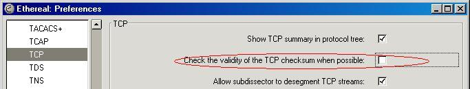

## TCP Checksum Verification

By default and whenever possible Wireshark will verify whether the [TCP](/TCP) checksum of a packet will be correct or not. TCP packets that have invalid checksums will be marked as such with a warning in the information column in the summary pane and also, most important, if the checksum is BAD that tells wireshark that the packet is corrupted and it will NOT be included in any [TCP\_Reassembly](/TCP_Reassembly). I.e. these packets will be ignored by the [TCP\_Reassembly](/TCP_Reassembly) engine and reassembly will not work.

The TCP checksum will only be tested for packets that have been fully captured, and thus for short packets, the checksum will not be verified. But then again, short packets will be ignored by the desegmentation engine anyway.

It should be VERY VERY rare to see corrupted packets in today's networks unless you have a router or a switch with a bad RAM module with a sticky bit. Still, it should be VERY rare to see this for packets that actually are corrupted.

### TCP checksum offloading (lots of checksum errors)

There are causes where you might see lots of checksum errors.

If you capture on a recent Ethernet [NIC](/NIC), you may see many such "checksum errors". This is due to TCP Checksum offloading often being implemented on those [NIC](/NIC)s and thus, for packets being **transmitted** by the machine. The checksum will not be calculated until the packet is sent out by the [NIC](/NIC) hardware, long long after your capture tool intercepted the packet from the network stack.

As this may be confusing and will prevent Wireshark from reassemble TCP segments it's a good idea to switch checksum verification off in these cases.

To disable checking of the TCP checksum validity, go to the TCP preferences and untick the box for checksum verification

### Preference String

Check the validity of the TCP checksum when possible.

---

Imported from https://wiki.wireshark.org/TCP_Checksum_Verification on 2020-08-11 23:26:30 UTC
