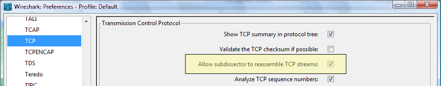
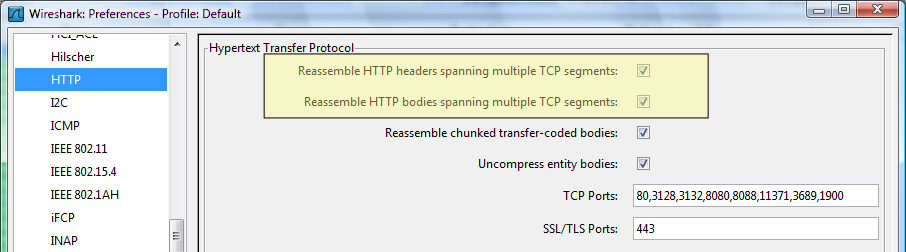
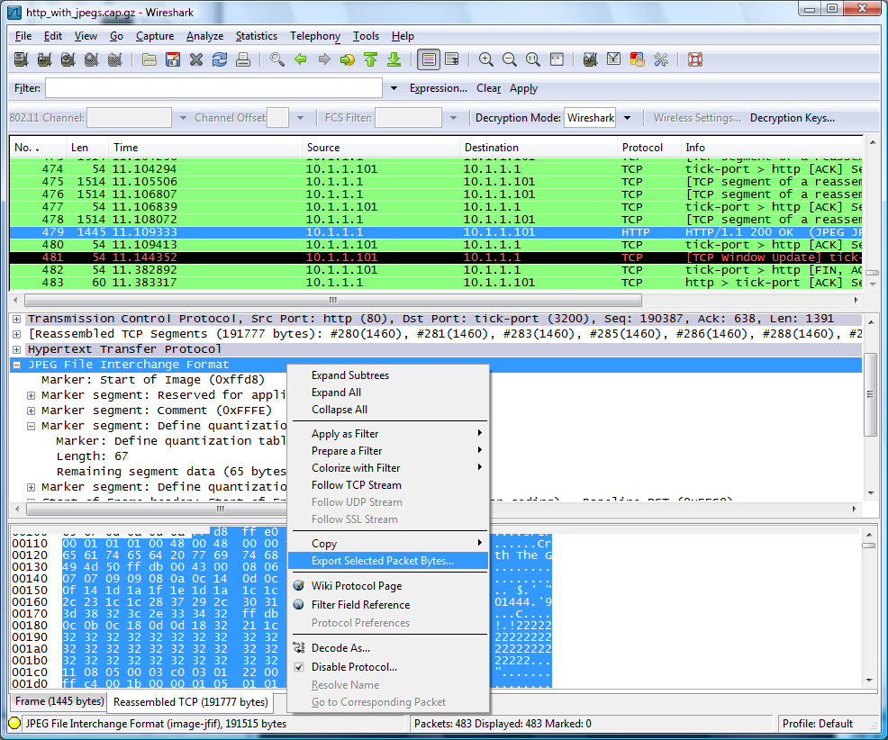

## TCP Reassembly

Wireshark supports reassembly of [PDU](/PDU)s spanning multiple TCP segments for a large number of protocols implemented on top of TCP. These protocols include, but are not limited to, [iSCSI](/iSCSI), [HTTP](/HTTP), [DNS](/DNS), [Kerberos](/Kerberos), [CIFS](/CIFS), [ONC-RPC](/ONC-RPC) etc. All in all probably something like 20 different protocols. The support to do this is very easy to add to Wireshark if required for new protocols, so if your favorite protocol is missing, please give the Wireshark developers a shout.

Note that TCP Reassembly ONLY works if you capture the entire packet and if all the checksums for that packet are valid. If you use packet slicing and only capture parts of the packets OR if the packets have incorrect checksums, i.e. [TCP\_Checksum\_Verification](/TCP_Checksum_Verification) fails, then the packets will be ignored and reassembly will fail. (You can disable the [TCP\_Checksum\_Verification](/TCP_Checksum_Verification) test in preferences.)

### Preferences

To enable this feature you must enable the preference :  
  
This option will enable the TCP layer to perform reassembly of PDUs spanning multiple segments for all protocols that request it.  
Note that this is not sufficient in itself, this preference above is the master switch to enable it on the TCP layer, you will also have to make sure that the protocol specific reassembly option is enabled as well.  
The protocol specific reassembly option for HTTP are these:  
  
  
If for example you want to reassemble HTTP PDUs spanning multiple segments you must thus enable all three options above.

### Warning : memory is consumed like there is no tomorrow

This feature requires a lot of memory so it is always disabled by default. I advise that if you use it, only enable it temporarily when you absolutely need to and leave it off for the rest of the time. (You can not imagine how much memory is required if you accidentally leave it on and then load a 1GByte trace into wireshark)

### Example

This is an example of how to reassemble a HTTP stream and to extract and save to a file a JPEG image from inside a HTTP PDU.  
First download the example capture [SampleCaptures/http\_with\_jpegs.cap.gz](uploads/__moin_import__/attachments/SampleCaptures/http_with_jpegs.cap.gz) from the [SampleCaptures](/SampleCaptures) page.  
Then enable all three preferences above.  
Then select packet \#479 and click on the JPEG protocol to select it:  
  
Then just right click on the JPG protocol and select "Export Selected Bytes" and save it to a file. If everything worked, you will now have a nice JPEG of the Dolphin Show at SeaWorld in SurfersParadise to view for your enjoyment.

### BUGS

(It seems reassembly of HTTP packets consume an enormous amount of CPU. There must be something suboptimal in the implementation and someone should have a look at it. It also likes to rescan the capture list several times when selecting one such packet.)

The Wireshark implementation itself should be ok. It's the display of the packet bytes which causes the trouble. The GTK widget we are using doesn't seem to be prepared to handle several tenths of kB (or even more) of text in a reasonable time. We might need to find a way improving this - implement our own widget or tweaking the existing somehow. - *[UlfLamping](/UlfLamping)*

### Preference String

Allow subdissector to desegment TCP streams

---

Imported from https://wiki.wireshark.org/TCP_Reassembly on 2020-08-11 23:26:31 UTC
