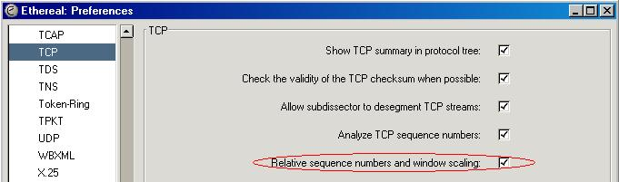
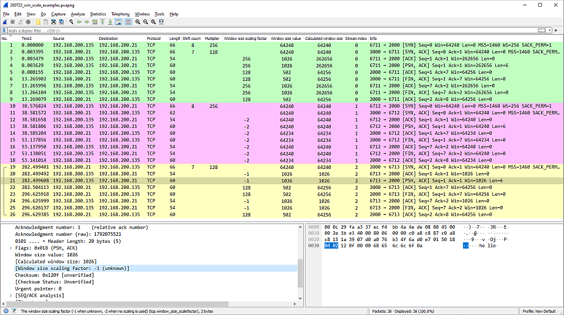
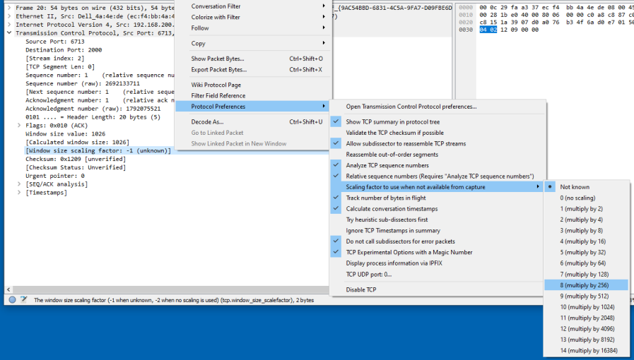
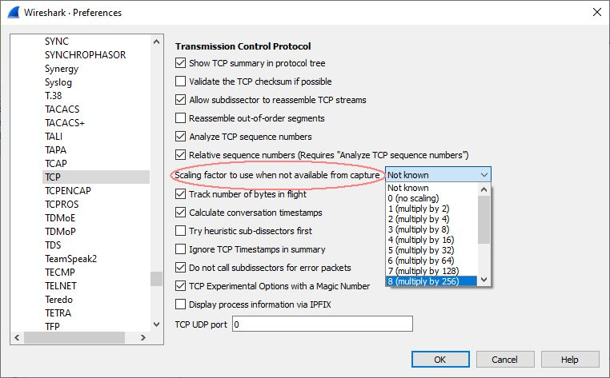
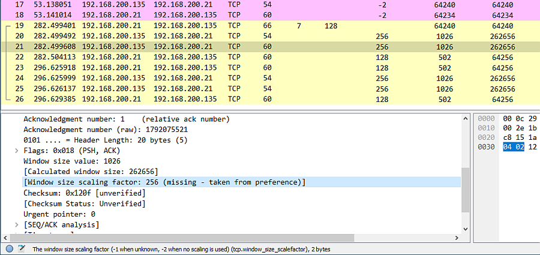

## TCP Relative Sequence Numbers & TCP Window Scaling

By default Wireshark and TShark will keep track of all TCP sessions and convert all Sequence Numbers (SEQ numbers) and Acknowledge Numbers (ACK Numbers) into relative numbers. This means that instead of displaying the real/absolute SEQ and ACK numbers in the display, Wireshark will display a SEQ and ACK number relative to the first seen segment for that conversation.

This means that all SEQ and ACK numbers always start at 0 for the first packet seen in each conversation.

This makes the numbers much smaller and easier to read and compare than the real numbers which normally are initialized to randomly selected numbers in the range 0 - (2^32)-1 during the SYN phase.

This usability feature relies on features from [TCP\_Analyze\_Sequence\_Numbers](/TCP_Analyze_Sequence_Numbers) so in order to use this feature you must also enable [TCP\_Analyze\_Sequence\_Numbers](/TCP_Analyze_Sequence_Numbers).

Using relative sequence numbers is a usability enhancement, making the numbers easier to read and compare. In order to compare a dissection with data from a less advanced analyzer that can not handle relative sequence numbers it might be required to temporarily disable this feature in Wireshark.

For Wireshark versions prior to 1.5: When the Relative Sequence Numbers preference is enabled Wireshark will also enable "Window Scaling".

For Wireshark 1.5 & newer: "Window Scaling" is a separate TCP preference enabled by default.

If "Window Scaling" is enabled, Wireshark will try to monitor the TCP Window Scaling option negotiated during the SYN phase and if such TCP Window Scaling has been detected, Wireshark will also scale the window field and translate it to the effective window size. This may affect what the dissected and reported window is and may make Wireshark to decode packets differently, but more accurately, than other tools.

To disable relative sequence numbers and instead display them as the real absolute numbers, go to the [TCP](/TCP) preferences and untick the box for relative sequence numbers. 

### Preference String

Relative sequence numbers and window scaling.

### Window Scale Factor

`tcp.window_size_scalefactor` - The window size scaling factor (-1 when unknown, -2 when no scaling is used)

## Example capture file

[SampleCaptures/200722\_win\_scale\_examples\_anon.pcapng](uploads/__moin_import__/attachments/SampleCaptures/200722_win_scale_examples_anon.pcapng)

`TCP Stream 0` - client and server provide shift count (scale factor) in SYN and SYN/ACK TCP options.

`TCP Stream 1` - not supported by both ends. No shift count in SYN/ACK from server. Set to -2 - no scaling.

`TCP Stream 2` - SYN from client not captured. Wireshark sets scale factor to -1 - `unknown`

The Scaling Factor is ONLY sent in the SYN and SYN/ACK packets at the start of a TCP connection which shows why it is important to capture the full TCP handshake for troubleshooting.

When the Window Scale Factor is -1 (unknown) or -2 (no scaling), the Calculated Window size = the Window Size value in the TCP header.

The -1 (unknown) scale factor can be overridden using TCP preferences.

Right click on a TCP packet in the Packet List, or in the Packet Details on the TCP section header or a TCP field.

TCP Preferences are also available through Edit -\> Preferences... -\> Protocols -\> TCP

Packet details indicate field value supplied by TCP Preferences setting.

---

Imported from https://wiki.wireshark.org/TCP_Relative_Sequence_Numbers on 2020-08-11 23:26:32 UTC
