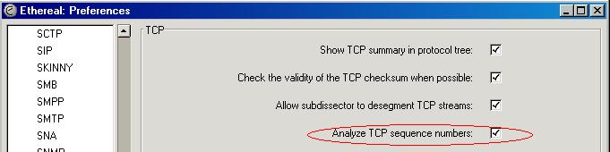

## TCP Retransmissions ColorFilter

These [ColoringRules](/ColoringRules) will mark all TCP Retransmissions (and other interesting TCP events) with an easy to spot red background color. This makes it very easy to spot where [PacketLoss](/PacketLoss) occurs for TCP based protocols and can be used to quickly find performance issues related to [PacketLoss](/PacketLoss).

This filter requires that the preference for Analyzing TCP Sequence numbers has been enabled, or else the filter will not work. Make sure that the preference setting for this feature has been enabled: 

**File:** [tcpretransmissionscolorfilter.txt](uploads/__moin_import__/attachments/TCP_Retransmissions_ColorFilter/tcpretransmissionscolorfilter.txt)  
**Description:** Show TCP Retransmissions and other interesting TCP events with easy to spot red background.  
**Contributor:** Ronnie Sahlberg

---

Imported from https://wiki.wireshark.org/TCP_Retransmissions_ColorFilter on 2020-08-11 23:26:33 UTC
