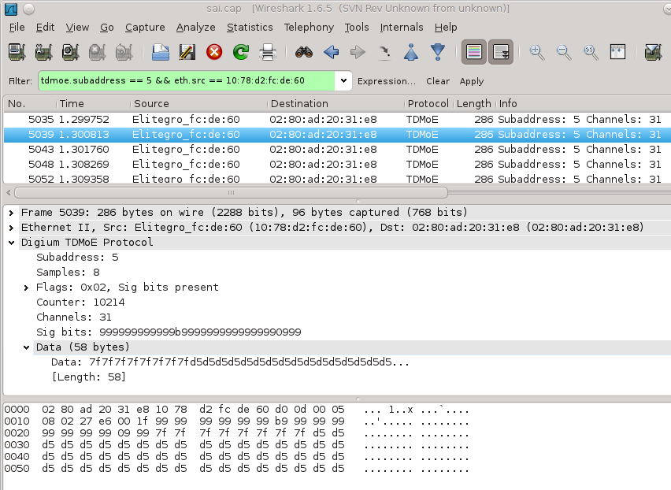

# TDMoE - Time Division Multiplexing over Ethernet

This protocol was originally created by Mark Spencer in [Digium, Inc](http://www.digium.com/) for enabling Asterisk users to use TDM protocols over inexpensive hardware (Ethernet Hardware).

## Protocols

This protocol is a container for 'all' TDM based telephony-protocols. Unfortunatly, the TDMoE protocol does not contain information about what protocol(s) it transmits, so to further decode the data stream, you need to know exactly the configuration of the transmitting party.

Inside the TDM stream you can have a number of different configurations of framing systems, coding systems and protocols such as the ones contained inside the BRI, PRI or [SS7](/SS7) signalling specifications.

## Example traffic

Screen shot of a TDMoE frame from file: [tdmoe.cap](uploads/__moin_import__/attachments/TDMoE/tdmoe.cap)

## Example capture file

[tdmoe.cap](uploads/__moin_import__/attachments/TDMoE/tdmoe.cap) A simple TDMoE capture (TDMoE/CAS/MFCR2)

## Display Filter

A complete list of TDMoE display filter fields can be found in the [display filter reference](http://www.wireshark.org/docs/dfref/t/tdmoe.html)

Show only the TDMoE traffic:

    tmdoe 

## External links

  - [Info about Asterisk's TDMoE support](http://www.voip-info.org/wiki/view/Asterisk%2BTDMoE)

  - [Wikipedia article about TDM](http://en.wikipedia.org/wiki/Time-division_multiplexing)

## Discussion

---

Imported from https://wiki.wireshark.org/TDMoE on 2020-08-11 23:26:33 UTC
