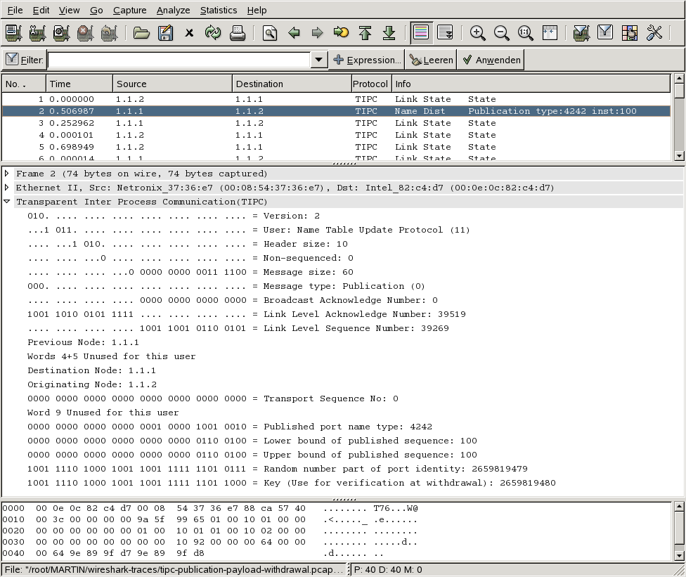

# Transparent Inter Process Communication (TIPC)

## History

The TIPC protocol originated at the telecommunications manufacturer Ericsson, and has been deployed in their products for years; it has been released to the Open Source community. So far TIPC is available for Linux and VxWorks. An OpenSolaris implementation is work in progress.

## Protocol dependencies

  - [Ethernet](/Ethernet): For now, TIPC uses [Ethernet](/Ethernet) as its transport protocol. The ethertype 0x88ca is assigned by IEEE. Other transport protocols are possible and might be implemented.

  - [TCP](/TCP): A TIPC bearer using TCP as its transport protocol is work-in-progress.

## Example traffic



## Wireshark

The TIPC dissector is fully functional but could be improved for sure:

  - Improve info column
  - Use conversations

## Preference Settings

  - Reassemble TIPCv1 SEGMENTATION\_MANAGER datagrams
  - Dissect TIPC data
  - Try heuristic subdissectors first
  - Handle version 2 as ALL or TIPC1.5/1.6 or TIPC1.7 As TIPC1.5/1.6 and TIPC1.7 both use version 2 but have differing layout in some message, one can choose here if the dissector shall show a superset of the message fields (ALL) or just the ones active in the respective TIPC version.

## Example capture files

  - [SampleCaptures/tipc-publication-payload-withdrawal.pcap](uploads/__moin_import__/attachments/SampleCaptures/tipc-publication-payload-withdrawal.pcap)

  - [SampleCaptures/tipc-bundler-messages.pcap](uploads/__moin_import__/attachments/SampleCaptures/tipc-bundler-messages.pcap)

  - [SampleCaptures/tipc\_v2\_fragmenter\_messages.pcap.gz](uploads/__moin_import__/attachments/SampleCaptures/tipc_v2_fragmenter_messages.pcap.gz)

  - [SampleCaptures/TIPC-over-TCP\_disc-publ-inventory\_sim-withd.pcap.gz](uploads/__moin_import__/attachments/SampleCaptures/TIPC-over-TCP_disc-publ-inventory_sim-withd.pcap.gz)

  - [SampleCaptures/TIPC-over-TCP\_MTU-discovery.pcap.gz](uploads/__moin_import__/attachments/SampleCaptures/TIPC-over-TCP_MTU-discovery.pcap.gz)

## Display Filter

A complete list of TIPC display filter fields can be found in the [display filter reference](http://www.wireshark.org/docs/dfref/t/tipc.html)

Show only the TIPC based traffic:

``` 
 tipc 
```

## Capture Filter

Capture TIPC traffic only:

``` 
  ether proto 0x88ca 
```

## Making subdissectors

The determination of the right Port Name Type ("tipcv2.port\_name\_type") for all messages is not implemented yet because it is not explicily set in every message (see above for more information).

If you're only running one sub-protocol in your TIPC network it might be sufficient if you're just using the TIPC User ("tipc.usr") to trigger your dissector when it's a message containing data (this field is the TIPC IMPORTANCE value).

So, the most easiest way is to substitute "tcp.port" or "udp.port" (in most of examples on how to make your own dissector) with ("tipc.usr") and the port with the message IMPORTANCE you're using to send your data. You can also use more than one hook if you don't know the message IMPORTANCE in advance or are using different ones.

Possible values are:

    TIPC_IMPORTANCE_LOW                      0
    TIPC_IMPORTANCE_MEDIUM (Normal)          1
    TIPC_IMPORTANCE_HIGH                     2
    TIPC_IMPORTANCE_CRITICAL (NonRejectable) 3

Alternatively you can determine with heuristics ("tipc") if a message's data contains your protocol.

If you're having more than one sub-protocol, it will be better to determine a clear way to distinguish them and implement heuristics.

### Why can't I attach a dissector to a TIPC port name?

On the tipc-discussion mailinglist, Allan Stephens described where the Port Name is not set with the following words:

    The "named" and "mcast" message types have info in the TIPC header to
    specify the message's destination (a port name and port name sequence,
    respectively); these message types typically occur when an application
    sends connectionless traffic.  The "conn" type is used to carry
    connection-oriented traffic over an already established connection;
    since the sending socket/port already knows the port ID of the other end
    of the connection, there is no need for any port name information to be
    present in the TIPC header.
    
    The "direct" type is used to carry connectionless traffic to a
    destination that was specified using a port ID, rather than a port name;
    again, no port name info is present in the TIPC header because it is not
    required.  Situations where this sort of message might be generated
    include: a) an application obtains a port ID as part of a subscription
    event generated by TIPC's topology server and then sends a message to
    that port ID (using sendto() or sendmsg()), and b) a server obtains a
    client's port ID when it receives a message from the client (using
    recvfrom() or recvmsg()) and then sends a reply back to that client port
    ID (using sendto() or sendmsg()).

### Example

Here is a simple example in LUA (based on [Lua/Dissectors](/Lua/Dissectors)):

    -- trivial protocol example
    -- declare our protocol
    trivial_proto = Proto("trivial","TRIVIAL","Trivial Protocol")
    -- create a function to dissect it
    function trivial_proto.dissector(buffer,pinfo,tree)
        pinfo.cols.protocol = "TRIVIAL"
        local subtree = tree:add(trivial_proto,buffer(),"Trivial Protocol Data")
        subtree:add_le(buffer(0,2),"The first two bytes: " .. buffer(0,2):le_uint())
        subtree = subtree:add(buffer(2,2),"The next two bytes")
        subtree:add_le(buffer(2,1),"The 3rd byte: " .. buffer(2,1):le_uint())
        subtree:add_le(buffer(3,1),"The 4th byte: " .. buffer(3,1):le_uint())
    end
    -- load the tipc.usr (TIPC importance) table
    tipc_table = DissectorTable.get("tipc.usr")
    -- register our protocol to all the 4 importance
    tipc_table:add(0,trivial_proto)
    tipc_table:add(1,trivial_proto)
    tipc_table:add(2,trivial_proto)
    tipc_table:add(3,trivial_proto)

#### Note on endianess

The example uses subtree:add\_le() and buffer(offset,len):le\_uint() to ilustrate messages in Little Endian (host byte order on a x86 architecture), because its common to use host byte order for TIPC messaging. The default (subtree:add() and buffer(offset,len):uint() interpret the bytes as Big Endian).

## External links

  - <http://tipc.sourceforge.net/> *TIPC Project Homepage* - Documentation, Download and Support.

  - <http://linux-net.osdl.org/index.php/TIPC> *TIPC FAQ*.

  - <http://www.multicore-association.org/workgroup/TIPC.html> *TIPC working group* of the *Multicore Association* oversees the evolution of the TIPC protocol.

## Discussion

---

Imported from https://wiki.wireshark.org/TIPC on 2020-08-11 23:26:40 UTC
