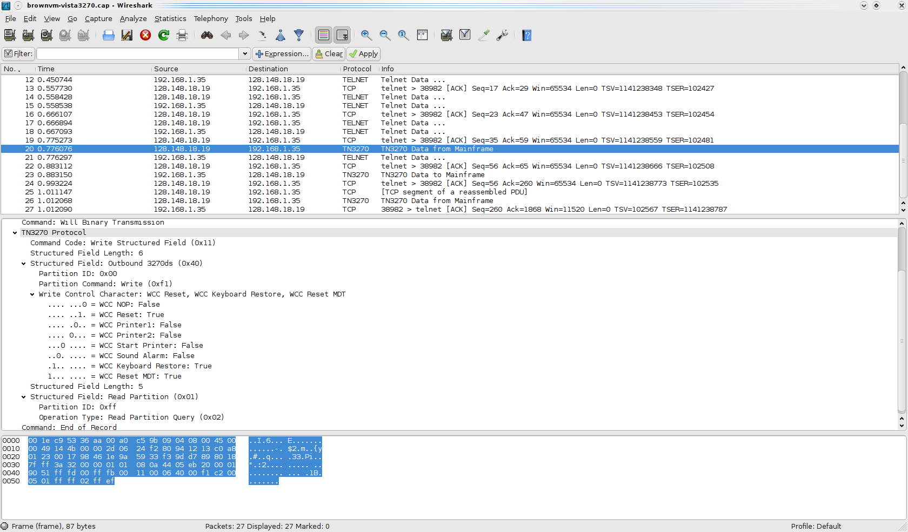

# Telnet 3270 (TN3270)

"Telnet 3270, or TN3270 describes either the process of sending and receiving 3270 data streams using the Telnet protocol or the software that emulates a 3270 class terminal which communicates using that process. TN3270 allows a 3270 terminal emulator to communicate over a TCP/IP network instead of an SNA network. Standard telnet clients cannot be used as a substitute for TN3270 clients, as they use fundamentally different techniques for exchanging data." [Wikipedia](http://en.wikipedia.org/wiki/TN3270)

## History

"The IBM 3270 is a class of terminals made by IBM since 1972 (known as "display devices") normally used to communicate with IBM mainframes. As such, it was the successor to the IBM 2260 display terminal. Due to the text color on the original models, these terminals are informally known as green screen terminals. Unlike common serial ASCII terminals, the 3270 minimizes the number of I/O interrupts required by accepting large blocks of data known as datastreams, and uses a high speed proprietary communications interface, using coax cable. IBM stopped manufacturing terminals many years ago, but the IBM 3270 protocol is still commonly used via terminal emulation to access some mainframe-based applications. Accordingly, such applications are sometimes referred to as green screen applications. Use of 3270 is slowly diminishing over time as more and more mainframe applications acquire Web interfaces, but some web applications use the technique of "screen scraping" to capture old screens and transfer the data to modern front-ends. Today, many sites such as call centers still find the "green screen" 3270 interface to be more productive and efficient than spending resources to replace them with more modern systems." [Wikipedia](http://en.wikipedia.org/wiki/TN3270)

## Protocol dependencies

  - [TELNET](/TELNET): Typically, TN3270 uses [TCP](/TCP) and [TELNET](/TELNET) as its transport protocol. The well known TCP port for TN3270/TELNET traffic is 23.

## Example traffic



## Wireshark

The TN3270 dissector is almost fully functional.

## Preference Settings

There are no preference settings associated with TN3270.

## Example capture file

  - [SampleCaptures/TN3270-Plain.pcap](uploads/__moin_import__/attachments/SampleCaptures/TN3270-Plain.pcap)

  - [SampleCaptures/TN3270E.pcap](uploads/__moin_import__/attachments/SampleCaptures/TN3270E.pcap)

## Display Filter

A complete list of TN3270 display filter fields can be found in the [display filter reference](http://www.wireshark.org/docs/dfref/t/tn3270.html)

Show only the TN3270 based traffic:

``` 
 tn3270 
```

## Capture Filter

You cannot directly filter TN3270 protocols while capturing. However, if you know the [TCP](/TCP) port used (see above), you can filter on that one.

Capture only the TN3270 traffic over the default port (23):

``` 
 tcp port 80 
```

## External links

  - [3270 Information Display System: Data Stream Programmer's Reference - GA23-0059-07](http://www-01.ibm.com/support/docview.wss?uid=pub1ga23005907)

  - [RFC 1647](http://www.ietf.org/rfc/rfc1647.txt) *TN3270 Enhancements*.

  - [RFC 1576](http://www.ietf.org/rfc/rfc1576.txt) *TN3270 Current Practices*.

  - [RFC 1041](http://www.ietf.org/rfc/rfc1041.txt) *Telnet 3270 Regime Option*.

  - [TN3270 Work In Progress Page](http://www.roberthogan.net/stuff/tn3270-dissector) *Developer's Work in Progress Page*.

## Discussion

---

Imported from https://wiki.wireshark.org/TN3270 on 2020-08-11 23:26:42 UTC
