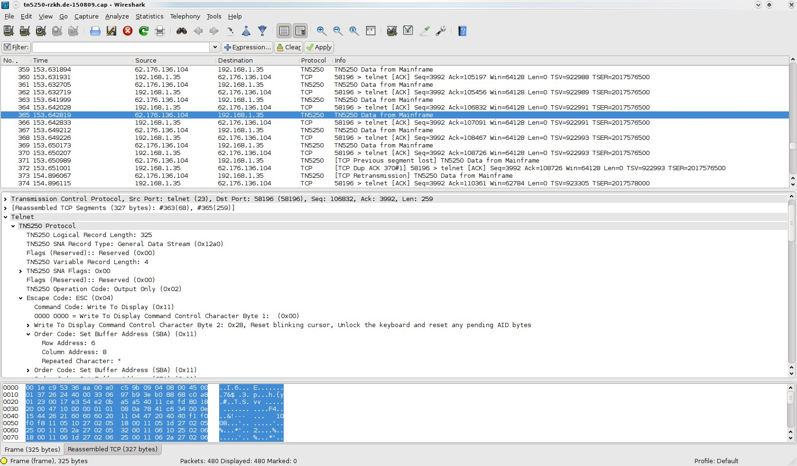

# Telnet 5250 (TN5250)

"IBM 5250 was originally a family of terminal devices sold with the IBM System/3, System/32 and System/34 minicomputer systems. One model was the IBM 5251-11. It also connected to the later System/36, System/38 and AS/400 systems. Similar to the IBM 5250, it is a block-oriented terminal protocol, yet is incompatible with the 5250 standard. The relationship between the terminal and system was rich: The system sent a data stream containing markup bytes indicating the boundaries of data entry fields, highlighted or colored areas, and indication that the system was busy responding to the last request from the terminal. The 5250 data stream definition has been refined over time to include GUI elements like pop-up windowing, check and option boxes, mouse handling, and pull-down menus. The term "5250" now refers to the content of the data stream itself; few physical 5250 terminals (with their bulky Twinax cables) still exist, although they are still used to provide a "connection of last resort," hard-wired to the host computer. Robustly constructed, 5250 terminals weighed roughly 36kg (80 lbs.) The 5250 terminals generated an audible clicking sound as the user typed, similar to the electric typewriters of the era. Today, it is more common to use PC or web-based terminal emulation packages that can interpret and display 5250 data streams." [Wikipedia](http://en.wikipedia.org/wiki/TN5250)

## Protocol dependencies

  - [TELNET](/TELNET): Typically, TN5250 uses [TCP](/TCP) and [TELNET](/TELNET) as its transport protocol. The well known TCP port for TN5250/TELNET traffic is 23.

## Example traffic



## Wireshark

The TN5250 dissector is almost fully functional. However it is still a work in progress and has not been submitted for inclusion in wireshark yet. See notes below.

## Preference Settings

There are no preference settings associated with TN5250.

## Example capture file

  - [SampleCaptures/TN5250-rzkh.de-150809.cap](uploads/__moin_import__/attachments/SampleCaptures/TN5250-rzkh.de-150809.cap)

## Display Filter

A complete list of TN5250 display filter fields can be found in the [display filter reference](http://www.wireshark.org/docs/dfref/t/tn5250.html)

TN5250 is a stream protocol within telnet. If the telnet data stream contains TN5250 data telnet will display it automatically.

Show only the Telnet traffic (including TN5250 traffic, if present):

``` 
  telnet 
```

Note:

  - Your capture needs to include the start of the telnet session - this is where the TN5250 protocol is negotiated.

## Capture Filter

You cannot directly filter TN5250 protocols while capturing. However, if you know the [TCP](/TCP) port used (see above), you can filter on that one.

Capture only the TN5250 traffic over the default port (23):

``` 
 tcp port 23 
```

## External links

  - [5494 Remote Control Unit - Functions Reference Release 3.0 Document Number SC30-3533-04](http://www-01.ibm.com/support/docview.wss?uid=pub1sc30353304)

  - [RFC 1205](http://www.ietf.org/rfc/rfc1205.txt) *TN5250 Telnet Interface'.*

  - [TN5250 Work In Progress Page](http://www.roberthogan.net/stuff/tn5250) Developer's Work in Progress Page*.*

## Discussion

---

Imported from https://wiki.wireshark.org/TN5250 on 2020-08-11 23:26:43 UTC
