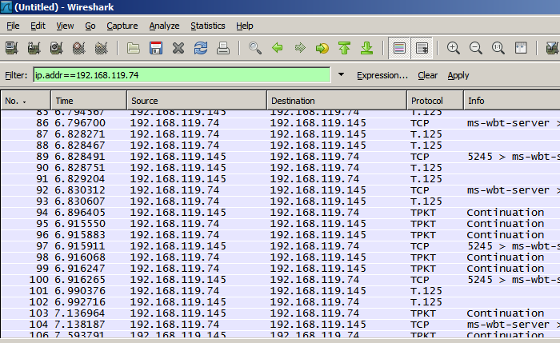

# ISO transport services on top of the TCP (TPKT)

"Emulate" ISO transport services [COTP](/COTP) on top of [TCP](/TCP). The two major points missing in TCP (compared to [COTP](/COTP)) are the TSAP addressing and the detection of packet boundaries on the receiving host. See the [IsoProtocolFamily](/IsoProtocolFamily) page for an overview.

## History

As TCP becomes more and more popular (around 1995?), a mechanism was needed to encapsulate ISO services on top of TCP transport, as both protocols have similiar tasks and [COTP](/COTP) was becoming obsolete these days.

## Protocol dependencies

  - [TCP](/TCP): Typically, TPKT uses [TCP](/TCP) as its transport protocol. The well known TCP port for TPKT traffic is 102.

## Example traffic



## Wireshark

The TPKT dissector is fully functional.

## Preference Settings

\* Wether TPKT packets spanning multiple TCP segments should be reassembled or not, for VoIP traffic this setting is essential.

## Example capture file

XXX - Add a simple example capture file to the [SampleCaptures](/SampleCaptures) page and link from here. Keep it short, it's also a good idea to gzip it to make it even smaller, as Wireshark can open gzipped files automatically.

## Display Filter

A complete list of TPKT display filter fields can be found in the [display filter reference](http://www.wireshark.org/docs/dfref/t/tpkt.html)

Show only the TPKT based traffic:

``` 
 tpkt
```

## Capture Filter

You can filter TPKT protocols while capturing, as it's always using TCP port 102.

Capture only the TPKT based traffic (you will only see TPKT, but not additions like the corresponding ARP packets):

``` 
 tcp port 102
```

## External links

  - [RFC1006](http://www.ietf.org/rfc/rfc1006.txt?number=1006) *ISO Transport Service on top of the TCP Version: 3*, based on ISO 8073 which is available as [RFC905](http://www.ietf.org/rfc/rfc0905.txt)

  - [RFC2126](http://www.ietf.org/rfc/rfc2126.txt?number=2126) *ISO Transport Service on top of TCP (ITOT)*

Obsolete:

  - [RFC983](http://www.ietf.org/rfc/rfc983.txt) *ISO Transport Services on Top of the TCP*

## Discussion

---

Imported from https://wiki.wireshark.org/TPKT on 2020-08-11 23:26:47 UTC
