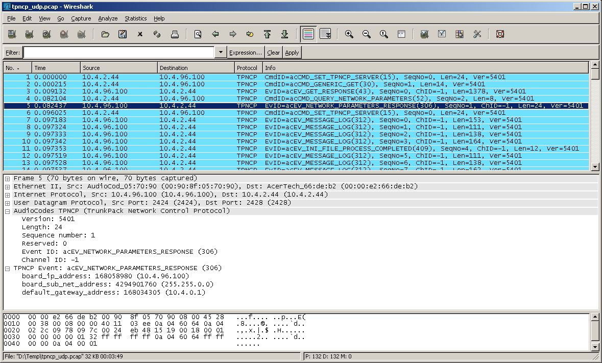
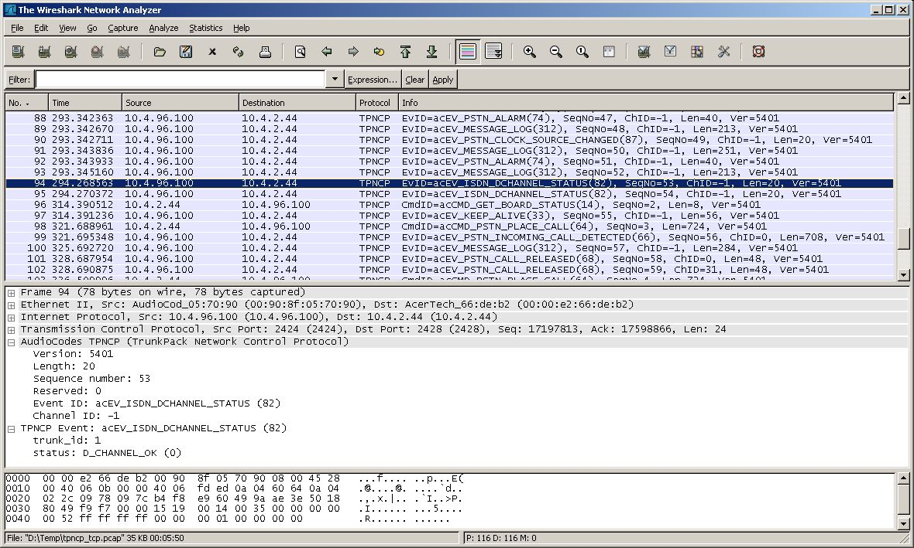

# TrunkPack Network Control Protocol (TPNCP)

  
TPNCP is [Audiocodes](http://www.audiocodes.com)' proprietary network-based protocol. Using this method, the VoPLib ([AudioCodes](http://www.audiocodes.com)’ Voice over Packet Library is a proprietary, all-sources-included API library, enabling control of all VoP-related functions of devices in [AudioCodes](http://www.audiocodes.com)’ TrunkPack-VoP series) communicates with the device via the IP network.  
  

## History

  
The TPNCP was developed to provide additional control and configuration capabilities over and above those offered by the standard control protocols.  
  

## Protocol dependencies

  - [UDP](/UDP): TPNCP uses [UDP](/UDP) as its transport protocol. The well known [UDP](/UDP) port for TPNCP traffic is 2424.

  - [TCP](/TCP): TPNCP uses [TCP](/TCP) as its transport protocol. The well known [TCP](/TCP) port for TPNCP traffic is 2424.

## Example traffic

  
TPNCP over [UDP](/UDP).  
  



  
TPNCP over [TCP](/TCP).  
  

  
  

## Wireshark

  
The TPNCP dissector is fully functional. The TPNCP protocol is constantly changing and requires tpncp.dat file for proper registration and dissection. The tpncp.dat file resides in TPNCP folder in Wireshark program directory and it is read at program start. The tpncp.dat file is distributed with [Audiocodes](http://www.audiocodes.com)' SW Release Package. The example of tpncp.dat file  
  
[tpncp.dat](uploads/__moin_import__/attachments/TPNCP/tpncp.dat)  
  

## Preference Settings

  
None.  
  

## Example capture file

  - [SampleCaptures/tpncp\_udp.pcap](uploads/__moin_import__/attachments/SampleCaptures/tpncp_udp.pcap)

  - [SampleCaptures/tpncp\_tcp.pcap](uploads/__moin_import__/attachments/SampleCaptures/tpncp_tcp.pcap)

## Display Filter

Show only the TPNCP based traffic:

``` 
 tpncp
```

## Capture Filter

  
You cannot directly filter TPNCP protocol while capturing. However, if you know the [UDP](/UDP) or [TCP](/TCP) port used (see above), you can filter on that one.

Capture only the TPNCP traffic over the default port (2424):

``` 
 tcp port 2424
```

## External links

  
[AudioCodes](http://www.audiocodes.com)  
  

## Discussion

---

Imported from https://wiki.wireshark.org/TPNCP on 2020-08-11 23:26:47 UTC
