## Background
A particular challenge for network and application support people is identifying the cause of a slow response time issue.

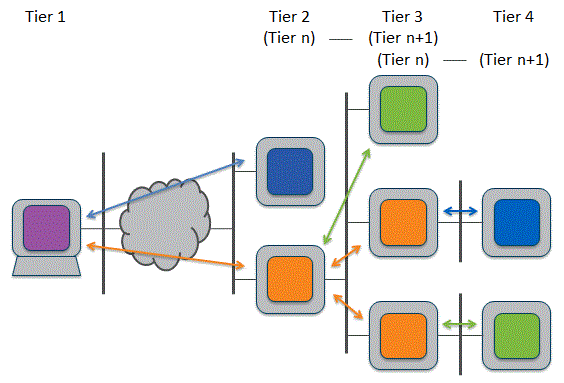

Today's business applications are delivered by complex multi-tiered systems.  When a performance problem occurs it can be difficult to determine the causing component let alone the fix.  In this manual we refer to these types of issues as gray problems.
Network analysis is a tremendously powerful way to analyze the performance of a computer system, and Wireshark is by far the most widely used tool for this purpose.  We can use a tool like Wireshark to analyze the data flows between the components.
TRANSUM extends the capabilities of Wireshark by providing a breakdown of the overall response time from a service in a way that makes it simple to:
Identify slow response times from components such as web, application and database services
Breakdown the slow response times into network and service elements
The principle objective of TRANSUM is to enable an application or network analyst to be able to quickly pinpoint the cause of slow response times.

## Concepts
The concept of Response Time Elements is key to the design and use of TRANSUM.  It's a simple concept but you'll need to understand it to make any sense of the TRANSUM output.
We start by understanding that every multi-tier system is made up of multiple processes running on infrastructure.

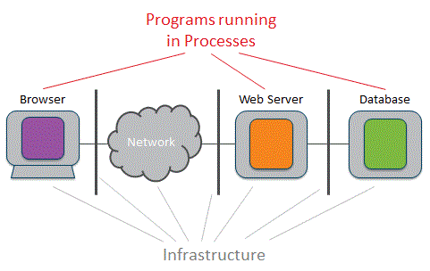

When the processes communicate with each other, in almost all cases one will take the role of client and the other will provide a service.

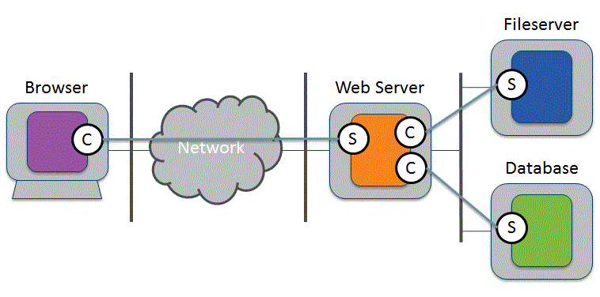

Flowing between the client and service we have application messages, which we will call Application Protocol Data Units or APDUs.  There are two types of APDU:
Request APDU that flows from client to service; an example would be an HTTP POST message
Response APDU that flows from service to client; an example would be an HTTP 200 OK response
Many APDUs are transported from client to service using TCP, and TRANSUM can analyze these types of flow.

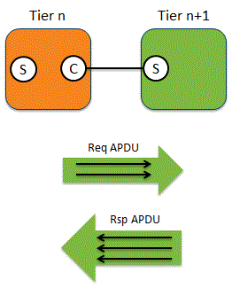

An APDU may not fit into a single segment.  Typically a segment can only carry 1,460 bytes of data, and so if the APDU is, say, 2,000 bytes it must be split into two segments and hence two packets.  In the diagram above we see a Request APDU split across two packets and a Response APDU split across three packets.

## The RTE Model
The following diagram is our reference model for response time analysis.  Don't be put off by the talk of reference models, it's a very simple concept.

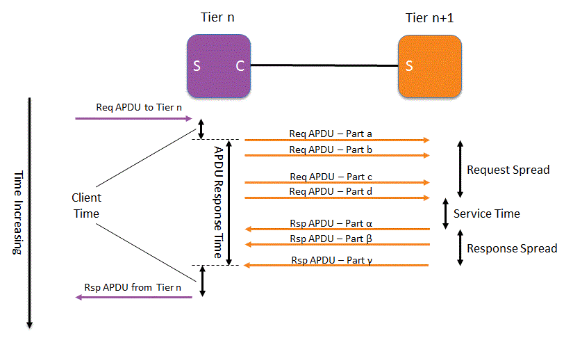

### APDU Response Time
In the diagram above we see a Request APDU split across four packets and a Response APDU split across three packets.  From the perspective of the Tier n client process what's important is the time taken from sending the first Request packet to receiving the last Response packet.
APDU Response Time measures first request to last response

### Service Time
The perspective of the service process is somewhat different.  The service will probably need to receive the whole Request to begin processing it and once it starts sending the response it's reasonable to assume that all processing is complete; this assumption will be accurate for almost all systems you ever study.  Therefore, what is important here is the time between receiving the last Request packet and sending the first Response packet.
Service Time measures last request to first response

### Spread Time
It will take some time to transfer the multiple request packets and the multiple response packets across the network.  We call this time Spread.  The Spread time is affected by network and transport issues such as:
- Bandwidth
- Queuing (Load)
- TCP Retransmissions
- Latency
- TCP Window Size
- Poor buffer sizing (Nagle Delayed Send and Delayed ACK effects)

The important point here is that if we see high Spread values, we can then drill down into the sequence of request or response packets to determine the cause.
Request Spread measures first request to the last request.
Response Spread measures first response to last response.

### Important Note
The important point to note about the RTE concept is that APDU Response Time is a measure of Service Time plus Spread, and therefore only when you identify a high APDU Response Time do you need to drill down into it to determine if it's caused by a network/transport problem or by a slow service.
Isn't that neat?

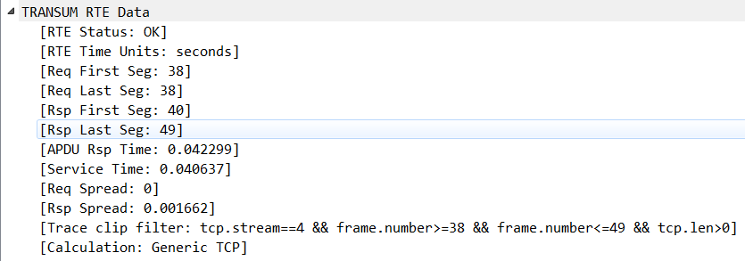

## Limitations

### Supported Protocols
TRANSUM studies the flow of packets within a TCP Stream to identify Request and Response APDUs.


TRANSUM has a number of RTE functions.

#### Generic TCP
The Generic TCP RTE function is only accurate if:
- The APDUs within a stream follow a request-response-request-response pattern; we call this a *flip-flop mode* of operation
- There is no other further level of multiplexing running on top of TCP

Therefore, if we look at a single TCP stream and we see two requests followed by two response, the Generic TCP Function cannot currently accurately calculate the RTE values.

Those protocols supported by the Generic TCP measurement function include:
- Web HTTP and HTTPS
- Web service HTTP and HTTPS
- Microsoft SQL database TDS without Multiple Active Result Set (MARS) activated
- Oracle database TNS
- PostgeSQL database
- .NET Remoting both SOAP and binary
- SMTP
- FTP command connection
- Many proprietary protocols that obey the flip-flop pattern

#### Generic UDP

The Generic UDP RTE function is only accurate if:
- The APDUs within a stream follow a request-response-request-response pattern; we call this a *flip-flop mode* of operation
- There is no other further level of multiplexing running on top of UDP

Therefore, if we look at a single UDP stream and we see two requests followed by two response, the Generic UDP Function cannot accurately calculate the RTE values.
UDP is often used for broadcasts and DHCP is a good example.

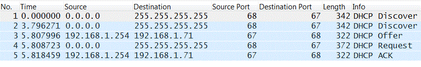

The DHCP Requests have an IP address of 0.0.0.0 and a broadcast destination address.  The response flow as unicast packets.  Because the IP address pairs in requests and responses don't match, Wireshark considers there to be two different UDP streams here; one for the requests and one for the responses.  The TRANSUM Generic UDP dissector uses the UDP Stream value as one of the criteria to match requests and responses and so it's quite obvious that TRANSUM cannot successfully process DHCP flows.

#### DCE-RPC Support

TRANSUM includes support for DCE-RPC based protocols, including Microsoft's MS-RPC protocol.  The match of request with response is made using the TCP Stream, Context ID, Call ID and an internally generated suffix.  The suffix is needed because the other three values are not necessarily unique and TRANSUM needs to be able to uniquely identify a Request-Response pair.

#### DNS Support

The match of request with response is made using the UDP Stream Number and the DNS Transaction ID.

#### SMB2 Support

This is automatically used for streams to or from TCP Port 445 that include SMB2 messages.  SMB1 messages are not processed by the SMB2 RTE function.

The SMB2 RTE function handles:
- Multi-credit requests (several requests sent before receiving a response)
- Compound message and multi-message packets
- When a multi-message request is processed, the SMB2 function calculates RTE values from the request packet to the point where responses have been received for all requests.

[MISSING IMAGE]

Therefore, the RTE figures represent the worst case response time values.

#### Other Protocols

For other protocols, the Wireshark response time measurements (Time from/since request) are the next best thing, we just need to be aware that one or other of the Spread values will not be included.

### IPv6

TRANSUM includes support for IP version 6.  Due to the limited amount of IPv6 sample trace data we have available this area has not been tested as thoroughly as traces based on IPv4.

### Accuracy

There are some inaccuracies in the way that TRANSUM calculates the RTE elements.  These arise because the values are calculated using traces captured at a single point in the network.

[MISSING IMAGE]

Consider the values calculated from a trace captured adjacent to the client.  The Request Spread value will not include network transit time for the last packet, which should strictly be included.  Similarly, the Response Spread value will not include the network transit time for the first response packet.  The sum of these values is one Network Round Trip Time (RTT), and we can think of it as a missing RTT.

TRANSUM will assume that these missing times are part of the Service Time, and so the Service Time is exaggerated. This also means that a Request or Response APDU comprising a single packet will have a spread value of zero, whereas in fact the spread should be equivalent to the one-way network latency.

If we use TRANSUM to investigate an intermittent response time problem, these inaccuracies tend to be insignificant compared to the delays associated with the actual problem.

We can get a more accurate view if needed in the following way:
- Capture a trace adjacent to the client
- Capture a trace adjacent to the service
- Export the Packet List from each trace with RTE data values
- Import the Packet Lists into a spreadsheet program
- Line up the entries from each trace so that data for one packet from the two traces resides on a single row (two sets of RTE data; one client-side, one service side)
- The APDU Response Time from the client-side trace will be accurate
- The Service Time from the service-side trace will be accurate
- For each row calculate a Spread Adjustment value as follows:
  + Spread Adjustment = ( APDU Response Time [measured adj. to client] - Service Time [measured adj. to service] - Request Spread [measured adj. to service] - Response Time [measured adj. to client] ) / 2
- Add this Spread Adjustment figure to each client-side or service-side spread figure to give Request Spread and Response Spread values that include the network delay

This adjustment in itself is a compromise as it assumes that the missing RTT is a symmetrical delay across the network.  However, to achieve something more accurate would require perfect synchronisation of clocks on the two capture units and this is not realistic.

Most importantly, none of these inaccuracies affect the APDU Response Time measured at the client, which remains accurate in all cases.  As APDU Response Time is the value that is initially used to flag up a problem, the need to make the above adjustments will be rare.

## TSHARK

TRANSUM supports tshark.  To obtain the decode information tshark must be run with the -2 option.  A typical command is:
```
tshark -2 -q -ta -C TRANSUM -Y "transum"  -T fields -E separator=, -E quote=d -e _ws.col.Time -e frame.number -e ip.src -e ip.dst -e transum.art -e _ws.col.Info -r trace_file.pcapng
```

## Configuration
In this section we look at the individual configuration.

The TRANSUM plugin is not enabled by default, and so the first step is to enable it:

- In the main top menu choose Analyze -> Enabled protocols...
- In the Enabled Protocols dialogue box search for TRANSUM
- Check the TRANSUM protocol and click OK

Now let's look at the preferences for the TRANSUM plugin.

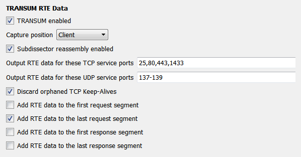

The preferences dialogue screen can be accessed in the normal ways:
- In the top menu go to Edit -> Preferences -> Protocols (expand this) -> TRANSUM
- Right click on an TRANSUM RTE Data object in the Packet Detail pane and choose Protocol Preferences -> Open TRANSUM RTE DATA preferences ...

### Capture position

This setting affects how TRANSUM handles TCP retransmissions.

- Client - TRANSUM ignores retransmissions from service to client.  The rationale is that if we are tracing adjacent to the client and we see an original packet and later a retransmitted packet then the client would have seen both too, and so the retransmission should be ignored.
- Service - TRANSUM ignores retransmissions from client to service.  The rationale is that if we are tracing adjacent to the service and we see an original packet and later a retransmitted packet then the service would have seen both too, and so the retransmission should be ignored.
- Intermediate - TRANSUM includes all retransmissions in spread calculations.

Wireshark can mark a packet as a TCP Retransmission if ACKs and data packets get out of sync.  This will cause an inaccurate RTE calculation if the retransmission is the last request or last response packet.

### Subdissector reassembly enabled

This setting should match that of the TCP preference *Allow subdissectors to reassemble TCP streams*.

[MISSING IMAGE]

If none of the options to add RTE data to particular packets are set as defined below, the RTE data will be added to the packet list entry that has a summary of the APDU message.
NB:  It's important to note that this setting will not automatically track that of the TCP preference setting.  Currently the Wireshark support for LUA scripting does not provide a mechanism to read the preference settings of another dissector and so we must manually keep these settings in sync.

### Output RTE data for these TCP service ports

This is a list of the TCP service ports for which TRANSUM will calculate RTE values.  The list must be port numbers with a single comma between each.  TRANSUM now supports port ranges of the form 4000-4024.
If you need TRANSUM to generate RTE data for other service ports simply add them to the list.
For example, a Microsoft SQL Database instance uses port 1433 by default.  However, your DBA may have configured it to use another port, or you may have multiple instances running on a single server, in which case you will want to add those port numbers.

### Output RTE data for these UDP service ports

This is a list of the UDP service ports for which TRANSUM will calculate RTE values.  The list must be port numbers with a single comma between each.  TRANSUM now supports port ranges of the form 4000-4024.
If you need TRANSUM to generate RTE data for other UDP service ports simply add them to the list.

### Discard orphaned TCP Keep-Alives

TRANSUM ignores packets that Wireshark marks as TCP Keep-Alive.  However, Wireshark needs to see the packet prior to the TCP Keep-Alive to correctly interpret the current packet as a TCP Keep-Alive, and if this earlier packet is not in the trace file Wireshark will assume that the Keep-Alive packet as a data packet.

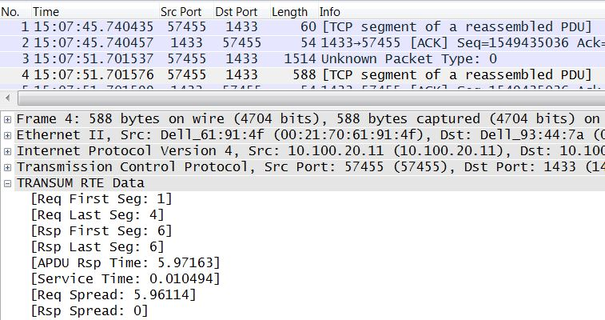

The above screenshot shows the issue.  Note how packet 1 has been interpreted as a data packet, whereas it is actually a TCP Keep-Alive.  We can see that TRANSUM assumes that this is the first packet of the Request APDU and so we get a very high Req Spread value.

By enabling this* Discard orphaned TCP Keep-Alives* option TRANSUM will assume that any packet with a TCP Len of 1 byte and the ACK flag set is a TCP Keep-Alive, and so ignore the packet.

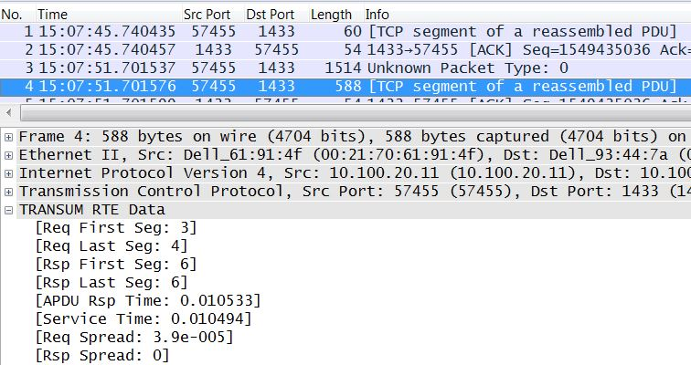

Here the discard option has been enabled and we see that TRANSUM has ignored packet 1.  It's important to note that even though enabling this option gets around the TRANSUM issue, Wireshark still incorrectly assumes that the packet contains valid data.

The default setting is *disabled*

### RTE Data Placement

By checking one or more of the options presented after this heading we can specify which packets should include the RTE data.

[MISSING IMAGE]

## Using TRANSUM

### Interpreting the Output
In this section we'll look at the meaning of every element of the TRANSUM RTE Data.

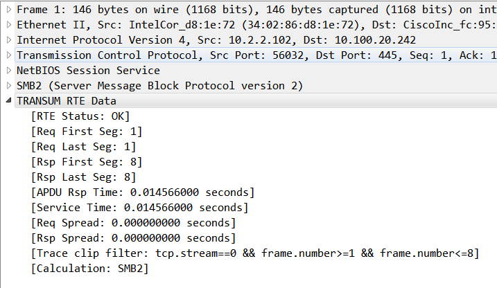

#### RTE Status (transum.status)
The value here indicates the status of the RTE data:
OK - both a request and response was detected and all values should be valid
Response missing - although TRANSUM detected a request it could not find a matching response

#### Req First Seg (transum.firstreq)
This is the frame number of the first (or only) packet in a sequence of packets that make up the APDU Request.

#### Req Last Seg (transum.lastreq)
This is the frame number of the last (or only) packet in a sequence of packets that make up the APDU Request.

#### Rsp First Seg (transum.firstrsp)
This is the frame number of the first (or only) packet in a sequence of packets that make up the APDU Response.

#### Rsp Last Seg (transum.lastrsp)
This is the frame number of the last (or only) packet in a sequence of packets that make up the APDU Response.

#### APDU Rsp Time (transum.art)
The difference between the timestamp of the Request First Segment and the timestamp of the Response Last Segment, expressed in seconds.  This is the amount of time the client entity must wait for completion of the APDU Request.

#### Service Time (transum.st)
The difference between the timestamp of the Request Last Segment and the timestamp of the Response First Segment, expressed in seconds.  This is the amount of time the service takes to process and respond to the APDU Request.

#### Req Spread (transum.reqspread)
The Request Spread is the difference between the timestamp of the Request First Segment and the timestamp of the Request Last Segment, expressed in seconds.  Sometimes the value is shown in scientific notation e.g. 3.9e-005 which equates to 39 microseconds. This is the amount of time the transport mechanism (including the underlying network infrastructure) took to send the entire APDU Request from the client to the service.

#### Rsp Spread (transum.rspspread)
The Response Spread is the difference between the timestamp of the Response First Segment and the timestamp of the Response Last Segment, expressed in seconds.  Sometimes the value is shown in scientific notation e.g. 3.9e-005 which equates to 39 microseconds.  This is the amount of time the transport mechanism (including the underlying network infrastructure) took to send the entire APDU Request from the service to the client.

#### Trace clip filter (transum.clip_filter)
Using this filter selects all packets with TCP Payload within a TCP or UDP stream starting at the Request First Segment and ending at the Response Last Segment.  See Selecting a Trace Clip for further details

#### Calculation (transum.calculation)
This value indicates which TRANSUM dissector generated the RTE Data.

### Using Packet List Output

We can add RTE Data to the packet list window, the procedure is quite simple:

- Right click on a TRANSUM RTE Data value such as APDU Rsp Time
- From the pop-up menu choose Apply as Column

Adding all of the RTE Data values as columns can make things a bit confusing.  The best compromise is to add the time values (APDU Rsp Time, Service Time, Req Spread and Rsp Spread.

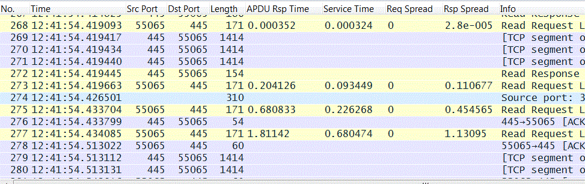

This provides an instant view of the performance of each APDU pair.  The display can be further simplified by adding a filter term of *transum*:

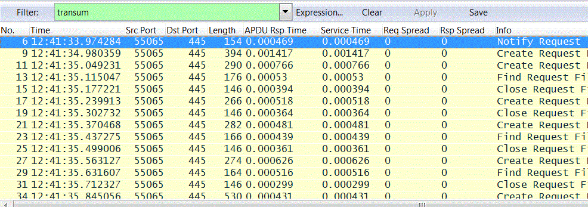

Once we have the data in this form we can sort by, say, slowest APDU Rsp Time and immediate start studying those APDU Request-Response pairs that are slow.

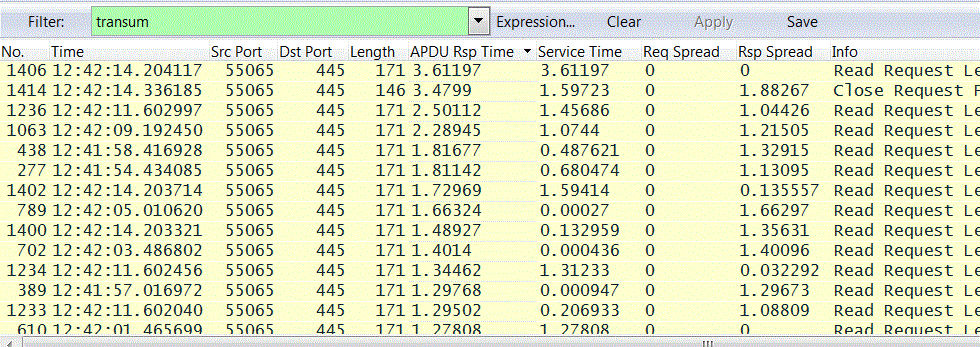

It's at this point that we can make good use of the Trace Clip facility.

### Selecting a Trace Clip

TRANSUM will generates a filter expression that will show all data packets for the present APDU Request-Response pair

To select a trace clip do the following:

1. Right click on the Trace clip filter field and choose Prepare a Filter -> Selected
1. In the filter expression box deleted from the start of the expression up to the first quote
1. Go to the end of the expression and delete the last quote
1. Apply the filter

An alternative procedure (and maybe simpler) is:

1. Right click on the Trace clip filter field and choose Copy -> Value
1. Paste the copied value into the Filter: box
1. Apply the filter

Because the filter term generated is based around the TCP or UDP Stream Number the filter will include all packets between the first APDU Request packet to the last APDU Response packet.  For those protocol that don't multiplex multiple sessions onto one TCP connection, the trace entries selected will be just those associated with the APDU Pair that interests us. However, protocols like SMB2 multiplex multiple SMB sessions onto a single TCP connection.  In this case our trace clip may include packets for other APDU pairs.

In practice this limitation turns out to be an advantage.  We are often looking for TCP related performance issues and if we didn't see all of the packets on a TCP connection within the timeframe of a slow APDU pair we could miss a cause for the problem.

### Batch Processing with Tshark

TRANSUM support for Tshark opens up a whole new area of analysis.  With a relatively simple script we can process hundreds of trace files to select detailed performance data for any of the protocols supported by TRANSUM.

### Processing a Single File (HttpTs)

Let's start by looking at a single command that will extract web performance figures from a single trace file.
```
tshark -2 -q -ta -R "eth.type" -Y "transum && tcp.port==80"
-T fields -E separator=, -E quote=d
-e _ws.col.Time -e frame.number -e ip.src -e ip.dst -e tcp.srcport -e tcp.dstport
-e transum.firstreq -e transum.lastreq -e transum.firstrsp -e transum.lastrsp
-e transum.art -e transum.st -e transum.reqspread -e transum.rspspread -e http.request.method -e http.request.uri
-r _trace_file_
```
At first look this looks very complicated, but once we break it down it's actually very simple.

<table>
<tr>
<th>
Element
</th>
<th>
Meaning
</th>
</tr>
<tr>
<td>
tshark
</td>
<td>
The command to invoke Tshark
</td>
</tr>
<tr>
<td>
-2
</td>
<td>
This switch forces Tshark to scan the trace file twice.  This causes Tshark to produce decode information and the generate further information on the second scan.  TRANSUM requires this switch.
</td>
</tr>
<tr>
<td>
-q
</td>
<td>
Quiet mode.  Because we will redirect the output into a CSV we don't want spurious messages.
</td>
</tr>
<tr>
<td>
-ta
</td>
<td>
Ensures we get absolute time.  Other settings will work but we find this is the most useful particularly when processing multiple files.
</td>
</tr>
<tr>
<td>
-R "eth.type"
</td>
<td>
This is a necessary dummy entry that forces Tshark to perform detailed decodes on all packets.
</td>
</tr>
<tr>
<td>
-Y "transum && tcp.port==80"
</td>
<td>
This is an output filter so that we only get packets with TRANSUM RTE Data for HTTP traffic.
</td>
</tr>
<tr>
<td>
-T fields -E separator=, -E quote=d 
</td>
<td>
These switches and values ensure that the output is CSV compatible.
</td>
</tr>
<tr>
<td>
-e
</td>
<td>
 Each of these parameters define the columns to output.
</td>
</tr>
<tr>
<td>
-r
</td>
<td>
 This parameter states the trace file that's used for input.
</td>
</tr>
</table>
 
To make life much simpler we can create a script with the command and replace the file name with an input variable reference.  A simple Windows .bat file would look like this:
```
@echo off
REM  Parameter %1 is name of the file to be processed
echo "Time","Frame","IP Src","IP Dst","TCP Src","TCP Dst","Req First Seg","Req Last Seg","Rsp First Seg","Rsp Last Seg","APDU Rsp Time","Service Time","Req Spread","Rsp Spread","Method","URI"
tshark -2 -q -ta -R "eth.type" -Y "transum && tcp.port==80"  -T fields -E separator=, -E quote=d -e _ws.col.Time -e frame.number -e ip.src -e ip.dst -e tcp.srcport -e tcp.dstport -e transum.firstreq -e transum.lastreq -e transum.firstrsp -e transum.lastrsp -e transum.art -e transum.st -e transum.reqspread -e transum.rspspread -e http.request.method -e http.request.uri -r %1
```
If the .bat file is called HttpSum.bat we can create a CSV with the command:
```
C:\temp> HttpSum trace_file.pcapng > http_performance.csv
```
The CSV can then be opened in a spreadsheet program like Excel for further manipulation.

### Processing Multiple Files (HttpSum)

Building on the simple example above we can create a Windows .bat file that enumerates a list of files and then processes them in sequence to produce a single CSV with performance data:
```
@echo off
REM  Parameter %1 is name of the file to be processed - wildcards are allowed
if %1. == . (
 ECHO .
 ECHO Processing stopped - no parameters provided
 goto :EOF
)
echo "Time","Frame","IP Src","IP Dst","TCP Src","TCP Dst","Req First Seg","Req Last Seg","Rsp First Seg","Rsp Last Seg","APDU Rsp Time","Service Time","Req Spread","Rsp Spread","Method","URI"
for %%f in (%1) do call :ffsub %%f
goto :EOF

:ffsub
tshark -2 -q -ta -R "eth.type" -Y "transum && tcp.port==80"  -T fields -E separator=, -E quote=d
-e _ws.col.Time -e frame.number -e ip.src -e ip.dst -e tcp.srcport -e tcp.dstport -e transum.firstreq -e transum.lastreq -e transum.firstrsp -e transum.lastrsp -e transum.art -e transum.st
-e transum.reqspread -e transum.rspspread -e http.request.method -e http.request.uri -r %1
goto :EOF
```
Let's call the above .bat file HttpSum.bat. If we have a directory containing multiple HTTP traces that have file names that start myHttpTrace we can summarise all of them with:
```
C:\temp> HttpSum myHttpTrace* > performance_data.csv
```
The resulting CSV can be opened directly in your spreadsheet program.

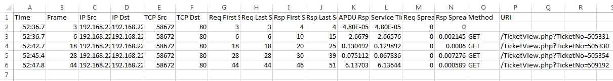

In this trace, frame number 3 is a measurement for a SYN - SYN/ACK response time and so there is no associated Method or URI. The Time column can be formatted with the Excel custom format hh:hh:ss.000 to give a readable value.

### SMB Performance

Here's a useful command to get SMB2 response times in CSV format.
```
"c:\program files\wireshark\tshark" -2 -q -ta -Y "transum && tcp.port==445" -T fields -E separator=, -E quote=d -e _ws.col.Time -e frame.number -e ip.src -e ip.dst -e tcp.srcport -e tcp.dstport
-e transum.firstreq -e transum.lastreq -e transum.firstrsp -e transum.lastrsp -e transum.art -e transum.st -e transum.reqspread -e transum.rspspread -e smb2.cmd -e smb2.fid -r "%1"
```
Store this in a file, say, smb_performance.bat and then execute from the command line with something like this:
```
smb_performance slow_file_transfer.pcapng
```
