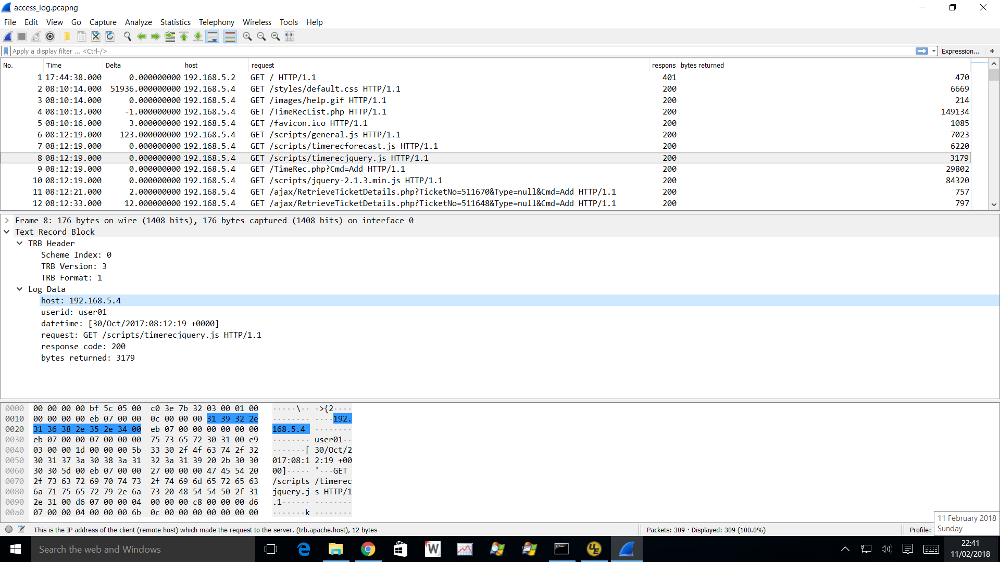

**WARNING:** Work in progress

# Introduction

The widespread use of encryption means that network packet content is often opaque. Systems, subsystems, equipment and applications generate a lot of useful log data that can be used to provide the desired visibility, and generally enrich packet data.

[](uploads/__moin_import__/attachments/TRB-Protocol/trb_screenshot.png "{{attachment:trb_screenshot.png||width=900}}")

Although there are many data analytics tools available, some are expensive and all require learning yet another tool. Wireshark has powerful features, such as filter and search, that would be very useful in the analysis of log data, particularly for engineers who are already familiar with Wireshark.

This page proposes Wireshark support for the analysis of text-based log data carried in pcapng files.

# Objective

The objective of the project is to add Wireshark support for the display, filtering, etc. of text log data (machine data). The data is presented to Wireshark in a pcapng file that contains two new block types:

  - TDB - Text Description Block that defines the layout of the data records
      - The data in the TDB is used to define heading fields i.e. the heading fields aren't predefined as they typically are in dissectors, but rather defined at file load time (and cleared when the file is closed)
      - This block is analogous to the Interface Descriptor Block found in a network packet capture
  - TRB - Text Record Block that contains the log record data

There is no proprietary content here, and the block formats are documented so that any suitable tool can be used to convert log data into pcapng format. It may possible to add support to the Wiretap library to directly read log files.

# Test pcapng Generation

The Babel function of [TribeLab Workbench](http://web.archive.org/web/20161031011910/https://community.tribelab.com/mod/page/view.php?id=490) has been extended to convert log file data into TRBs and TDBs. Babel produces the pcapng file like this:

``` 
    log_file -----------------------------------> TRBs
                           ^
                           |
    apache-common.xml -----+--------------------> TDB
```

An XML file describes the format of the log file. The XML is used to generate the TDB, and some elements of it are used to help parse the log records to form TRBs.

  - See Appendix C below for an example of the XML file
  - See Appendix D below for a sample pcapng file

Of course, any tool could be built to generate TRB files; something based on Logstash is an obvious choice here.

# Text Description Block (TDB)

The TDB defines the type and meaning of each field using a Field Descriptor. The Field Descriptors can themselves be encoded in a number of field formats. The TRB plugin only supports one format, TDB\_FD\_FORMAT\_WS, which is a native Wireshark format. The pcapng reader (e.g. Wireshark) should not generate an event list entry for this block.

## TDB Block Format

``` 
    0                   1                   2                   3
    0 1 2 3 4 5 6 7 8 9 0 1 2 3 4 5 6 7 8 9 0 1 2 3 4 5 6 7 8 9 0 1
   +---------------------------------------------------------------+
 0 |                    Block Type = 0x80000010                    |
   +---------------------------------------------------------------+
 4 |                      Block Total Length                       |
   +-+-+-+-+-+-+-+-+-+-+-+-+-+-+-+-+-+-+-+-+-+-+-+-+-+-+-+-+-+-+-+-+
 8 |            Version            |            Format             |
   +-+-+-+-+-+-+-+-+-+-+-+-+-+-+-+-+-+-+-+-+-+-+-+-+-+-+-+-+-+-+-+-+
12 |          Scheme Index         |           Reserved            |
   +-+-+-+-+-+-+-+-+-+-+-+-+-+-+-+-+-+-+-+-+-+-+-+-+-+-+-+-+-+-+-+-+
16 |                             GUID1                             |
   +-+-+-+-+-+-+-+-+-+-+-+-+-+-+-+-+-+-+-+-+-+-+-+-+-+-+-+-+-+-+-+-+
24 |                             GUID2                             |
   +-+-+-+-+-+-+-+-+-+-+-+-+-+-+-+-+-+-+-+-+-+-+-+-+-+-+-+-+-+-+-+-+
32 |                             GUID3                             |
   +-+-+-+-+-+-+-+-+-+-+-+-+-+-+-+-+-+-+-+-+-+-+-+-+-+-+-+-+-+-+-+-+
40 |                             GUID4                             |
   +-+-+-+-+-+-+-+-+-+-+-+-+-+-+-+-+-+-+-+-+-+-+-+-+-+-+-+-+-+-+-+-+
44 |                           FD Length                           |
   +-+-+-+-+-+-+-+-+-+-+-+-+-+-+-+-+-+-+-+-+-+-+-+-+-+-+-+-+-+-+-+-+
48 /                                                               /
   /                       Field Descriptors                       /
   /              variable length, padded to 32 bits               /
   /                                                               /
   +-+-+-+-+-+-+-+-+-+-+-+-+-+-+-+-+-+-+-+-+-+-+-+-+-+-+-+-+-+-+-+-+
   /                                                               /
   /                      Options (variable)                       /
   /                                                               /
   +-+-+-+-+-+-+-+-+-+-+-+-+-+-+-+-+-+-+-+-+-+-+-+-+-+-+-+-+-+-+-+-+
   |                      Block Total Length                       |
   +---------------------------------------------------------------+
```

<div>

<table>
<tbody>
<tr class="odd">
<td><p><strong>Name</strong></p></td>
<td><p><strong>Data Type</strong></p></td>
<td><p><strong>Description</strong></p></td>
<td><p><strong>Example</strong></p></td>
</tr>
<tr class="even">
<td><p>Version</p></td>
<td><p>UINT16</p></td>
<td><p>The protocol version. This document describes TRB v3.</p></td>
<td><p>3</p></td>
</tr>
<tr class="odd">
<td><p>Format</p></td>
<td><p>UINT16</p></td>
<td><p>The format of the Field Descriptors</p></td>
<td><p>101 - TDB_FD_FORMAT_WS</p></td>
</tr>
<tr class="even">
<td><p>Scheme Index</p></td>
<td><p>UINT16</p></td>
<td><p>Used to relate TRBs with a particular record format</p></td>
<td><p>0</p></td>
</tr>
<tr class="odd">
<td><p>Reserved</p></td>
<td><p>UINT16</p></td>
<td><p>Not used - must be set to 0</p></td>
<td><p>0</p></td>
</tr>
<tr class="even">
<td><p>GUID1-4</p></td>
<td><p>UINT32</p></td>
<td><p>Not used - must be set to 0</p></td>
<td><p>0</p></td>
</tr>
<tr class="odd">
<td><p>FD Length</p></td>
<td><p>UINT32</p></td>
<td><p>The length of the Field Descriptor data</p></td>
<td><p>420</p></td>
</tr>
<tr class="even">
<td><p>Field Descriptors</p></td>
<td><p>Variable</p></td>
<td><p>Descriptors that describe the data type for each field - See ???</p></td>
<td></td>
</tr>
<tr class="odd">
<td><p>Options</p></td>
<td><p>Variable</p></td>
<td><p>TDB options - See below</p></td>
<td></td>
</tr>
</tbody>
</table>

</div>

## Wireshark Native Field Descriptors

Wireshark Native Field Descriptors simplify Wireshark decoding of the TRB protocol. Wireshark's interpretation and rendering of each protocol field value is controlled by a header field (hf). A header field has a number of attributes:

<div>

<table>
<tbody>
<tr class="odd">
<td><p>type</p></td>
<td><p>UINT32</p></td>
<td><p>The type of value this field holds. See Appendix A for values.</p></td>
</tr>
<tr class="even">
<td><p>display</p></td>
<td><p>UINT32</p></td>
<td><p>The display field has a couple of overloaded uses. See Appendix B for values.</p></td>
</tr>
<tr class="odd">
<td><p>bitmask</p></td>
<td><p>UINT64</p></td>
<td><p>If the field is a bitfield, then the bitmask is the mask which will leave only the bits needed to make the field when ANDed with a value. The proto_tree routines will calculate 'bitshift' automatically from 'bitmask', by finding the rightmost set bit in the bitmask. This shift is applied before applying string mapping functions or filtering.</p></td>
</tr>
<tr class="even">
<td><p>name</p></td>
<td><p>String</p></td>
<td><p>A string representing the name of the field. This is the name that will appear in the graphical protocol tree. It must be a non-empty string.</p></td>
</tr>
<tr class="odd">
<td><p>abbrev_ending</p></td>
<td><p>String</p></td>
<td><p>This string is concatenated with "trb.<em>group_name</em>." to form a complete Wireshark abbreviation. The group_name value is carried in a Group Start field descriptor (see Groups below). Example: "trb" protocol plus "httpd" group name plus field name "host" will be rendered in Wireshark as "trb.httpd.host".</p></td>
</tr>
<tr class="even">
<td><p>strings</p></td>
<td><p>Compound</p></td>
<td><p>Some integer fields, of type FT_UINT*, need labels to represent the true value of a field. You could think of those fields as having an enumerated data type, rather than an integral data type.</p></td>
</tr>
<tr class="odd">
<td><p>blurb</p></td>
<td><p>String</p></td>
<td><p>This is a string giving a proper description of the field. It should be at least one grammatically complete sentence, or NULL in which case the name field is used.</p></td>
</tr>
</tbody>
</table>

</div>

A TDB contains these values serialised like this:

    ++-----------------------------------------------------++-----------------------------------------------------++----
    ||type|display|bitmask|name|abbrev_ending|strings|blurb||type|display|bitmask|name|abbrev_ending|strings|blurb|| etc
    ++-----------------------------------------------------++-----------------------------------------------------++----

The treatment of the abbrev field was tricky. A concern is that if two files are merged, they may have abbrev values that clash i.e. same value, different meaning. By forming the abbrev in Wireshark from the protocol name (trb), a group name value and abbrev\_ending, there is an opportunity to adjust the group name value and hence avoid the clash. For example, let's imagine that we need to merge two logs that both have records with a first level group name value of "websphere" and a "host" field; in one log this means the client IP and in the other it means the WebSphere instance. Wireshark could suffix the first level group name of the second log to give websphere\_2, thereby avoiding the clash. Ultimately, the use of GUIDs rather than group names is preferable, but these would have to be administered and so this is not a simple matter.

### type

The encoded integer values for the field types are not the same as the integer values used within Wireshark. This is because the Wireshark types are generated via an enumerated list. A change to the list could change the enumerated values. If we used these values within the TDB, we would have compatibility problems. Wireshark field type values start at 0. The TDB field type values start at 1001.

The types map to native Wireshark field types with three important exceptions:

  - A log record could contain many date-time values. We need to indicate which value should be used in the Wireshark packet list. This is done through the EVENT\_DATETIME field type.
  - A log often mixes IPv4 and IPv6 addresses in the same column; both Apache HTTPD and Microsoft IIS do this. To accommodate this we have a TS\_FT\_IPvx field type.
  - Subset Start and Subset End (see below) are pseudo field values.

## Field Descriptor Encoding

Field Descriptor values are encoded like this:

<div>

<table>
<tbody>
<tr class="odd">
<td><p>value_type</p></td>
<td><p>UINT16</p></td>
<td><p>See value types below</p></td>
</tr>
<tr class="even">
<td><p>value_length</p></td>
<td><p>UINT16</p></td>
<td><p>The length of value including zero terminator for a string but not padding</p></td>
</tr>
<tr class="odd">
<td><p>value</p></td>
<td><p>Various</p></td>
<td><p>An element of the Field Descriptor e.g. blurb</p></td>
</tr>
</tbody>
</table>

</div>

Note that the value\_type is the data type and not related to the variable identity (so not name, abbrev\_ending, blurb, etc.). The identity of of each value is purely defined by its position.

value\_types are:

<div>

<table>
<tbody>
<tr class="odd">
<td><p>1</p></td>
<td><p>UINT8</p></td>
</tr>
<tr class="even">
<td><p>2</p></td>
<td><p>UINT16</p></td>
</tr>
<tr class="odd">
<td><p>4</p></td>
<td><p>UINT32</p></td>
</tr>
<tr class="even">
<td><p>8</p></td>
<td><p>UINT64</p></td>
</tr>
<tr class="odd">
<td><p>10</p></td>
<td><p>Zero-terminated string</p></td>
</tr>
<tr class="even">
<td><p>12</p></td>
<td><p>Compound</p></td>
</tr>
<tr class="odd">
<td><p>14</p></td>
<td><p>Group Start</p></td>
</tr>
<tr class="even">
<td><p>16</p></td>
<td><p>Group End</p></td>
</tr>
</tbody>
</table>

</div>

All FD values are padded to a 4-byte boundary.

The Field Descriptors must be defined in the same order as the fields appear in a row of log data. This allows for rapid matching of TRB fields with the correct Field Descriptor by indexing into an array of Field Descriptors. This also means that if a log data row has a missing value, it must be represented in the TRB. Two exceptions to this rule are Group Start and Group End, which bracket a related group of fields - see Groups below.

### Compound Type

The strings value is a compound data type and presents three challenges:

  - It can contain arrays
  - It contains compound types (structures and arrays)
  - It's overloaded with a variety of compound types

There are seven variants of string value:

  - value\_string
  - Extended value strings
  - val64\_string
  - Unit string
  - Ranges
  - Booleans
  - Custom

For full details see doc/README.dissector in the Wireshark code tree.

[ToDo](/ToDo) - The first release of the TRB dissector doesn't support strings values. Define the encoding and add support for strings.

## Groups

Wireshark (or any protocol analyzer) rarely defines a packet decode as a flat list of field values. Related values are group so that they can be shrunk and expanded as necessary. Take a TCP/IP packet as an example. The decode groups the Ethernet fields together, the IP fields, and so on. The Ethernet destination address is further grouped into the Address, LG bit and IG bit.

The availability of this feature for text logs is attractive, and the program generating the TRBs needs to be able to define the group structure.

The rules of the use of groups are:

  - Group Start marks the start of a group
  - Group End marks the end of a group
  - Groups can be nested

As a group is a construct that relates to the presentation of a set of fields, a group definition resides in the TDB only; there is no corresponding field in the log and so there is no related TRB field value.

In this way, Group Start should be thought of as a pseudo field descriptor; there is no corresponding field in the log.

Each field of a TRB maps to an entry in the TDB, for example:

<div>

<table>
<tbody>
<tr class="odd">
<td><p>TDB Field Descriptor</p></td>
<td><p>fd_index</p></td>
<td><p>TRB Data</p></td>
<td><p>field_index</p></td>
</tr>
<tr class="even">
<td><p>TS_FT_GRP_START - trb.iis</p></td>
<td><p>0</p></td>
<td><p>-</p></td>
<td><p>-</p></td>
</tr>
<tr class="odd">
<td><p>TS_FT_STRINGZ - trb.iis.date</p></td>
<td><p>1</p></td>
<td><p>2018-06-06</p></td>
<td><p>0</p></td>
</tr>
<tr class="even">
<td><p>TS_FT_STRINGZ - trb.iis.time</p></td>
<td><p>2</p></td>
<td><p>10:52:28</p></td>
<td><p>1</p></td>
</tr>
<tr class="odd">
<td><p>TS_FT_STRINGZ- trb.iis.s-sitename</p></td>
<td><p>3</p></td>
<td><p>W3SVC1</p></td>
<td><p>2</p></td>
</tr>
<tr class="even">
<td><p>.</p></td>
<td><p>.</p></td>
<td><p>.</p></td>
<td><p>.</p></td>
</tr>
<tr class="odd">
<td><p>.</p></td>
<td><p>.</p></td>
<td><p>.</p></td>
<td><p>.</p></td>
</tr>
<tr class="even">
<td><p>TS_FT_UINT32 - trb.iis.time-taken</p></td>
<td><p>11</p></td>
<td><p>31</p></td>
<td><p>10</p></td>
</tr>
<tr class="odd">
<td><p>TS_FT_GRP_END - trb.iis</p></td>
<td><p>12</p></td>
<td><p>-</p></td>
<td><p>-</p></td>
</tr>
</tbody>
</table>

</div>

It's expected that a pcapng reader uses a field index (field\_index) to process each field of a TRB and a field descriptor index (fd\_index) to access the correct TDB entry. When the reader encounters the first TRB field it would go to fd\_index 0 for descriptor information, and when it finds that the descriptor at this point is a Group Start, it would:

  - Take what ever actions are necessary for a Group Start
  - Look to the next descriptor (fd\_index of 1) for a description of the field

Wireshark represents a group by creating a subtree within the protocol tree. Therefore, the Wireshark TRB dissector should create a subtree when it sees a Group Start.

Processing a Group End should be the same.

## TDB Options

<div>

<table>
<tbody>
<tr class="odd">
<td><p><strong>Name</strong></p></td>
<td><p><strong>Code</strong></p></td>
<td><p><strong>Length</strong></p></td>
<td><p><strong>Multiple Allowed</strong></p></td>
</tr>
<tr class="even">
<td><p>opt_owner</p></td>
<td><p>3</p></td>
<td><p>Variable</p></td>
<td><p>No</p></td>
</tr>
<tr class="odd">
<td><p>opt_nativeformat</p></td>
<td><p>4</p></td>
<td><p>Variable</p></td>
<td><p>No</p></td>
</tr>
<tr class="even">
<td><p>opt_missingvalue</p></td>
<td><p>6</p></td>
<td><p>1</p></td>
<td><p>No</p></td>
</tr>
<tr class="odd">
<td><p>opt_infocolumn</p></td>
<td><p>7</p></td>
<td><p>Variable</p></td>
<td><p>No</p></td>
</tr>
<tr class="even">
<td><p>opt_summary</p></td>
<td><p>8</p></td>
<td><p>Variable</p></td>
<td><p>No</p></td>
</tr>
<tr class="odd">
<td><p>opt_delimiter</p></td>
<td><p>9</p></td>
<td><p>Variable</p></td>
<td><p>No</p></td>
</tr>
</tbody>
</table>

</div>

opt\_owner:

Details of the owner of this format description. It's envisaged that this would be presented as information only and would not have a direct affect on rendering the data.  
Example: 'Paul Offord'

opt\_nativeformat:

Native format of the log file. It's envisaged that this would be presented as information only and would not have a direct affect on rendering the data.  

Example: '[LogFormat](/LogFormat) "%h %l %u %t \\"%r\\" %\>s %b" common'

opt\_missingvalue:

A character that MAY be used to represent a missing string value.  
Example: '-'

opt\_infocolumn:

Defines the information in the Info column of the Wireshark Packet List. Can be constructed from a mixture of fixed text and field values. Field values are specified by the fully qualified abbrev prefixed with a percentage symbol, e.g. %trb.iis.cs-method  
Example: 'HTTPD: %trb.httpd.request' which would produce something like this 'HTTPD: GET / HTTP/1.1'

opt\_delimiter:

One or more characters marked the boundary between fields i.e. the variable delimiter. It's envisaged that this would be presented as information only and would not have a direct affect on rendering the data.  
Example: " " (space character to a Space Separated Variable log record)

## Field Descriptors as Options

The structure of the Field Descriptor is based on pcapng Options. This allows the possibility of simply renaming these fields as options, if it is appropriate to do so.

# Text Record Block (TRB)

``` 
   0                   1                   2                   3
   0 1 2 3 4 5 6 7 8 9 0 1 2 3 4 5 6 7 8 9 0 1 2 3 4 5 6 7 8 9 0 1
   +---------------------------------------------------------------+
 0 |                    Block Type = 0x80000011                    |
   +---------------------------------------------------------------+
 4 |                      Block Total Length                       |
   +-+-+-+-+-+-+-+-+-+-+-+-+-+-+-+-+-+-+-+-+-+-+-+-+-+-+-+-+-+-+-+-+
 8 |            Version            |            Format             |
   +-+-+-+-+-+-+-+-+-+-+-+-+-+-+-+-+-+-+-+-+-+-+-+-+-+-+-+-+-+-+-+-+
12 |          Scheme Index         |           Reserved            |
   +-+-+-+-+-+-+-+-+-+-+-+-+-+-+-+-+-+-+-+-+-+-+-+-+-+-+-+-+-+-+-+-+
16 |                        Timestamp (High)                       |
   +-+-+-+-+-+-+-+-+-+-+-+-+-+-+-+-+-+-+-+-+-+-+-+-+-+-+-+-+-+-+-+-+
20 |                        Timestamp (Low)                        |
   +-+-+-+-+-+-+-+-+-+-+-+-+-+-+-+-+-+-+-+-+-+-+-+-+-+-+-+-+-+-+-+-+
24 |                       Text Data Length                        |
   +-+-+-+-+-+-+-+-+-+-+-+-+-+-+-+-+-+-+-+-+-+-+-+-+-+-+-+-+-+-+-+-+
28 /                                                               /
   /                           Text Data                           /
   /              variable length, padded to 32 bits               /
   /                                                               /
   +-+-+-+-+-+-+-+-+-+-+-+-+-+-+-+-+-+-+-+-+-+-+-+-+-+-+-+-+-+-+-+-+
   /                                                               /
   /                      Options (variable)                       /
   /                                                               /
   +-+-+-+-+-+-+-+-+-+-+-+-+-+-+-+-+-+-+-+-+-+-+-+-+-+-+-+-+-+-+-+-+
   |                      Block Total Length                       |
   +---------------------------------------------------------------+
```

<div>

<table>
<tbody>
<tr class="odd">
<td><p><strong>Name</strong></p></td>
<td><p><strong>Data Type</strong></p></td>
<td><p><strong>Description</strong></p></td>
<td><p><strong>Example</strong></p></td>
</tr>
<tr class="even">
<td><p>Version</p></td>
<td><p>UINT16</p></td>
<td><p>The protocol version. This document describes TRB v3.</p></td>
<td><p>3</p></td>
</tr>
<tr class="odd">
<td><p>Format</p></td>
<td><p>UINT16</p></td>
<td><p>The format of the Field Descriptors</p></td>
<td><p>101 - TDB_FD_FORMAT_WS</p></td>
</tr>
<tr class="even">
<td><p>Scheme Index</p></td>
<td><p>UINT16</p></td>
<td><p>Used to relate this TRB to the TDB describing this record format</p></td>
<td><p>0</p></td>
</tr>
<tr class="odd">
<td><p>Reserved</p></td>
<td><p>UINT16</p></td>
<td><p>Not used - must be set to 0</p></td>
<td><p>0</p></td>
</tr>
<tr class="even">
<td><p>Timestamp (High)</p></td>
<td><p>UINT32</p></td>
<td><p>The high order 32 bits of a pcapng timestamp</p></td>
<td></td>
</tr>
<tr class="odd">
<td><p>Timestamp (Low)</p></td>
<td><p>UINT32</p></td>
<td><p>The low order 32 bits of a pcapng timestamp</p></td>
<td></td>
</tr>
<tr class="even">
<td><p>Data Length</p></td>
<td><p>UINT32</p></td>
<td><p>The length of the field data</p></td>
<td><p>968</p></td>
</tr>
<tr class="odd">
<td><p>Field Descriptors</p></td>
<td><p>Variable</p></td>
<td><p>Field values</p></td>
<td><p>E.g. encoded as per Wireshark Field Encoding below</p></td>
</tr>
<tr class="even">
<td><p>Options</p></td>
<td><p>Variable</p></td>
<td><p>TRB options - See below</p></td>
<td></td>
</tr>
</tbody>
</table>

</div>

## Wireshark Field Encoding

Each field values are encoded like this:

<div>

<table>
<tbody>
<tr class="odd">
<td><p>value_type</p></td>
<td><p>UINT32</p></td>
<td><p>Values that map to native directly to Wireshark field types as shown in Appendix A</p></td>
</tr>
<tr class="even">
<td><p>value_length</p></td>
<td><p>UINT32</p></td>
<td><p>The length of value including zero terminator for a string</p></td>
</tr>
<tr class="odd">
<td><p>value</p></td>
<td><p>Various</p></td>
<td><p>An element of the Field Descriptor e.g. blurb</p></td>
</tr>
</tbody>
</table>

</div>

The field values are not padded.

The field values must be defined in the same order as the order the corresponding Field Descriptors appear in the TDB. Missing values must be represented in the TRB with a value length of zero.

## TRB Options

<div>

<table>
<tbody>
<tr class="odd">
<td><p><strong>Name</strong></p></td>
<td><p><strong>Code</strong></p></td>
<td><p><strong>Length</strong></p></td>
<td><p><strong>Multiple Allowed</strong></p></td>
</tr>
<tr class="even">
<td><p>opt_tsadjust</p></td>
<td><p>3</p></td>
<td><p>8</p></td>
<td><p>No</p></td>
</tr>
</tbody>
</table>

</div>

opt\_tsadjust:

Plus or minus adjustment (INT64) to the timestamp based on if\_tsresol in the IDB.  

# Appendix A - Wireshark Native Field Types

Prior to adding TRB support, pcapng files had no need to carry Wireshark Field Type values. Within Wireshark, the field types are enumerated values, and so if the enumeration list is changed the integer value for a field type may change. If we were to use the enumerated values in the TRB protocol, we could experience compatibility issues. Therefore, TRB defines its own set of values for Wireshark field types and the TRB dissector maps these to the enumerated values used in the Wireshark code. The following values are completely different from the enumerated values and this is intentional; the objective being to avoid confusion.

    #define EVENT_DATETIME            1001
    #define TS_FT_IPvx                1002  /* Special Case */
    
    #define TS_FT_PROTOCOL            2001
    #define TS_FT_BOOLEAN             2002  /* TRUE and FALSE come from <glib.h> */
    #define TS_FT_UINT8               2003
    #define TS_FT_UINT16              2004
    #define TS_FT_UINT24              2005  /* really a UINT32 but displayed as 6 hex-digits if FD_HEX*/
    #define TS_FT_UINT32              2006
    #define TS_FT_UINT40              2007  /* really a UINT64 but displayed as 10 hex-digits if FD_HEX*/
    #define TS_FT_UINT48              2008  /* really a UINT64 but displayed as 12 hex-digits if FD_HEX*/
    #define TS_FT_UINT56              2009  /* really a UINT64 but displayed as 14 hex-digits if FD_HEX*/
    #define TS_FT_UINT64              2010
    #define TS_FT_INT8                2011
    #define TS_FT_INT16               2012
    #define TS_FT_INT24               2013  /* same as for UINT24 */
    #define TS_FT_INT32               2014
    #define TS_FT_INT40               2015   /* same as for UINT40 */
    #define TS_FT_INT48               2016   /* same as for UINT48 */
    #define TS_FT_INT56               2017   /* same as for UINT56 */
    #define TS_FT_INT64               2018
    #define TS_FT_IEEE_11073_SFLOAT   2019
    #define TS_FT_IEEE_11073_FLOAT    2020
    #define TS_FT_FLOAT               2021
    #define TS_FT_DOUBLE              2022
    #define TS_FT_ABSOLUTE_TIME       2024
    #define TS_FT_RELATIVE_TIME       2025
    #define TS_FT_STRING              2026
    #define TS_FT_STRINGZ             2027  /* for use with proto_tree_add_item() */
    #define TS_FT_UINT_STRING         2028  /* for use with proto_tree_add_item() */
    #define TS_FT_ETHER               2029
    #define TS_FT_BYTES               2030
    #define TS_FT_UINT_BYTES          2031
    #define TS_FT_IPv4                2032
    #define TS_FT_IPv6                2033
    #define TS_FT_IPXNET              2034
    #define TS_FT_FRAMENUM            2035  /* a UINT32 but if selected lets you go to frame with that number */
    #define TS_FT_PCRE                2036  /* a compiled Perl-Compatible Regular Expression object */
    #define TS_FT_GUID                2037  /* GUID UUID */
    #define TS_FT_OID                 2038          /* OBJECT IDENTIFIER */
    #define TS_FT_EUI64               2039
    #define TS_FT_AX25                2040
    #define TS_FT_VINES               2041
    #define TS_FT_REL_OID             2042  /* RELATIVE-OID */
    #define TS_FT_SYSTEM_ID           2043
    #define TS_FT_STRINGZPAD          2044  /* for use with proto_tree_add_item() */
    #define TS_FT_FCWWN               2045
    #define TS_FT_GRP_START           2046
    #define TS_FT_GRP_END             2047

TS\_FT\_BOOLEAN is encoded as a UINT32; 0 = FALSE and 1 = TRUE;

TS\_FT\_GRP\_START and TS\_FT\_GRP\_END are both encoded as UINT32 values but the value is ignored. The value should be set to zero.

# Appendix B - Wireshark Native Display Values

The rational behind defining the display values is exactly the same as the reason for defining values for field types - see the explanation above.

    #define TS_BASE_NONE          0   /**< none */
    #define TS_BASE_DEC        1001   /**< decimal */
    #define TS_BASE_HEX        1002   /**< hexadecimal */
    #define TS_BASE_OCT        1003   /**< octal */
    #define TS_BASE_DEC_HEX    1004   /**< decimal (hexadecimal) */
    #define TS_BASE_HEX_DEC    1005   /**< hexadecimal (decimal) */
    #define TS_BASE_CUSTOM     1006   /**< call custom routine (in ->strings) to format */

# Appendix C - XML Example

    <?xml version="1.0" encoding="utf-8" standalone="yes"?>
    <source>
      <info>
        <description>Descriptor file for Apache HTTPD access log in common format</description>
        <generator>Babel 3.0</generator>
        <gendate>2017-10-20</gendate>
        <gentime>19:18:22</gentime>
        <genzoffset>+1</genzoffset>
        <owner>Paul Offord</owner>
        <nativeformat>LogFormat "%h %l %u %t \"%r\" %>s %b" common</nativeformat>
        <example>192.168.1.87 - aslpjo [09/Jul/2012:08:25:35 +0100] "GET /Setup.php HTTP/1.1" 200 1824</example>
        <charencoding>ASCII</charencoding>
      </info>
      <records>
        <record type="1">
          <eols enforce="true">
            <eol>\n</eol>
            <eol>\r\n</eol>
          </eols>
          <delimiters>
            <delimiter>&nbsp;</delimiter>
          </delimiters>
          <missingvalues>
            <missingvalue>-</missingvalue>
          </missingvalues>
          <criteria>
            <criterium type="string" offset="*">*</criterium>
          </criteria>
          <columns definedby="position">
            <group name="httpd" label="HTTPD Log Record">
              <column>
                <informat quoted="false">%i</informat>
                <name>host</name>
                <abbrev>host</abbrev>
                <blurb>This is the IP address of the client (remote host) which made the request to the server.</blurb>
                <type quoted="false">FT_IPvx</type>
                <display>BASE_NONE</display>
                <bitmask>0</bitmask>
              </column>
              <column>
                <informat quoted="false">%s</informat>
                <name>identid</name>
                <abbrev>identid</abbrev>
                <blurb>The identity of the client determined by a request to the identd server on the clients machine.</blurb>
                <type quoted="false">FT_STRINGZ</type>
                <display>BASE_NONE</display>
                <bitmask>0</bitmask>
              </column>
              <column>
                <informat quoted="false">%s</informat>
                <name>userid</name>
                <abbrev>userid</abbrev>
                <blurb>This is the userid of the person requesting the document as determined by HTTP authentication.</blurb>
                <type quoted="false">FT_STRINGZ</type>
                <display>BASE_NONE</display>
                <bitmask>0</bitmask>
              </column>
              <column>
                <informat quoted="false" start-bracket="[" end-bracket="]">[%d/%b/%Y:%H:%M:%S %z]</informat>
                <name>datetime</name>
                <abbrev>datetime</abbrev>
                <blurb>The time that the request was received.</blurb>
                <type>EVENT_DATETIME</type>
                <display>BASE_NONE</display>
                <bitmask>0</bitmask>
              </column>
              <column>
                <informat quoted="true">%s</informat>
                <name>request</name>
                <abbrev>request</abbrev>
                <blurb>The request line from the client is given in double quotes.</blurb>
                <type>FT_STRINGZ</type>
                <display>BASE_NONE</display>
                <bitmask>0</bitmask>
              </column>
              <column>
                <informat quoted="false">%d</informat>
                <name>response code</name>
                <abbrev>response-code</abbrev>
                <blurb>This is the status code that the server sends back to the client.</blurb>
                <type>FT_UINT32</type>
                <display>BASE_DEC</display>
                <bitmask>0</bitmask>
              </column>
              <column>
                <informat quoted="false">%d</informat>
                <name>bytes returned</name>
                <abbrev>sc-bytes</abbrev>
                <blurb>This indicates the size of the object returned to the client, not including the response headers.</blurb>
                <type>FT_UINT32</type>
                <display>BASE_DEC</display>
                <bitmask>0</bitmask>
              </column>
            </group>
          </columns>
          <infofield>HTTPD: %trb.hhtpd.request</infofield>
        </record>
      </records>
    </source>

# Appendix D - Sample Pcapng File

  - Apache HTTPD log - [access\_log.httpd\_common](uploads/__moin_import__/attachments/TRB-Protocol/access_log.httpd_common)

  - Pcapng version of the Apache HTTPD log - [httpd\_common\_access\_log.pcapng](uploads/__moin_import__/attachments/TRB-Protocol/httpd_common_access_log.pcapng)

  - Microsoft IIS log - [u\_ex161012.w3svc](uploads/__moin_import__/attachments/TRB-Protocol/u_ex161012.w3svc)

  - Pcapng version of the IIS log - [u\_ex161012.pcapng](uploads/__moin_import__/attachments/TRB-Protocol/u_ex161012.pcapng)

(Use Wireshark `View->Reload as File Format/Capture` to view Pcapng contents)

# Appendix E - Other Information

  - [TRB Dissector](/TRB-Dissector)

---

Imported from https://wiki.wireshark.org/TRB%20Protocol on 2020-08-11 23:26:54 UTC
