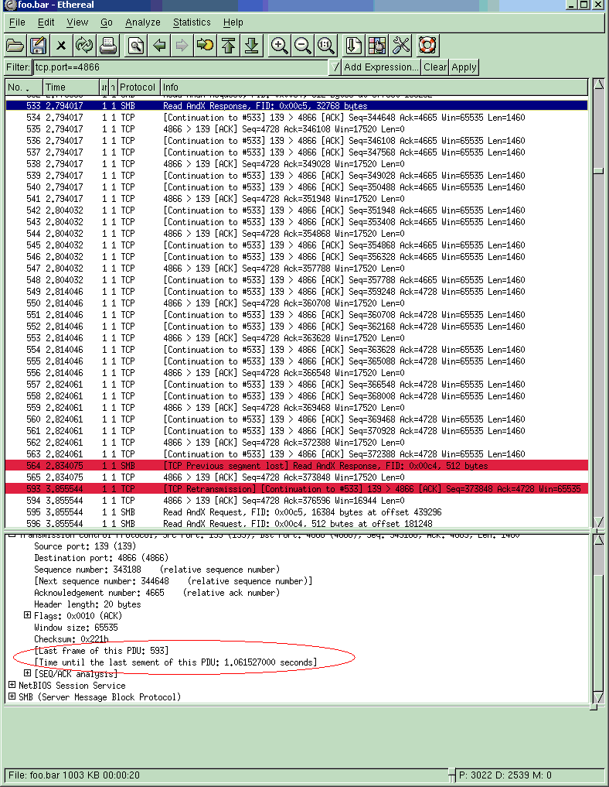
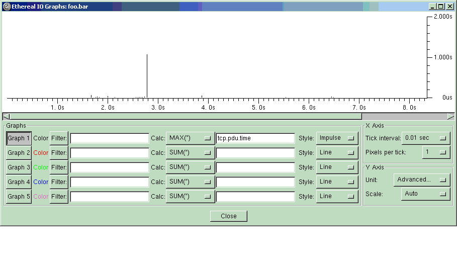

## TCP PDU Time

Wireshark keeps track internally of where the Protocol Data Unit ([PDU](/PDU)) boundaries are for a large number of protocols running on top of TCP so that it can even find and dissect PDUs that start somewhere in the middle of a segment.  
Some of these protocols where this is supported are [NFS](/NFS)([ONC-RPC](/ONC-RPC)), [iSCSI](/iSCSI), [NetBIOS](/NetBIOS)/[CIFS](/CIFS) etc.  
Wireshark will only do this for PDUs spanning multiple segments and not for those PDUs that already fit completely inside a single segment.

### Display Filter Fields

While tracking PDU boundaries, Wireshark will also keep track of which was the last TCP segment seen that belonged in whole or in part to that PDU and the timestamp of it.  
This allows Wireshark to measure the amount of time it took to transfer the PDU.  

### tcp.pdu.time

    tcp.pdu.time

This field measures the time between the first segment where the PDU starts to the last seen packet that contains data for that PDU. If there were any retransmission timeouts during the transfer of this PDU making it take very very long to transfer it this will be reflected in the PDU time.  
This field is inserted in the TCP protocol layer for the segment where the PDU starts. Since it is based of information in packets received further down in the capture file, this field will not be shown in the protocol tree until you have refiltered the capture file at least once. It will not show up during the initial load and dissection of the capture file. In the same way, coloring rules that use this field will not take effect until after you have redissected the capture at least once. TShark can not use this field at all at this time :frowning:

### tcp.pdu.last\_frame

    tcp.pdu.last_frame

This field is placed in the TCP layer for the segment where the PDU starts and holds the frame number for the last seen packet that contained data for this PDU. Same restrictions on its use apply as for the time field.

### Useful Hint

This time measurement is great for finding where TCP retransmission timeouts are causing a performance degradation. Looking for PDUs that take very long to transfer are usually caused by network congestion or other sources for frame loss to occur, leading to retransission timeouts and eventually to performance degradation.

### Display

  
Here is a screenshot of these new fields that were inserted into the start segment. Notice that it took \>1 second to transfer this PDU. This can be filtered on by either normal or color filters.

  
This is a screenshot of how to use this measurement with the [IoGraph](/IoGraph) feature of Wireshark. See how easy it is to spot where the retransmission timeout which took \>1second occurs.

---

Imported from https://wiki.wireshark.org/TcpPduTime on 2020-08-11 23:26:27 UTC
