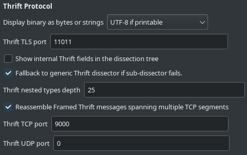
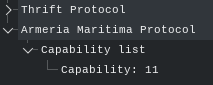
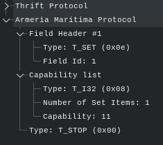
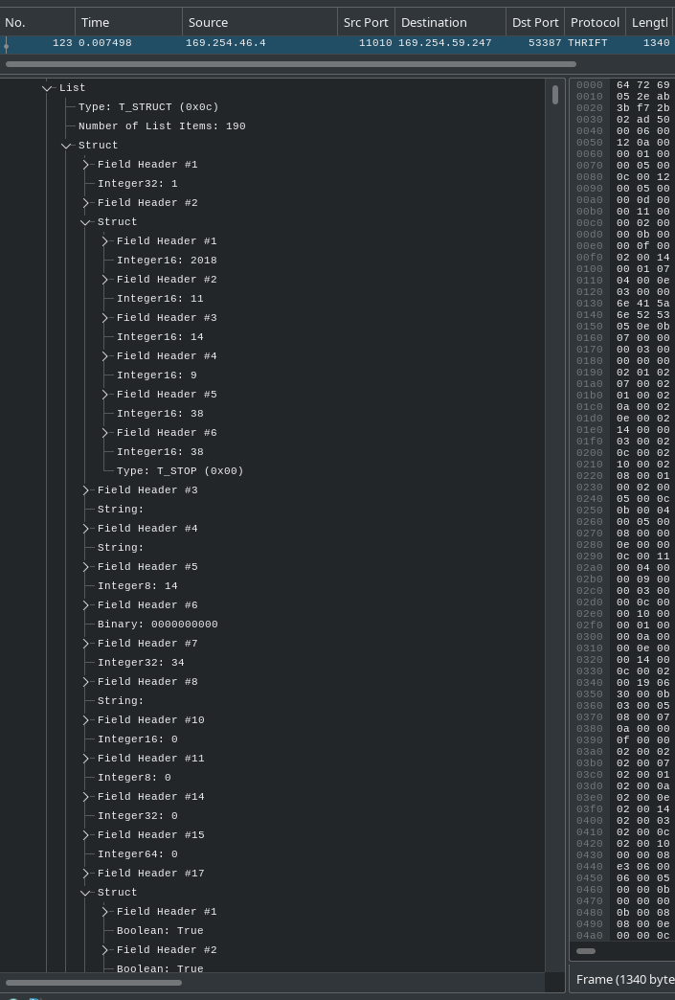
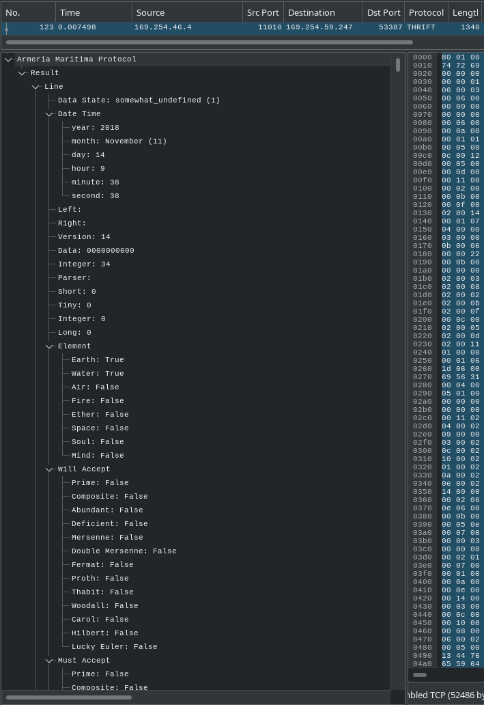

[[_TOC_]]

# Apache Thrift (Thrift)

Thrift is a lightweight, language-independent software stack for point-to-point RPC implementation.

For a description of Thrift refer to [Apache Thrift home page](https://thrift.apache.org/).

One key point of Thrift is that several data serialization methods (Thrift Protocols) are possible for a given definition. Only Thrift Binary Protocol and Thrift Compact Protocol are currently supported by the Thrift dissector of Wireshark.

For an overview of the different protocols available, see [Thrift GitHub repository](https://github.com/apache/thrift).

Change log about Wireshark supporting Thrift:

* Wireshark 2.0.0 - Initial support for Thrift Binary Protocol.
* Wireshark 3.5.0 - Full support for Thrift Binary and Compact protocols as well as C sub-dissectors based on the generic one.
* Wireshark 3.7.1 - Support for uuid data type (Thrift 0.17.0 - https://issues.apache.org/jira/browse/THRIFT-5587)
* Wireshark master - Support for expert info on exceptions in sub-dissectors.

All the changes required to update a sub-dissector for newer versions of Wireshark can be found [at the end of this page](#sub-dissector-fast-upgrade).


## Protocol dependencies

Thrift content is usually detected and dissected automatically by the default Thrift dissector, allowing fast analysis out-of-the-box.

In some cases however, in particular when one of the endpoints is using an unbuffered implementation, the heuristic dissector might fail to detect a Thrift header as there is not enough data to look at.

In this case, one can set the known port number in the Thrift dissector preferences (both TCP and UDP are supported).

## Preferences settings

The Thrift dissector allows for some customization of the user experience whether a subdissector is used or not.



_Display binary as bytes or strings_: As the generic Thrift dissector as bundled in vanilla Wireshark does not know if the `T_BINARY` fields are binary blobs or strings (and in this case, which encoding), this settings allows the user to choose the encoding that Wireshark must use for _all_ `T_BINARY` fields.

* _UTF-8 if printable_: using a basic heuristic, the dissector checks for each field whether the content is a printable UTF-8 string or not.
  * If it is considered printable, Wireshark displays it a a string (making the filtering requests easier as well).
  * If it is not the case, display falls back to an hexadecimal representation of the binary field.
  * Both Thrift protocols specify that “_Strings_ are first encoded to UTF-8, and then send as binary” so this setting should work in most cases.
    * [Thrift Binary protocol encoding](https://github.com/apache/thrift/blob/master/doc/specs/thrift-binary-protocol.md#string-encoding)
    * [Thrift Compact protocol encoding](https://github.com/apache/thrift/blob/master/doc/specs/thrift-compact-protocol.md#string-encoding)
* _Binary (hexadecimal string)_: Consider all `T_BINARY` fields as binary blobs.
  * You can consider using this setting if you find the heuristic trying to display some binaries as strings when it should not.
  * Also consider making a report to help improve the heuristic.
* _ASCII_ and various Unicode encodings: If you know that you protocol uses (or should use) a specific encoding for all strings then you can explicitly set it.

_Thrift TLS port_: Select the TCP port used for your TLS encrypted communications.

_Show internal Thrift fields in the dissection tree_: This setting only applies to sub-dissectors as the generic dissector always displays these internal fields.

By default, the sub-dissections will not show the internal Thrift fields (field type and field id) as the field name displayed by the sub-dissector is usually much more usable.



However, you might want to display these fields in some cases to better understand how data is interpreted, including while developing a sub-dissector.



_Fallback to generic Thrift dissector if sub-dissector fails_: In case the sub-dissector return with an error code, for example when a mandatory field is missing or the field type is not what was expected, the generic dissector can try to dissect the PDU if it’s well-formed.

This can be useful to understand why the sub-dissector failed and still be able to see the end of the PDU.

_Thrift nested types depth_: Indicates the maximum depth of the Thrift tree of types to prevent exceeding the system calls limit. See [Add maximum depth for emitBatch nested types](#add-maximum-depth-for-emitbatch-nested-types) for usage and sub-dissector overriding.

_Reassemble Framed Thrift messages spannig multiple TCP segments_: Tells the helper function `tcp_dissect_pdus`, used when Framed Transport is used by the application, to reassemble Thrift PDUs that are split into several TCP packets.

In the absence of Framed Transport, the reassembly is controlled by the global TCP parameter _Allow subdissector to reassemble TCP streams_.

While UDP and USB bulk are supported by the Thrift dissector, reassembly is not available for these transport streams.

_Thrift TCP port_ and _Thrift UDP port_: As explained in previous section, the heuristic Thrift dissector will properly detect and dissect Thrift PDU in most cases so there should not be any need for port selection.

However, there are a few cases where the heuristic cannot detect that Thrift is in use:

* When the old Thrift Binary Protocol header is used instead of the new Thrift Strict Binary Protocol header (not enough fixed data to ensure balance between false positive and false negative).
* When the endpoint uses unbuffered transport as the first packet is only 4 bytes long for Thrift Binary Protocol and even less for Compact.

In such cases, the port settings indicate that the selected port is indeed Thrift data. This will ensure that the Thrift dissector is called without relying on the heuristic and the Thrift dissector will properly handle valid Thrift data, ensuring reassembly or dissecting the old header.

Please note that in this case, the Thrift dissector is trying very hard to find a matching format and could generate more false positive, leading to Thrift dissection ending with `[TCP segment of a reassembled PDU]` and the right dissector not being called. Because of that, if you have multiple protocols on the same port, it is recommended to set the TCP port back to 0 as soon as it is no longer required.

## Write your own Thrift-based dissector

With Thrift protocols being self-described, it’s relatively easy to analyze Thrift PDU with Wireshark on one screen and the documentation of your protocol on the other but it can get bothersome when your protocol contains a lot of different types and deep sub-structures.

Writing a Thrift-based sub-dissector removes the need for the documentation of your Thrift-based protocol and makes the search for a specific PDU easier in a huge capture.

### Generic usage

This section describes the usual steps to create a dissector based on Thrift.

A Thrift custom sub-dissector works the same way as any dissector: Create the `epan/dissectors/packet-tcustom.c` file and update `epan/dissectors/CMakeLists.txt` accordingly.

The initial `packet-tcustom.c` file looks like that:

```c
#include <epan/packet.h>
#include "packet-thrift.h"

void proto_register_tcustom(void);
void proto_reg_handoff_tcustom(void);

/* Return codes or assimilated. */
#define NOT_AN_EXPECTED_PDU  (0)

// Common helper definitions but not always needed (see containers and structures)
#define TMUTF8 NULL, { .encoding = ENC_UTF_8 }
#define TMRAW NULL, { .encoding = ENC_NA }

static int proto_tcustom = -1;

// Here will go all hf id declarations
//static int hf_tcustom_<where>_<what>

static int ett_tcustom = -1;
// Any "ett tree" addition (for containers and structures) will happen here first

void
proto_register_tcustom(void)
{
    static hf_register_info hf[] = {
        // This location will be referred to as the "hf_register_info section"
    };

    /* setup protocol subtree arrays */
    static gint* ett[] = {
        &ett_tcustom,
        // Any "ett tree" addition will happen here second
    };

    /* Register protocol name and description */
    proto_tcustom = proto_register_protocol("Thrift Custom Protocol", "TCustom", "tcustom");

    /* register field array */
    proto_register_field_array(proto_tcustom, hf, array_length(hf));

    /* register subtree array */
    proto_register_subtree_array(ett, array_length(ett));
}

void
proto_reg_handoff_tcustom(void)
{
    // Any supported command will be registered in this function.
}
```

#### Basic types

As an "Hello World!"-level example, consider the following Thrift definition:

```c
service HelloWorld {
  oneway void initialize(1: binary payload);
  oneway void registration(1: bool unregister, 2: string server_name, 3: i16 port);
  oneway void greetings(1: binary user_name_utf32le);
  oneway void good_bye();
}
```

To handle this protocol, we need to create and register 3 functions, each responsible for one of the commands. Each function is created following this template:

```c
// Here, the <command_name> will be one of registration, initialize, and greetings
static int
dissect_tcustom_<command_name>(tvbuff_t *tvb, packet_info *pinfo, proto_tree *tree, void *data)
{
    // We get this data from the generic dissector and need to pass it back to the helper functions.
    thrift_option_data_t *thrift_opt = (thrift_option_data_t *)data;
    // Start dissection from the beginning of the tvbuff_t.
    int offset = 0;
    // Create the tree right now, using unspecified length (-1)
    proto_item *tcustom_pi = proto_tree_add_item(tree, proto_tcustom, tvb, offset, -1, ENC_NA);;
    proto_tree *tcustom_tree = proto_item_add_subtree(tcustom_pi, ett_tcustom);

    /********************************/
    /* Dissection will happen here! */
    /********************************/

    // Thrift commands /always/ ends with T_STOP, so keep it in the template
    offset = dissect_thrift_t_stop(tvb, pinfo, tcustom_tree, offset);

    // The current value of offset is either an error code or the end of the dissected data.
    // T_STOP takes 1 byte so offset cannot be 0.
    if (offset > 0) {
        // Set the end of the main tree
        proto_item_set_end(tcustom_pi, tvb, offset);
    }
    return offset;
}
```

_Note_: The above template can be used to handle a function without any parameter (like `good_bye()` in this example). The only improvement against the generic dissector is the identification of the command as one from our custom protocol, including filtering capabilities, this is why it's interesting to implement this kind of command as well. In this case, remove the `thrift_opt` definition on the first line and add `_U_` after the `data` parameter as it will not be used.

Registration happens in `proto_reg_handoff_tcustom()`

```c
void
proto_reg_handoff_tcustom(void)
{
    dissector_add_string("thrift.method_names", "initialize", create_dissector_handle(dissect_tcustom_initialize, proto_tcustom));
    dissector_add_string("thrift.method_names", "registration", create_dissector_handle(dissect_tcustom_register, proto_tcustom));
    dissector_add_string("thrift.method_names", "greetings", create_dissector_handle(dissect_tcustom_greetings, proto_tcustom));
    dissector_add_string("thrift.method_names", "good_bye", create_dissector_handle(dissect_tcustom_good_bye, proto_tcustom));
}
```

For any field that needs to be dissected, the first step is to define it in the hf_register_info section for proper display:

For `initialize(binary init_vector)`, we define the unique parameter via its hf id under the name `hf_tcustom_<command_name>_<param_name>` (if a parameter or structure field with a given name is _always_ of the same type as any other parameter or structure field with the same name, you can omit the command name):

```c
        // Associated with the declaration of hf_tcustom_initialize_init_vector at the beginning
        { &hf_tcustom_initialize_init_vector,
            { "Initialization Vector", "tcustom.initialize.init_vector",
                FT_BYTES, BASE_NONE, NULL,
                0x0, NULL, HFILL }
        },
```

After that, we can use the hf info using the matching `dissect_thrift_t_<type>` helper in `dissect_tcustom_initialize` function:

```c
    offset = dissect_thrift_t_binary(tvb, pinfo, tcustom_tree, offset, thrift_opt, TRUE, 1, hf_tcustom_initialize_init_vector);
```

* Parameters `tvb`, `pinfo`, `tcustom_tree`, and `thrift_opt` are always passed as-is to the helper function, _do not_ change anything.
* `offset` is always passed as it was received from previous helper, they do handle the error cases transparently.
* `is_field` is always set to `TRUE` when using the individual fields dissection (essentially an internal parameter).
* `field_id` is the number associated to the parameter in the IDL definition.
* `hf_id` is the hf info matching the field we want to dissect.

For `registration(bool unregister, string server_name, i16 port)`, we define the 3 parameters:

```c
        { &hf_tcustom_registration_unregister,
            { "Unregister", "tcustom.registration.unregister",
                FT_BOOLEAN, BASE_NONE, NULL,
                0x0, NULL, HFILL }
        },
        { &hf_tcustom_registration_server_name,
            { "Server Host Name", "tcustom.registration.server_name",
                FT_STRING, BASE_NONE, NULL,
                0x0, NULL, HFILL }
        },
        // Please note that all Thrift integers are signed.
        // This particular application seems to only support ports up to 32767.
        { &hf_tcustom_registration_port,
            { "Port Number", "tcustom.registration.port",
                FT_INT16, BASE_DEC, NULL,
                0x0, NULL, HFILL }
        },
```

and we put the 3 successive calls in `dissect_tcustom_registration`:

```c
    offset = dissect_thrift_t_bool(tvb, pinfo, tcustom_tree, offset, thrift_opt, TRUE, 1, hf_tcustom_registration_unregister);
    // When using string type in the .thrift definition, data is serialized as an UTF-8 string.
    offset = dissect_thrift_t_string(tvb, pinfo, tcustom_tree, offset, thrift_opt, TRUE, 2, hf_tcustom_registration_server_name);
    offset = dissect_thrift_t_i16(tvb, pinfo, tcustom_tree, offset, thrift_opt, TRUE, 3, hf_tcustom_registration_port);
```

For `greetings(binary user_name_utf32le)`, the content is just a binary from Thrift point of view but we happen to know that this is indeed an UTF-32 string encoded in little-endian (for some kind of historical reasons, this tends to happen in real-life projects) so we define it as a string:

```c
        { &hf_tcustom_greetings_user_name,
            { "User Name", "tcustom.greetings.user_name",
                FT_STRING, BASE_NONE, NULL,
                0x0, NULL, HFILL }
        },
```

In this case, we need to use `dissect_thrift_t_string_enc` that allows us to specify the encoding of the string:

```c
    offset = dissect_thrift_t_string_enc(tvb, pinfo, tcustom_tree, offset, thrift_opt, TRUE, 1, hf_tcustom_greetings_user_name, ENC_UCS_4|ENC_LITTLE_ENDIAN);
```

#### Enumerations

The handling of thrift enumerations is similar to any enumeration in Wireshark, the only constraint is to associate them with `i32` integers.

The example will use the following definition:

```c
enum nearly_boolean {
  True,
  False,
  Maybe,
}

service Enumeration {
  oneway void configure(1: nearly_boolean active);
}
```

In this case, we need to define the string translations for each enum values as usual:

```c
static const value_string tcustom_nearly_boolean_vals[] = {
    { 0, "Very True" }, // Like in C, Thrift enums start at 0
    { 1, "Absolutely False" },
    { 2, "It’s not impossible" },
    { 0, NULL },
};
```

Then, we define the parameter in the hf_field_info section associated to the right enumeration:

```c
        { &hf_tcustom_configure_active,
            { "Active", "tcustom.configure.active",
                FT_INT32, BASE_DEC, VALS(tcustom_nearly_boolean_vals),
                0x0, NULL, HFILL }
        },
```

_Note_: I choose to keep the hf_id associated with the specific use and not the type itself to allow for an easier search. This choice brings the need to define a new hf_id for every usage of this type. You might want to do otherwise to limit the number of hf_id.

Then, the dissection is done as usual using `dissect_thrift_t_i32`:

```c
    offset = dissect_thrift_t_i32(tvb, pinfo, tcustom_tree, offset, thrift_opt, TRUE, 1, hf_tcustom_configure_active);
```

#### Containers

Thrift exposes 3 kinds of container:

* A `list` is an ordered sequence of 0 or more objects of a given type (same type for all elements, repetitions are authorized).
* A `set` is an unordered sequence of 0 or more objects of a given type (same type for all elements) without repetition of the same object in the set.
* A `map` is an unordered sequence of 0 or more pairs of objects
  * The first object of each pair is the _key_.
  * The second object of each pair is the _value_.
  * All keys are of the same type, all values are of the same type.
  * The type of the keys can be different from the type of the values.
  * A given _key_ cannot be repeated within the `map`.
  * A given _value_ can be repeated within the `map`.

The example will use the following definition:

```c
service Containers {
  oneway void set_keys(1: map<string, i32> registry);
}
```

In order to properly dissect these containers, we need to describe both the container itself and the elements (key and value in case of `map`).

We will first describe the key and value as any `string` or `i32`:

```c
        { &hf_tcustom_set_keys_registry_key,
            { "Registry Key", "tcustom.set_keys.registry.key",
                FT_STRING, BASE_NONE, NULL,
                0x0, NULL, HFILL }
        },
        { &hf_tcustom_set_keys_registry_value,
            { "Registry Value", "tcustom.set_keys.registry.value",
                FT_INT32, BASE_DEC, NULL,
                0x0, NULL, HFILL }
        },
```

But we also need to encapsulate that into a `thrift_member_t` structure that will be used by the container helper function:

```c
static const thrift_member_t tcustom_set_keys_registry_key   = { &hf_tcustom_set_keys_registry_key,   0, FALSE, DE_THRIFT_T_BINARY, TMUTF8 };
static const thrift_member_t tcustom_set_keys_registry_value = { &hf_tcustom_set_keys_registry_value, 0, FALSE, DE_THRIFT_T_BINARY, TMFILL };
```

In order, the fields of this structure are:

* The hf id that describes the data.
* The field id. (only used in structures, set it to 0)
* Is the field optional? (also for structures, set to `FALSE`)
* The expected type of the field/element/key/value, required to ensure we will decode the data properly. Remember that Thrift exposes more types in the IDL than on the network:
  * `string` and `binary` are transferred as `DE_THRIFT_T_BINARY` (only the encoding changes)
  * `struct`, `union`, and `exception` are transferred as `DE_THRIFT_T_STRUCT`.
* The "ett tree" of the inner element (for a list of structures, it would be the ett tree of the structure), keep it `NULL` for all types but containers and structures.
* The additional parameters in case this element needs some:
  * `binary` and `string` need an encoding.
  * `list` and `set` need information about the element type.
  * `map` needs information about the key and value types.
  * `struct` & co need information about the fields (we’ll see in next chapter).

Since in most cases, ett tree and additional parameters are not necessary, the `packet-thrift.h` header provides the convenient definition of `TMFILL` (similar to the `HFILL` for hf ids).

If your dissector often uses strings and/or binaries, you can use the `TMUTF8` and `TMRAW` definitions given in this example.

The definition of the `thrift_member_t` for the inner element or key and value types closes the description of the content, then we need to describe the container itself.

* Add the matching "ett tree":
  * Add `static int ett_tcustom_set_keys_registry = -1;` next to the declaration of `ett_custom` (the _trunk_ of our tree).
  * Add `ett_tcustom_set_keys_registry` in the initialization list in `proto_register_tcustom`.
* Add the hf id definition which is straightforward:

```c
        { &hf_tcustom_set_keys_registry,
            { "Registry Configuration Keys", "tcustom.set_keys.registry",
                FT_NONE, BASE_NONE, NULL, // We don’t want to display the data in the interface
                0x0, NULL, HFILL }
        },
```

Then you can call `dissect_thrift_t_map` (or any other container helper) with its additional parameters.

```c
    offset = dissect_thrift_t_map(tvb, pinfo, tcustom_tree, offset, thrift_opt, TRUE, 1, hf_tcustom_set_keys_registry, ett_tcustom_set_keys_registry, &tcustom_set_keys_registry_key, &tcustom_set_keys_registry_value);
```

#### Structures

The last types of object exposed by Thrift are the `struct` and `union` types.

* A `struct` contains any number of fields, each of them indexed by a specific numeric value (visible on the network). In addition, each field can be
  * either `required`, meaning it must be present when the parent `struct` is used in communication,
  * or `optional`, meaning it may or may not be present during communication.
  * In the context of Wireshark, the absence of qualifier must be considered equivalent to `optional`.
* An `union` is similar to a `struct` (and is sent as such in the serialized data) with the following restrictions:
  * All fields are `optional`.
  * Exactly one (1) field is filled when used in a communication.

To demonstrate this, we’ll use the following definition:

```c
union big_integer {
  1: i64    small;
  2: binary efficient;
  3: list<bool> inefficient;
}

struct placement {
  0: required i32 position;
  32767: optional i8 occurrences;
}

service Structures {
  oneway void insert(1: big_integer bigint, 2: placement where);
}
```

As usual, we start with the definition of the leafs (exact definition left as an exercise :pencil:):

```c
// hf id for all leaf elements
static int hf_tcustom_big_integer_small = -1;
static int hf_tcustom_big_integer_efficient = -1;
static int hf_tcustom_big_integer_inefficient_bit = -1; // For the elements of the list
static int hf_tcustom_big_integer_inefficient = -1; // The list itself
static int hf_tcustom_placement_position = -1;
static int hf_tcustom_placement_occurrences = -1;

// ett tree for the list
static int ett_tcustom_big_integer_inefficient = -1;

// description of the list for deep dissection
static const thrift_member_t tcustom_big_integer_inefficient = { &hf_tcustom_big_integer_inefficient_bit, 0, FALSE, DE_THRIFT_T_BOOL, TMFILL };
```

Note that in this case, the leafs are child of a structure type so the naming scheme is now following the pattern `hf_tcustom_<type_name>_<field_name>` (it should be safe to assume we never have collision between type and command names but you can adapt to your needs).

Now we need to write the necessary ett trees (`ett_tcustom_insert_bigint` and `ett_tcustom_insert_where`) and hf id for the structures:

```c
        { &hf_tcustom_insert_bigint,
            { "Big Integer", "tcustom.insert.bigint",
                FT_NONE, BASE_NONE, NULL,
                0x0, NULL, HFILL }
        },
        { &hf_tcustom_insert_where,
            { "Where", "tcustom.insert.where",
                FT_NONE, BASE_NONE, NULL,
                0x0, NULL, HFILL }
        },
```

Now, we need the description for the structure dissection which looks like the same type as for lists and sets. The main difference is while the containers took 1 or 2 pointers to a `thrift_member_t`, the structure needs a sequence of elements so in this case, we want an array of element which are described as follows in our example:

```c
static const thrift_member_t tcustom_big_integer[] = {
    { &hf_tcustom_big_integer_small, 1, TRUE, DE_THRIFT_T_I64, TMFILL },
    { &hf_tcustom_big_integer_efficient, 2, TRUE, DE_THRIFT_T_BINARY, TMRAW },
    { &hf_tcustom_big_integer_inefficient, 3, TRUE, DE_THRIFT_T_LIST, &ett_tcustom_big_integer_inefficient, { .element = &tcustom_big_integer_inefficient } },
    { NULL, 0, FALSE, DE_THRIFT_T_STOP, TMFILL }
};
static const thrift_member_t tcustom_placement[] = {
    { &hf_tcustom_placement_position, 0, FALSE, DE_THRIFT_T_I32, TMFILL },
    { &hf_tcustom_placement_occurrences, 32767, TRUE, DE_THRIFT_T_I8, TMFILL },
    { NULL, 0, FALSE, DE_THRIFT_T_STOP, TMFILL }
};
```

This time, we see the second and third fields of the `thrift_member_t` structure really used:

* The second one is the field id as described in the .thrift IDL file (necessary to realign when optional fields are not provided).
* The third one is `TRUE` if the field is `optional` (or without qualifier) and `false` if `required`.

The last parameter (after the ett tree for the targetted element) also get more visible here (it can be used in container as well, depending on the type of elements):

* Most of the time, it’s not used and `TMFILL` provides a default initialization.
* For binary fields, we provide the expected encoding with `{ .encoding = ENC_SOMETHING }`.
  * When a binary is just a binary object, we can use the `TMRAW` helper defined earlier.
  * When it is a standard UTF-8 string (as per Thrift specifications), we can use the `TMUTF8` helper.
* For lists and set, we provide the pointer to the element description with `{ .element = &tcustom_<type_name>_<field_name> }`
* For maps, we provide both the key and value descriptions with `{ .m.key = &tcustom_<type_name>_<field_name>_key, .m.value = &tcustom_<type_name>_<field_name>_value }`
* For sub-structures, we provide the list of members with `{ .s.members = tcustom_<subtype_name>, .s.expert_info = NULL }`
  * For Wireshark 4.0 and before, it was just `{ .members = tcustom_<subtype_name> }`
* Finally, all structures and unions end with a `T_STOP` field when serialized, this is materialized in the description with the fixed content `{ NULL, 0, FALSE, DE_THRIFT_T_STOP, TMFILL }` which also marks the end of the array.

At this point, we can now call the helper as usual:

```c
    offset = dissect_thrift_t_struct(tvb, pinfo, tcustom_tree, offset, thrift_opt, TRUE, 1, hf_tcustom_insert_bigint, ett_tcustom_insert_bigint, tcustom_big_integer);
    offset = dissect_thrift_t_struct(tvb, pinfo, tcustom_tree, offset, thrift_opt, TRUE, 2, hf_tcustom_insert_where, ett_tcustom_insert_where, tcustom_placement);
```

##### Simplified display of unions

Given that unions always contain exactly one field, you might want to omit the sub-tree that would contain only one element (especially if you need to scan a long list of those).

This is very easily achieved by _not_ giving the matching hf id and ett tree elements and replace them with `-1` which is the default value for uninitialized elements.

In order to clarify this behavior, we can define the constant:

```c
static const int DISABLE_SUBTREE = -1;
```

And we can now replace the first call with:

```c
    offset = dissect_thrift_t_struct(tvb, pinfo, tcustom_tree, offset, thrift_opt, TRUE, 1, DISABLE_SUBTREE, DISABLE_SUBTREE, tcustom_big_integer);
```

In a similar way, when used as a field for a structure or an element inside a container, the matching `thrift_member_t` definition would be:

```c
    { DISABLE_SUBTREE, 1, TRUE, DE_THRIFT_T_STRUCT, DISABLE_SUBTREE, { .s.members = tcustom_big_integer, .s.expert_info = NULL } },
```

Until Wireshark 4.0, use the following definition:

```c
    { DISABLE_SUBTREE, 1, TRUE, DE_THRIFT_T_STRUCT, DISABLE_SUBTREE, { .members = tcustom_big_integer } },
```

:warning: If you choose to omit the tree, the label displayed in the interface will be the one from the available field (here, it would be the definition for `small`, `efficient`, or `inefficient` field) and not the definition of the union itself (which can in fact be removed, along with the matching ett tree).

##### Partial definition of structure for faster development results

When manually writing a dissector, it might be interesting to get results faster during the development by letting the generic dissector handle part of the work especially when we have a lot of fields and/or deep sub-structures.

While there is no way to directly trigger the generic dissector from the sub-dissector, it is possible to omit the definition of some of the fields and the struct handler will reroute non-specified field ids to the generic dissector and handle them.

Given a definition like:

```c
struct resource {
    // Very big structure we don’t want/need to handle right now
}

struct data {
    1: required i64 id;
    2: required string name;
    3: required resource content;
}
```

The complete way of defining this would use the following structure definition:

```c
static const thrift_member_t tcustom_data[] = {
    { &hf_tcustom_data_id, 1, TRUE, DE_THRIFT_T_I64, TMFILL },
    { &hf_tcustom_data_name, 2, TRUE, DE_THRIFT_T_BINARY, TMUTF8 },
    { &hf_tcustom_data_content, 3, TRUE, DE_THRIFT_T_STRUCT, &ett_tcustom_resource, { .s.members = tcustom_resource, .s.expert_info = NULL } }, // Adapt depending on Wireshark version.
    { NULL, 0, FALSE, DE_THRIFT_T_STOP, TMFILL }
};
```

In order to accelerate the development (at least the fact that we have some results and the ability to filter on the `id` and `name` fields of the data structure), we can proceed as follows:

```c
static const thrift_member_t tcustom_data[] = {
    { &hf_tcustom_data_id, 1, TRUE, DE_THRIFT_T_I64, TMFILL },
    { &hf_tcustom_data_name, 2, TRUE, DE_THRIFT_T_BINARY, TMUTF8 },
    { NULL, 3, TRUE, DE_THRIFT_T_GENERIC, TMFILL },
    { NULL, 0, FALSE, DE_THRIFT_T_STOP, TMFILL }
};
```

This saves us the need to define the entire `resource` structure before we can use the `data` structure.

This feature can be used for any number of fields, no matter their types or position in the parent structure.

In this case, we could have defined the entire `data` structure associated to the following definition for a similar result:

```c
static const thrift_member_t tcustom_resource[] = {
    { NULL, 1, TRUE, DE_THRIFT_T_GENERIC, TMFILL },
    { NULL, 2, FALSE, DE_THRIFT_T_GENERIC, TMFILL },
    { NULL, 3, TRUE, DE_THRIFT_T_GENERIC, TMFILL },
    // ... Specify all fields and only indicate whether they are optional or not...
    // ... or just always put TRUE (optional) as long as all possible field ids are covered.
    { NULL, 0, FALSE, DE_THRIFT_T_STOP, TMFILL }
};
```

In this case, the `content` field is correctly displayed (avoiding the irregularity in the `data` display tree) but this is the only difference and the content of its sub-tree is still dissected by the generic dissector.

#### Functions with a reply

Until now, we only dissected `oneway` commands which do not expect any response so when we see them on the network, we just have to dissect the parameters.

However, the Thrift IDL allow the definition of commands that return a value or possibly an exception:

```c
exception out_of_memory_exception {
  1: int error_code;
  2: string message;
};

service EchoChamber {
  binary ping(1: binary payload)
  throws (1: out_of_memory_exception oom_exc
          /* 2: some_other_exception so_exc, … */);
}
```

When commands with a result are used, we need to answer 2 questions:

1. Is this the request or the answer?
2. In case of answer, what kind of response was it?

For the first question, we need to take a look at the `data` provided by the Thrift generic dissector that we already casted into a `thrift_option_data_t` pointer:

```c
    switch (thrift_opt->mtype) {
    case ME_THRIFT_T_CALL:
        // Dissect the parameters as we do for oneway commands.
        offset = dissect_thrift_t_binary(tvb, pinfo, tcustom_tree, offset, thrift_opt, TRUE, 1, hf_tcustom_ping_payload);
        break;
    case ME_THRIFT_T_REPLY:
        /* TODO: Dissect the answer. */
        break;
    default: // ME_THRIFT_T_ONEWAY or ME_THRIFT_T_EXCEPTION
        // Something is wrong, let the generic dissector handle that.
        return NOT_AN_EXPECTED_PDU;
    }
    // We still need to dissect the ending `T_STOP` in all cases.
    offset = dissect_thrift_t_stop(tvb, pinfo, tcustom_tree, offset);
```

Note: You could do the check for `oneway` commands as well, in which case only `ME_THRIFT_T_ONEWAY` would be valid.

Regarding dissection of the answer, we need to understand that 3 kinds of answers are possible:

* A successful answer where we need to dissect the return type in the `T_REPLY`.
* A application exception reply, where we received one of the exceptions described in the `.thrift` files in the `T_REPLY`.
* A Thrift protocol exception, where we receive a `T_EXCEPTION`.

The last case is the easy one: as these exceptions are described in [Thrift itself](https://github.com/apache/thrift/blob/master/doc/specs/thrift-rpc.md), the `T_EXCEPTION` messages are handled by the generic dissector.

The `T_REPLY` on the other hand are a little more complex. As described in the [RPC specification](https://github.com/apache/thrift/blob/master/doc/specs/thrift-rpc.md), the answer contains either the return type as field 0, or exactly one exception with the field id defined in the IDL.

To be able to dissect the right element, we need to know the field id that is contained in the `T_REPLY`. This piece of information is once again provided in the `thrift_option_data_t` structure:

```c
    case ME_THRIFT_T_REPLY:
        // Dissect the answer.
        switch (thrift_opt->reply_field_id) {
        case 0:
            // If the return type is void, this `case 0:` only contains the `break;`.
            offset = dissect_thrift_t_binary(tvb, pinfo, tcustom_tree, offset, thrift_opt, TRUE, 0, hf_tcustom_ping_return);
            break;
        case 1:
            // Exception are just structures with a specific use.
            offset = dissect_thrift_t_struct(tvb, pinfo, tcustom_tree, offset, thrift_opt, TRUE, 1, hf_tcustom_out_of_memory_exception, ett_tcustom_out_of_memory_exception, tcustom_out_of_memory_exception);
            break;
        /*case 2:
            offset = dissect_thrift_t_struct(tvb, pinfo, tcustom_tree, offset, thrift_opt, TRUE, 2, hf_tcustom_some_other_exception, ett_tcustom_some_other_exception, tcustom_some_other_exception);
            break;
        // et caetera. */
        default:
            // Unsupported exception, let the generic dissector handle that.
            return NOT_AN_EXPECTED_PDU;
        }
        break;
```

We do not need to differentiate the exceptions by the name they were given in this specific command (using `hf_tcustom_ping_oom_exc` or `hf_tcustom_ping_so_exc`) because we can't have several times the same exception type for a given command (while we can have several parameters or fields with the same type), this way, hf id and ett tree are defined only once for exceptions.

_Note_: whether or not application exceptions are defined for a particular command, the return type will always be field number 0 in the `T_REPLY`.

The complete dissector (compiled but untested) for all these examples is attached in [packet-tcustom.c](uploads/8a9563f819ea15126f64d0a84a7734b9/packet-tcustom.c) for reference.

#### :tools: Hijacking structure dissection feature :paperclips:

Looking at the serialization of parameters, it really looks like a structure. In fact, even the definition looks like a structure with some restrictions:

* Field id should be strictly positive.
* All fields are `required` (the `optional` modifier is ignored).

The only difference is that the field header (field type = `struct` and field id) are not present at the beginning of this struct.

Since this missing field header also exist in the 3 container types, the ability to dissect a struct (or any other type, for that matter) must be available, right?

That’s precisely the use of the `is_field` parameter of the `dissect_thrift_t_<type>` functions. Set it to `FALSE` and the function will not start with the header dissection.

Getting back to the definition of `registration(bool unregister, string server_name, i16 port)`, another way of dissecting it would be to replace the 4 `dissect_thrift_t_<type>` calls (:warning: `T_STOP` is always part of the `struct`) with a structure definition and a single call to `dissect_thrift_t_struct`:

```c
    static const thrift_member_t tcustom_registration_params[] = {
        { &hf_tcustom_registration_unregister, 1, FALSE, DE_THRIFT_T_BOOL, TMFILL },
        { &hf_tcustom_registration_server_name, 2, FALSE, DE_THRIFT_T_BINARY, TMUTF8 },
        { &hf_tcustom_registration_port, 3, FALSE, DE_THRIFT_T_I8, TMFILL },
        { NULL, 0, FALSE, DE_THRIFT_T_STOP, TMFILL }
    };
    // In this case, the TCustom tree holds the structure fields so we disable the creation of an additional sub-tree.
    offset = dissect_thrift_t_struct(tvb, pinfo, tcustom_tree, offset, thrift_opt, FALSE, 0, DISABLE_SUBTREE, DISABLE_SUBTREE, tcustom_registration_params);

    // No call to dissect_thrift_t_stop()
    if (offset > 0) proto_item_set_end(tcustom_pi, tvb, offset);
    return offset;
```

This can be interesting if the protocol contains a lot of commands with the same list of parameters, for instance.

The same principle can be applied for the return value and exceptions with the difference that in this case, everything is optional and the field id for the nominal return type is 0 (that’s the only value which is not visible in the IDL).

The structure definition would look like this for `binary ping(1: binary payload)`:

```c
    static const thrift_member_t tcustom_ping_result[] = {
        { &hf_tcustom_ping_return, 0, TRUE, DE_THRIFT_T_BINARY, TMRAW }, // Omitted if return type is void
        { &hf_tcustom_out_of_memory_exception, 1, TRUE, DE_THRIFT_T_STRUCT, &ett_tcustom_out_of_memory_exception, { .members = tcustom_out_of_memory_exception, .s.expert_info = &ei_tcustom_out_of_memory_exception } },
        //{ &hf_tcustom_some_other_exception, 2, TRUE, DE_THRIFT_T_STRUCT, &ett_tcustom_some_other_exception, { .members = tcustom_some_other_exception, .s.expert_info = &ei_tcustom_some_other_exception } },
        { NULL, 0, FALSE, DE_THRIFT_T_STOP, TMFILL }
    };

    // …
    case ME_THRIFT_T_REPLY:
        offset = dissect_thrift_t_struct(tvb, pinfo, tcustom_tree, offset, thrift_opt, FALSE, 0, DISABLE_SUBTREE, DISABLE_SUBTREE, tcustom_ping_result);
        // WARNING: Make sure that dissect_thrift_t_stop is not called after that.
```

Provided `ei_tcustom_out_of_memory_exception` and `ei_tcustom_some_other_exception` have been defined as:

```c
static expert_field ei_tcustom_out_of_memory_exception = EI_INIT;
static expert_field ei_tcustom_some_other_exception = EI_INIT;
```

and registered with `expert_register_field_array()` in `proto_register_tcustom()` to be able to easily inform the user of the exception thrown.

Otherwise, simply use `.s.expert_info = NULL`.

### Example 1: [Jaeger](https://github.com/jaegertracing)

For this first real example, we will dissect the `emitBatch` command described in [agent.thrift](https://github.com/jaegertracing/jaeger-idl/blob/master/thrift/agent.thrift) and depending on structures defined in [jaeger.thrift](https://github.com/jaegertracing/jaeger-idl/blob/master/thrift/jaeger.thrift).

The complete dissector is shared on GitLab [on jaeger branch of EnigmaTriton/wireshark](https://gitlab.com/EnigmaTriton/wireshark/-/tree/jaeger), with the history of commits following the process described below.

:warning: The branch might still be written against Wireshark 3.6, keep in mind the [changes required for newer versions](#sub-dissector-fast-upgrade).

A [capture file](/uploads/c5eb22240c76f97801c6120017196bcd/jaeger-compact.pcap) is available on [SampleCaptures](/SampleCaptures#thrift) to test.

#### Add (empty) Jaeger dissector

For the first commit, we create a simple dissector with only the registration of said dissector in Wireshark.

In order to have a compilable dissector at every step (even if we do not have any command dissected before the last commits), we will essentially follow the order used in the file for the definition of the various types and define the matching dissector “objects” in the same order.

The idea of this approach is roughly the one an automated dissector generator would follow reading the `.thrift` IDL definitions.

#### Add jaeger enums

Since enumerations are really easy to define for Wireshark use and can only be leaf types (unlike structures or containers that can contain other structures that must be defined first), we start with them no matter the order of their definition in the `.thrift` files.

Since thrift consider the files as sub-namespaces, it is possible to have duplicate names in different files so we need to ensure the unicity of several elements using a few basic components:

* The protocol name: Jaeger
* The file name: jaeger (or agent)
* The type: TagType or SpanRefType for the enums
* More for other types as described in the Generic Usage chapter.

The name of the `value_string` arrays will then be `<protoabbrev>_<filename>_<enum_name>_vals` to follow the convention used in Wireshark dissectors which translates to `jaeger_jaeger_TagType_vals` in the first case.

* TagType does not follow the `lower_case_with_underscore` convention but follows the exact name used in the IDL, which is what an automated generator would do.
* For the same reason, we have the `jaeger_jaeger_` repetition at the beginning of the variable names which seems redundant but might not always be (we will also see `jaeger_agent_` for instance).

#### Add jaeger.Tag structure as tracing.Tag

Once the enumerations are covered, we need to define the structures starting with the ones without any dependency on other structures.

The simplest way of doing that is to start with the `.thrift` files without any `include` and parse them from top to bottom. In this case we only target the `emitBatch` command in `agent.thrift` which only depends on `jaeger.thrift` types so we will ignore the `zipkincore.thrift` file entirely.

In the case of structure, we need to define an hf id for each of the fields, a `member_thrift_t`array to define the content of the structure, and an ett tree for the structure itself.

:warning: The first 2 fields are mandatory (so "optional" member in third position is `FALSE`) and the remaining ones are optional, make sure to use the right values for each field. Using `TRUE` everywhere (everything optional) avoids having to check for each field if it’s mandatory or not but Wireshark wouldn’t be able to detect malformed PDUs regarding missing mandatory fields).

As this is the first structure (and it does not have any container field), all fields are using simple types that do not need additional variable definition to be usable in the array.

We just prepare the constants `TMUTF8` and `TMRAW` as described in the first chapter since we already need them (once or twice for now but it might help later on).

This is where the first problem arise: the recommended pre-commit hook for Wireshark is active on my repository and it rejects field keys with duplicated protoabbrev so `"jaeger.jaeger.something"` is not accepted.

* Solution 1: disable the pre-commit hook.
* Solution 2: rename the file (at least virtually regarding the naming, for an automated code generator, a real renaming —with update of the includes— would be necessary).

I choose the second solution and since `"jaeger.jaegertracing.something"` (from the namespaces defined in the file) is also rejected, we'll use `"jaeger.tracing.something"` and, for consistency, `jaeger_tracing_` in the variable names as if the file was named `tracing.thrift`.

Once the structure is created, we will also add a simple `thrift_member_t` defining the structure itself as it might be necessary if the structure is used in a container. To do that, we need to create an additional hf id for the structure itself.

#### Add tracing.Log structure

For the second structure, we proceed in the same way as the first one:

1. Define the hf id for each field _as well as the structure itself_.
2. Define the ett tree for the structure.
3. Define the structure content (all fields are mandatory) as well as the structure “element“.

The main thing here is that one of the fields is a list so we need a few more things to make it work:

1. An ett tree for the list itself.
2. A definition for the `.element` member of the `thrift_member_t` that describes the list.

The ett tree is easily defined and initialized and it appears that the type of the elements in the list is the `Tag` type for which we conveniently defined a `thrift_member_t` for this exact purpose.

#### Add tracing.SpanRef structure

`SpanRef` is one of the easy structures, containing only a few integers and an enum (which, aside from the use of `VALS(value_string[])`, is akin to an integer).

Once again, we create the list of hf id, the ett tree, the structure content, and the structure element (just in case).

#### Add tracing.Span structure

The `Span` structure is quite straightforward after what we already did, in particular with `Log`:

1. Define the hf id for each field as well as the structure itself.
2. Define the ett trees for the 3 lists as well as the structure.
3. Define the `thrift_member_t` array for the structure content using the previously defined `thrift_member_t` structure elements for the `.element` definition of each list.
4. Define the `thrift_member_t` element for this struct.

However, the documentation of the flags field indicates that this integer is in fact a flag-typed enum (hence the name), format that is supported neither by Thrift nor by the Thrift dissector but in this case, it’s small enough to take one step further and help the user immediately see the meaning of the value.

1. Define the enumeration `value_string` array (2 flags means 4 different values only).
2. Use it in the initialization of `hf_jaeger_tracing_Span_flags`.

An automated dissector generator could not do that but this kind of small manual improvements can go a long way into helping ease the analysis of a trace.

#### Add tracing.Process structure

Nothing unusual in this structure, a mandatory field which is an UTF-8 string and an optional field which is a list containing one of the previously defined structures.

#### Add tracing.ClientStats structure

Very basic structure containing only 3 mandatory 64-bit integers.

#### Add tracing.Batch structure

This structure contains some elements we are now accustomed to (a list of structures and an integer) but also structures as direct members of the structure we are currently preparing. In this case, the setup is even easier than the lists since we don’t have to define an ett tree for it.

In the content definition of the `Batch` structure, we use directly the ett tree defined for the structure itself and the `.s.members` value is the `thrift_member_t` array describing the content of the inner structure.

#### Add tracing.BatchSubmitResponse structure

This last structure is so basic (a single mandatory boolean) that the fact that it’s a structure is probably just for future extendability in case the Jaeger protocol requires more information in this place.

As a side note, this is a good design decision when your protocol might evolve over time.

#### Add tracing.submitBatches Thrift command

The `jaeger.thrift` file ends with the definition of a simple command expecting an answer. No exceptions are defined so we don’t have to handle that case.

The first step is to create the function that will take care of the dissection and register it in `proto_reg_handoff_jaeger`.

We define it following the skeleton provided in Generic usage chapter in Basic type section and we add a check for the `thrift_opt->mtype` value.

The only parameter (`ME_THRIFT_T_CALL` case) is a list of `Batch` structures so we just have to define the ett tree for this list and use what we already prepare for `Batch` with the `dissect_thrift_t_list` function.

The return type (`ME_THRIFT_T_REPLY` case, or `else` like here) is also a list of structure so we need to define another ett tree for the return type. Since there are no exceptions, we can directly call `dissect_thrift_t_list` and be done with it.

Unfortunately, the provided capture does no contain any `submitBatches` call so we can’t check our dissector yet.

#### Add agent.emitBatch Thrift command

Since the `jaeger.thrift` file is now entirely covered, we can now switch to `agent.thrift` and the `emitBatch` command we’re interested in.

Once again, we create a skeleton function and register it in `proto_reg_handoff_jaeger`.

In this case, this is a `oneway` command so we don’t have to worry about `thrift_opt->mtype` as there is only one possibility.

Since we only have a single parameter which is a structure, we don’t need to define an hf id and can directly use the generic hf id we defined for this structure.

We add a single call to `dissect_thrift_t_struct` with the right parameters and we’re done, the example capture can now be dissected with all the details we want to have.

#### Remove unused thrift_member_t

At this point, we consider the dissector complete so we clear the unused elements that were created through our systematic approach in order to avoid any compilation warning and get a dissector that passes all merge checks. :trophy:

#### Add maximum depth for emitBatch nested types

In case of a packet matching an unsupported version of the Thrift-based protocol (missing struct member, wrong type…), the Thrift generic dissector can take over the dissection and use the binary stream to show the PDU as a generic Thrift payload as a fallback.

However, as detected in #17694, a malformed packet could trigger an excessive number of nested calls leading to a crash as system limits are exceeded. Changes in !4954 introduced a limit regarding the maximum nesting depth.

If the default value (25 levels of nesting) is not suitable for your protocol, the quickest way of changing that is through the "Thrift nested types depth" preference but you might have the use for a custom value for each command, which would help detect incorrect PDUs even with an incomplete sub-dissector.

This can be achieved when handling the dissection back to the generic dissector by setting the "Thrift nested types depth" preference to the more pertinent value but you might want to use a different value for each commands depending on the expected depth of each parameter even if the sub-dissector is incomplete. In this case, it’s covered by setting the `thrift_option_data_t.nested_type_depth` member to the desired value before handling the control back to the generic dissector with an error return value.

In the case of `emitBatch`, the maximum depth can be found with the following nesting types: `Batch/list<Span>/list<Log>/list<Tag>/basic_types`. Given that each type and each container introduces 1 level of nesting, the maximum depth expected is 8:

1. `Batch`
2. `list<>`
3. `Span`
4. `list<>`
5. `Log`
6. `list<>`
7. `Tag`
8. `basic_types`

This translates in the sub-dissector code with the following code:

```c
    if (offset > 0) {
        proto_item_set_end(jaeger_pi, tvb, offset);
    } else {
        // In case of failure and fallback_on_generic is activated in Thrift generic dissector.
        thrift_opt->nested_type_depth = 8;
    }
    return offset;
```

### Example 2: [Armeria Maritima](https://en.wikipedia.org/wiki/Armeria_maritima)

The second example is the reverse engineered protocol for an anonymized capture that will allow us to cover all types of data as well as a few elements not covered by the Jaeger dissector above.

In particular, Jaeger is using `ONEWAY` command which allow the dissector to start dissecting the data without any prior check, while this protocol uses `CALL` commands associated to `REPLY` which request the sub-dissector to check the direction before analysis of the content (and also can return an exception even though the sample capture does not contain any).

This protocol is also developed as a plugin instead of an integrated dissector.

The complete dissector is shared on GitLab [on armeria branch of EnigmaTriton/wireshark](https://gitlab.com/EnigmaTriton/wireshark/-/tree/armeria), with the history of commits following the process described below.

:warning: The branch might still be written against Wireshark 3.6, keep in mind the [changes required for newer versions](#sub-dissector-fast-upgrade).

A [capture file](/uploads/99d63eaf8a2780a1da96cb111267deea/anony-tcp-std.pcap) is available on [SampleCaptures](/SampleCaptures#thrift).

#### Create Armeria plugin

Unlike the Jaeger dissector, the armeria dissector is not integrated but created as a plugin.

If you are developping a dissector for an internal protocol that you don’t intend to share, that’s probably the option you’ll want to choose in order not to have to rebuild Wireshark for every new release.

This first commit creates a bare minimum Thrift sub-dissector plugin and includes the `.thrift` IDL files (not necessary to build the plugin, only added for reference).

#### Add enumerations

As we did for Jaeger sub-dissector, we start we the enumerations which are really easy to define for Wireshark use and can only be leaf types.

We will use the same naming rules as in Jaeger for easier maintenance (we know what to search for) and unicity of names:

* The protocol name: Armeria (protoabbrev = armeria)
* The file name: common
* The type: roman_numerals, ordinal, … for the enums
* More for other types as described in the Generic Usage chapter.

The name of the `value_string` arrays will then be `<protoabbrev>_<filename>_<enum_name>_vals` to follow the convention used in Wireshark dissectors which translates to `armeria_common_roman_numerals_vals` in the first case.

In addition to the definition of the `value_string` arrays, we add a `thrift_member_t` structure for each of the enumeration. The definition of each structure depends upon the definition of af hf id so we declare all of them and register them.

This will allow us to quickly define containers with these enumerations as elements without the need to go back to check if it is already defined or not (or worse, define a different one for each container it appears in).

#### Add value_content & date_time

Once enumerations are defined, we proceed with the structures in the same order they are defined in the `.thrift` file to ensure that all dependencies exist when we process a definition.

The first structure (as in `DE_THRIFT_T_STRUCT` on the network) we define is the classical “variant” type, here named `value_content` which is a union: all fields are optional and exactly one of them is defined for any given instance.

The process is as described in the first theoretical explanation and Jaeger structures with a small difference:

1. Define the hf id for each field (one of each basic type, 2 `DE_THRIFT_T_BINARY` for `string`and `binary` types, nice example for the various possibilities).
2. Define the structure content (all fields are optional) as well as the union “element“.

As this is an union, we did not create an hf id and an ett tree for the union and we use `DISABLE_SUBTREE` in the `thrift_member_t` element. This will allow the union to appear as a single element in the dissection tree instead of a tree that always contain exactly 1 element.

In order to handle the ASCII string and binary buffer, we also define `TMASCII` and `TMRAW` fillers (using ASCII instead of UTF-8 will make Wireshark highlight the payloads that are using non-ASCII characters even if they are valid in UTF-8, this can help the analysis in case of issue).

The second structure, named `date_time`, looks very similar as all fields are also optional but this is not an union as we can (and do) have several of the fields defined in a given instance of the object so we proceed as we would for any other structure:

1. Define the hf id for each field (all `FT_INT16`) as well as the structure itself.
2. Define the ett tree for the structure.
3. Define the structure content as well as the structure “element“.

And because one point of the sub-dissector is to get a better readability of the capture, we also define a `value_string` array for the months as if they were defined in an enum.

However, we do not define the hf id and `thrift_member_t` as for the other enums because this is not a type that is used elsewhere than this structure.

#### Add cardinal_data & range

Next, we proceed with `cardinal_data` and `range` structures.

Both structures are quite straightforward with all fields being optional and all of the same type within a given structure:

* UTF-8 strings in `cardinal_data` (therefore, we define the `TMUTF8` filler which helps a lot here).
* 32-bit integers in `range`.

#### Add db_range structure

The next structure is `db_range`, containing a single optional field (probably to be prepared for future extension) which is it self a structure of type `range` so we make use of the `armeria_common_range` array defined in the previous commit to specify the `.s.members` definition.

#### Add element & acceptable structures

Next come the `element` and `acceptable` structures which are both relatively easy to specify with all fields being booleans.

The main point of attention in this case is the requiredness of each field, with optional resulting if the third member being `TRUE` and a required field showing a `FALSE` value.

As previously explained, we could make our life easier considering all fields optional but Wireshark would not detect the missing mandatory fields.

#### Add line structure

The `line` structure is a little less monotonous. All fields are optional but we see almost all simple types and we have a few structures as well.

The systematic definition of the ett tree for a structure allow us to write the `thrift_member_t` array for the `line` structure without any additional definition needed.

#### Add restriction, dwarf_day & snow_white_task

The next 3 structures are not showing anything we didn’t already encountered in the previous structures (only basic types, all of them optional except for `restriction.minimum_quantity`).

On the other hand, it’s _not_ showing something we always saw before: the requiredness is not specified for some of the fields.

In this case, Thrift recommends that it should be considered as `required` from a sender point of view and `optional` from a receiver point of view to account for the various implementations that may or may not abide to these recommendations.

Wireshark being a “receiver” in all cases, we take the “optional” route.

#### Add grimm_data structure

The final `struct` definition of the Armeria protocol concerns `grimm_data` and is a little more tedious than the other ones as the structure contains several lists.

1. Define the hf id for each field as well as the structure itself.  
   _Note_: No need to define hf id for the list elements as these are structures so we already defined everything we need.
2. Define the ett tree for the structure as well as each list.
3. Define the structure content as well as the structure “element“ for `grimm_data`.

This is the first time we use the `armeria_common_<structure_name>_element` we defined systematically for every structure but depending on your protocol (and the number of containers you use), it could happen much more often.

#### Add all exceptions

The last types we need to define in this sub-dissector are the exceptions.

As explained in the generic part, the exceptions are exactly like structures when we consider them from serialization point of view, the only difference being the authorized use inside an application using Thrift RPC.

With that in mind, the dissection of the exceptions for the Armeria protocol comes easy as the structures only contain basic types.

In this case, since the `error_code` parameter is always present (and we happen to know that it’s mandatory for every new exception in our protocol), we decide to bend the rule a little and use the already defined `hf_armeria_common_error_code` for each use of this enumeration.

This will allow us to filter a capture globally on `armeria.common.error_code` which might be useful during analysis.

As a matter of fact, we could also define a single hf id for the message that we would filter and use the more obvious filters `armeria.exception.error_code` and `armeria.exception.message` but it’s starting to go a little too much out of the automation path (it’s fine if you are writing the sub-dissector entirely manually, it’s a good way to take shortcuts).

#### Add function for easy exception handling

For the Armeria protocol, we can easily see in the IDL definition (and it’s in fact a design rule that for any command in Armeria protocol), the exceptions that can be raised follow 2 rules:

* They are numbered from 1 to the number of possible exceptions,
* There is no gap in the numbering (for example where exceptions could be 1, 2, and 4).

As the return value in case of success is always field number 0 of the `REPLY`, these rules allow us to define a common function that would take care of dissecting the reply for us whatever the status is.

This is very similar to the idea in *Hijacking structure dissection feature* where we define the reply as an union with a few additional benefits:

* If an exception is seen, the Armeria tree will show "Armeria: Exception (N)" at its root (N being the number of the exception.
* If the exception is unknown (the command evolved since the sub-dissector was written and can now throw a new one), the sub-dissector gracefully indicates exactly that instead of a generic error about unsupported field.
* It dissects the entire reply as union, including the final `T_STOP` and set the end of the PDU so we can just call `return dissect_armeria_reply_with_exceptions(…);` without having to worry about what we need to do next.

It receives the `thrift_member_t` array that defines the union of return value + exceptions as a parameter.

While this function is specific to the rules defined above, your own protocol might have some rules that allow the creation of a similar function albeit somewhat different. For example, if any exception is always associated to the same field id (`basic_exception` is always number 1, `invalid_parameter_exception` is always number 2, …).

#### Add anonymous_command_on and that_won_t_do commands

To make things a little more progressive, we will not start with the first command described in `armeria.thrift` file but the next ones.

We start from the skeleton given in the generic explanation and then, we add the parameters and reply handling.

The first thing to add to the basic skeleton function is the handling of `CALL`vs. `REPLY`. The generic explanation recommends a switch to ensure all cases are handled properly so we proceed as recommended.

The value 0 for `NOT_AN_EXPECTED_PDU` will indicate to the generic dissector that we did not dissect anything.

For the `CALL`, we need to handle the parameters which are all mandatory and must be sequential, starting with field id number 1.

The easiest implementation, especially when you have just a few fields, is to add as much `offset = dissect_thrift_t_<type>(…);` as you have parameters.

In both these cases, we only have a single parameter:

* `anonymous_command_on` takes an enumeration value (32-bit integer).
* `that_won_t_do` takes a binary buffer.

To cover simple parameters like these, we only need to define the hf id that decribes the name of the parameter and the associated filter.

Note that, like with Jaeger, if we try to use the `<protoabbrev>.<namespace>.<command_name>.*` filter, the pre-commit hook will complain again about the “duplicated protobbrev” because the file is `armeria.thrift`. In this case, this is less a problem since command names must be unique on the network because the namespace is not part of the content so we just drop the namespace (in the variable names as well for consistency).

The return values are quite simple too but we want to handle the possible exceptions as well. To take that into account, we create the `thrift_member_t` array that matches an union containg the result as field 0 and the exceptions with their respective field ids as defined in the `.thrift` file.

The name does not matter as we are inside a function so we use a generic name for faster copy-paste. :smirk_cat:

For the exception, we can use the hf id defined for the `thrift_member_t` element as we don’t really care where the exception occured:

* It’s always at the first level of a reply.
* We can easily filter the command name as well with a compound filter.

For the successful result itself, we need to define a new name that does not conflict with the parameters so we have 2 solutions:

1. Either use a name that is reserved in most languages, `return` comes to mind (`hf_armeria_<command_name>_return`, `"armeria.<command_name>.return"`).
2. Or use the absence of name (this is the choice in this example).

Once the pseudo-union is defined, we just have to call our helper function for dissection.

#### Add anonymous_things dissection

The very first command defined in the IDL needs a few additional steps regarding the handling of the parameter as it is not directly a value but as set of values (from an enumeration).

1. Define an hf id for the set itself, whose display name is the name of the parameter.
2. Define an ett tree for the set.

We dont need more because we already defined a `thrift_member_t` for the enumeration (and an hf id that is referenced in the `thrift_member_t`) so we can use it directly as the element parameter (remember that we need to give a reference to the structure).

The result could also seem slightly more complex because it’s a structure but most requirements are already there.

1. _The `thrift_member_t` array is present as it is the very definition of the structure._
2. _The ett tree is already defined for the structure itself (part of the creation process)._
3. We need to create an hf id for the result, as always.
4. We create the `thrift_member_t` array describing the union holding this result and the exceptions.

#### Add anonymous_command_differently

The next command we will dissect is much simpler on the parameter side: without any parameter, the `ME_THRIFT_T_CALL` case is just empty.

The reply, on the other hand, adds a new type of result with a list of enumeration values:

1. We need to create the hf id for the result (the list itself).
2. We also need to create an ett tree for the list.
3. Since the elements of the list are an already defined type (an enumeration in this case), we just plug in the `thrift_member_t` previously defined as the `.element` value which will use the matching hf id.

#### Add what_did_you_expect_really and someone_tries_to_analyze

The next 2 commands have the exact same first parameter (same name, same type) but due to the filter value which contains the command name, we cannot mutualize the hf id (we can still go faster with a copy-paste and just change the hf variable name and filter string).

Since this first common parameter is a structure, we don’t need anything else than the hf id.

For the second parameter of `someone_tries_to_analyze`, we have a set of enumeration values so we proceed the same way as for `anonymous_things`:

1. Define an hf id for the set itself, whose display name is the name of the parameter.
2. Define an ett tree for the set.

Regarding the results, the first command returns a single structure so we just need to define the hf id and add the right values in the first element of the `thrift_member_t` array.

The second command returns a set of structures which is not very different from a set of enumeration values:

1. We need to create the hf id for the result (the list itself).
2. We also need to create an ett tree for the list.
3. Since the elements of the list are an already defined type (this time it’s a structure), we just plug in the `thrift_member_t` previously defined as the `.element` value which will use the matching hf id.

Here is what it looked like like without the specific dissection:



At this step, we take a break for compilation and check what we achieved with the example capture:

* Once reassembled, this result is more than 50 kB long.
* The structure itself contains more sub-structures:
  * The presence of `date_time` and the values in it indicates it’s probably some kind of log.
* Some of those structures are among the most difficult to analyze without the sub-dissector:
  * `element` and `acceptable` structures contain only boolean fields.
  * Not all fields are mandatory in `acceptable` which makes it even worse to analyze.

Here is how it looks with a proper specific dissection:



In addition to the much clearer fields, we can see much more information on the same screen.

Then, we give the current state of the plugin to our colleagues who immediately offer us a well deserved coffee after seeing the achievement. :coffee:

#### Add there_is_no_spoon_trust_me and yet_another_command_passed

Next, we work on `there_is_no_spoon_trust_me` which doesn’t present any unseen characteristics since it does not have any parameter and returns a set of enumeration values which is essentially the same as the list in `anonymous_command_differently`.

The command `yet_another_command_passed` presents a new challenge, not due to the absence of parameter, obviously, but the result is a list of strings so we have a few more things to prepare:

1. We need to create the hf id for the result (the set itself).
2. We also need to create an ett tree for the set.
3. :new: We need to define another hf id for the elements of the set.
4. :new: We need to define a `thrift_member_t` that will be fed into the `.element` value of the set description.

In this case, we chose to name the element "Key Name" because it appears to be the same values that we put in the `dict_keys` parameter of next command. Without this hint (or in an automated code generation), the name would have been something like "Result Element" or simply "Element".

#### Add This_command_runs and unknown_command_in

The next commands use the same tools we already used for the previous ones:

* Define the hf id and ett tree for the list parameter.
* Define an hf id for the list elements because we don’t already have one:
  * If you have a plural name for the parameter itself, you probably can use the singular,
  * With "Object List", then "Object" would be a safe bet,
  * Without any insight (think automation), the name "Element" can be used,
  * In this case, it’s manual and `dict_keys` most probably designate dictionary keys.
* Define the hf id and ett tree for the list result.
* Use the `thrift_member_t` of the union to conclude the handling of `This_command_runs`.

For `unknown_command_in`, it’s even easier with a single enumeration value parameter and a single structure result:

* Define the hf ids for the parameter and result.
* Use these and already defined variables to fill in the `dissect_thrift_t_i32` call and result+exception definition.

#### Add another_anonymous_command

Now, we get to the mind-boggling `another_anonymous_command` where the parameter is simple enough (a set of integers which was probably an enumeration before anonymization but I got lazy seeing the number of values :sleeping:) but the return value is a map whose value is a list of unions.

We start with the parameter:

* Define the hf id and ett tree for the set.
* Define the hf id and `thrift_member_t` for the integer elements (would already been present with an enumeration).
* Call `dissect_thrift_t_set` with the appropriate parameters.

For the result, it will take a little more steps and a deep dive in one of the most difficult problem in computer science: naming things (or maybe we will just keep things generic and unspecific).

To handle the dependencies, we need to start from the leafs of the object and work our way down to the root of the map which is the result:

1. Consider the elements of the list: Luckily for us, it’s an union with it’s own generic hf id and `thrift_member_t` element description.
2. Step into the next level and consider the key and value of the map:
   1. Define the hf id (and stick to the "Key" name) and `thrift_member_t` for the key (once again, defining the enum would have spared us the work :disappointed:)
   2. Define the hf id (and stick to the "Value" name), the ett tree (it’s a list), and the `thrift_member_t` for the value using the previously defined `thrift_member_t`.
3. Finally, handle the result itself:
   1. Define the hf id for the result.
   2. Define the ett tree as it’s a map.
   3. Add the map in the union definition using the key and value `thrift_member_t` as the members `.m.key` and `.m.value`.

Once again, the sub-dissection of the command makes it much easier to analyze than the generic dissection and in this case for 2 reasons:

1. We see nearly meaningful names for the different trees.
2. Since the content of the list is the `value_content` union, we pruned one level of tree and just see a map from integer to a list of basic type.

In this case, the sample capture is quite anticlimactic because the map contains only 1 key-value pair and the list in it contains only 1 element.

#### Add this_should_be_the_least

The last command we dissect is using the same tools as previously:

1. Define the hf id and `thrift_member_t` for the byte elements of the parameter list (nothing is necessary for the elements of the result list since the structure in it is already associated with the right variables).
2. Define the hf ids and ett trees for both lists.
3. Add the call to `dissect_thrift_t_list` for the parameter and the `DE_THRIFT_T_LIST` element in the array of `thrift_member_t` defining the result+exceptions union.

This commit closes the implementation of our sub-dissector and everything is nicely displayed in Wireshark.

#### Remove compiler warnings on unused thrift_member_t

Now, it’s time to clean-up our code regarding elements that were systematically defined “just in case” and end up unused.

The first step happens with the obvious warnings about unused variables that the compiler complains about so we clean that up.

#### Remove unused href entries from tools/checkhf.pl

Now, the compilation is nice and clean so we run the various verification scripts that are at our disposal for pre-commit hook or just verifications that our code follows recommendations.

In this case, only `tools/checkhf.pl` complains about “unused href entr[ies]” so we remove all the cited hf id variables and registrations.

Keep in mind that your own sub-dissector could require to go back and forth between the compilation warnings and the various verification scripts even if one pass is enough here (also note that before cleaning the compilation warnings, `tools/checkhf.pl` was not complaining).

## Considerations for a sub-dissector generator

If for a small interface you could easily manually develop the sub-dissector, it quickly becomes tedious and error-prone when the interface grows.

The Jaeger exemple is in fact a very small subset of the entire Jaeger interface and the Armeria example only covers the anonymized capture (some optional sub-structures that were not present in the capture became integers or boolean for simplification and the 90% or 95% that were not visible were dropped entirely for demonstration purpose).

Even for these simplified examples, some amount of automation was used (sed+regex —or vim + `:%s/…/…/g`, manual editions, loop back to first step) and it was still quite long to write and completely unmaintainable as all the semi-automated steps would have to be run in order every time the protocol evolves.

With that in mind, it becomes obvious that we need to be able to have a way to input the `*.thrift` files somewhere and in a single action (or close enough) get full dissection of our Thrift based protocol.

One tempting approach might be to do like it is done on [Protobuf](Protobuf) side: update Wireshark to read and parse the `*.thrift` files automatically to display the right dissection.

While this is very interesting and remains the ultimate goal, it might be easier to generate the code from the IDL files following the proposals below (and when it’s complete, it could be the base for the inner parser as the logic would be readily available as a single call to `dissect_thrift_t_struct()` with right parameters is always enough to cover a complete PDU).

### Naming the variables

The first point of attention should be the naming of the various variables (mostly hf id and ett trees) used in the dissector:

* The first option would be to just use numbered variables and keep track of the use inside the code generator (that’s the approach taken for thrift code generator).
* The second option would follow the rules explained above (maybe with some adjustments).

While the first option might seem easier for the code generator, the user looses the possibility of easy customization (for hf id).
If done right it could help the analysis a lot while remaining low maintenance (by simply applying a patch after a new code generation).
The examples that come to mind are the `flags` field of the `Span` structure in Jaeger dissector or the `month` field in the `date_time` structure.

### Generic or specific hf id

Another compeling argument for automation is the huge number of href we need to create for each structure field, parameter and return types but even for that there is still the question whether the hf id shoud be linked to the type of the content or the position inside the structure (or name of the parameter for the command, it’s similar).

Using the type as the base is quit straightforward when the type is defined in the `.thrift` files like the structures and enumerations since we already considered the systematic creation of an hf id for the `thrift_member_t` “element”.

On the other hand, using the type as the sole element means that we are not able to differentiate between 2 fields of the same structure which have the same type but a different usage.

However, when it’s a container or a basic type (integer, string, …), we need to consider the name anyway with additional questions:

* Are 2 fields with the same name and type (like `i64 id`) really always the same type and does it make sense to search for `tprotocol.id == 2459` accross the entire capture?
* How do we consider 2 fields with the same name but a different type? For example in `add_user(user_data user)` and `remove_user(i64 user)` when the second “user” really means “user id” but automation doesn’t know.
* What is the name of the content of a container?
  * “Element” for a list or a set?
  * “Key” and “Value” for a map?
  * Use the user-defined type name if applicable?
  * Use generic names like “Int 32”, “Boolean”, or “String” for basic types?
  * Use a combination of above solutions, like “String Key”?
  * What if we have nested containers?

### Path of the filter string

Another element that should be taken into account when generating a sub-dissector is the choice of the filter string that can later be used in Wireshark’s display filter.

1. Do we want to integrate the namespace in the path?
   * If we do, there is the risk of the “protoabbrev” duplication which might or might not be a blocking issue depending on your policy.
   * The integration of the namespace can also leads to very long paths making it impractical.
   * On the other hand, eluding the namespace may lead to conflicts in type names (a sanely defined protocol should not have any but we need to consider every well-formed IDL without additional constraints).
   * This choice could probably be easily left to the end user of the dissector generator if they take care of guaranteeing unicity.
2. Do we want to search a field or parameter by its type only or do we want to search for the name?
   * A search by name implies that we have a different hf id for each field of each structure (see previous section).
   * A search by type does not add this constraint and allows to find every occurence of a given type in a single search.
3. How do we filter for the result of a function?
   * Use the name of the function without additional sub-element?
   * Use a generic name like “result” or “return”? (The former seems more natural but the latter is guaranteed to avoid conflicts as it is reserved in most languages, [including Thrift itself](https://github.com/apache/thrift/blob/master/doc/specs/idl.md#reserved-keywords).

### Detection of unused elements

Last point concerns the clean-up commits we have at the end of both examples, the code generator should keep track of what is used and what is not in order to avoid having to clean-up unused variables after the generation.

Done right, this could avoid generation of entire `thrift_member_t` arrays if the protocol happen to still contain the definition for structures that are no longer used and therefore limit the memory usage.

## Sub-dissector fast upgrade

In order to facilitate upgrade of the Thrift-based sub-dissectors, this section describes the code changes required in the sub-dissectors in order to compile it against newer branch of Wireshark.

### Upgrade from 3.4 to 3.6

This page was initially written for Wireshark 3.6 and there was an important rework of the Thrift dissector.

Given the amount of changes, the existing sub-dissectors should probably be rewritten using this documentation:
* Signature changes: different set of parameters, rename `byte` to `i8`, fix some typo.
* Removal of some functions: unsigned 64-bit integers are not part of the Thrift specification.
* Add new capabilities.

### Upgrade from 3.6 to 3.8

* No change required in existing sub-dissectors.
* New basic type available for use with the same principles.

### Upgrade from 4.0 to master (2023-09-03)

* Replace all occurrences of `{ .members = array_of_thrift_member_t_definition }` with `{ .s.members = array_of_thrift_member_t_definition, .s.expert_info = NULL }`
  * The `members` field is replaced with the sub-structure `s` containing the fields `members` and `expert_info`.
* When the defined structure is an exception, setting the `expert_info` field to a pointer to an `expert_field` will instruct the generic Thrift dissector to associate it with the dissected structure (or rather the exception).
  * This allows you to replace the `switch` described in [Functions with a reply](#functions-with-a-reply) with the simpler structure/union definition for the return type with all the possible exceptions as described in [Hijacking structure dissection feature](#tools-hijacking-structure-dissection-feature-paperclips)